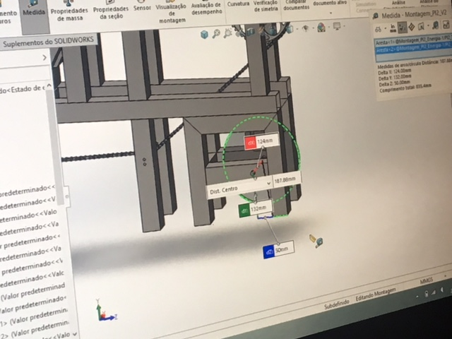
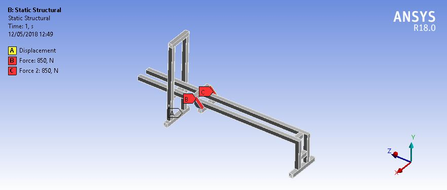
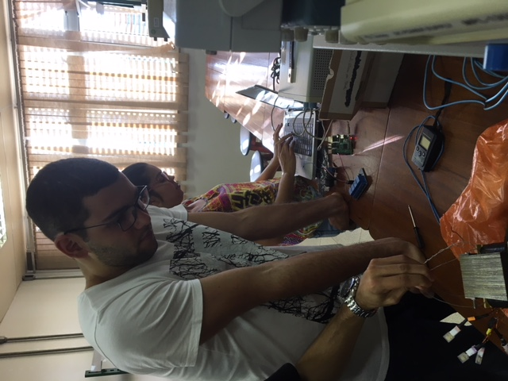
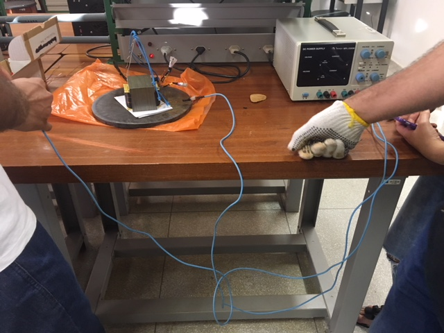
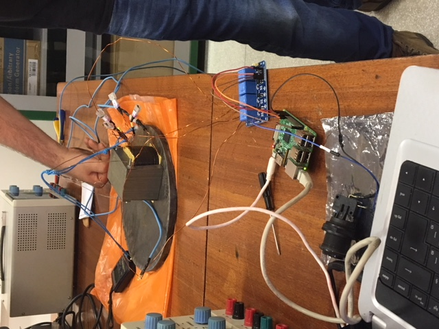

# Plano de Integração
## Integração – 2RBoat/2RPower

{#fig:estrutura-e-energia}

## Integração – 2RBoat/2RElectronic

{#fig:simuforca}

## Integração - 2RElectronic/2RPower

{#fig:estrutura-e-eletronica-1}

{#fig:estrutura-e-eletronica-2}

{#fig:estrutura-e-eletronica-3}

## Integração – 2RElectronic/2RSystem
