## 2RBoat

### Simulações Estruturais

Para se definir o perfil a ser utilizado para construção da estrutura se construiu um modelo em elementos finitos no software _Ansys Mechanical APDL_. A escolha da ferramenta utilizado se deu principalmente por dois fatores:

* Velocidade de Simulação: A estrutura principal, formada pela trave, é composta por perfis de aço unidos por solda. É uma estrutura que pode ser simplificada através de elementos lineares em um _software_ de elementos finitos. Elementos lineares são computacionalmente mais leves e propiciam resultados altamente precisos em estruturas simples.
* Parametrização da Estrutura: A princípio o principal objetivo das simulações era a escolha do perfil a ser utilizado, o _Mechanical APDL_ permite mudar o perfil estrutural escolhido com a alteração de apenas uma linha de comando. Eliminando o processo de alterar o CAD, exportar geometria, importar no _ANSYS_ e realizar a simulação.

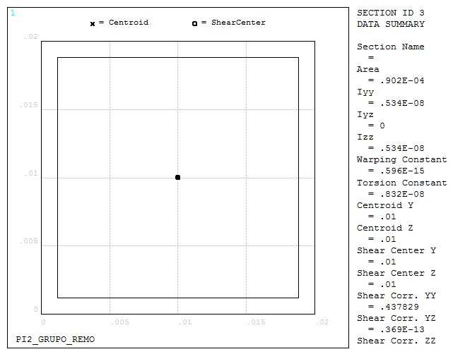{#fig:PERFIL1}

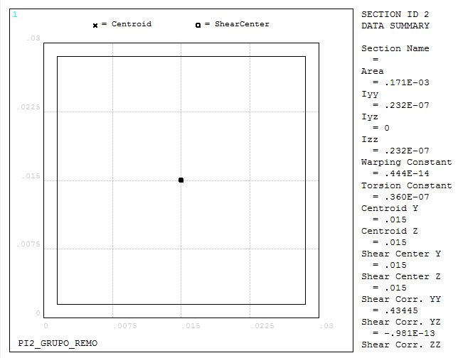{#fig:PERFIL2}

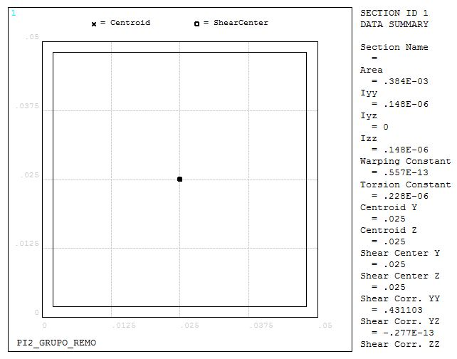{#fig:PERFIL3}

O _ANSYS MAPDL_ requer que o usuário alimente o programa com as informações referentes ao material utilizado nas simulações, para tal utilizamos as informações para o Aço 1020 retiradas do Apêndice B da referência [@callister].

|Material | Aço 1020 |
|:--------|:----------|
|Módulo de Elasticidade | 207 _GPa_|
|Coef. de Poisson | 0.33 |
|Densidade | 7850 _kg/m^3_|

O Elemento linear utilizado foi o _BEAM188_, apesar das vantagens mecionas ao se utilizar o elemento linear, o elemento possui limitações quanto aos resultados que pode fornecer. O programa não é capaz de calcular tensão equivalente de Von-Mises ou tensão de cisalhamento na seção transversal. Os valores que o programa é capaz de entregar são de tensão normal causada por esforço axial e de tensão normal causada por flexão. Logo, não foi utilizado critério de falha nessa etapa. O principal critério para a escolha do perfil foi o deslocamento máximo da estrutura e a tensão normal causada por flexão.

As condições de contorno utilizadas para a simulação foram as de deslocamento restrito nos pés da estrutura e a aplicação de um força distribuída sobre o comprimento que se encontrará o trilho, simulando o peso que o usuário fará na estrutura principal, além disso o peso próprio da estrutura foi contabilizado ao se inserir na simulação uma aceleração na direção vertical de valor equivalente a 1 gravidade.

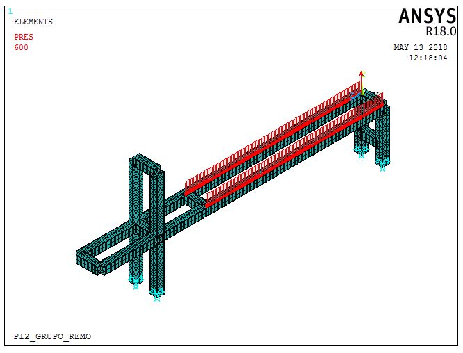{#fig:BC1}

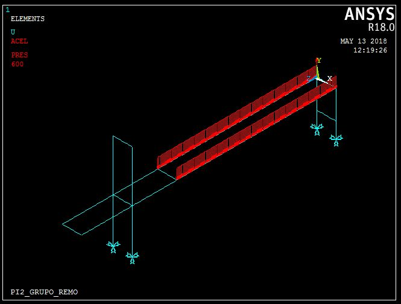{#fig:BC2}

Todos os perfis simulados são de formato quadrado, o primeiro a ser simulado possui dimensões de 20x20x1.2mm. O deslocamento máximo da estrutura foi de 12,9mm e a tensão máxima foi de 184 _MPa_.

{#fig:20201}

{#fig:20202}

{#fig:20203}

O segundo perfil simulado tinha dimensões de 30x30x1.5mm. O deslocamento máximo encontrado foi de aproximadamente 3mm. A tensão máxima causada por flexão foi de 64.3 _MPa_.

{#fig:30301}

{#fig:30302}

{#fig:30303}

O último perfil escolhido tinha dimensões 50x50x2mm. O deslocamento máximo encontrado foi de 0.508mm, e a tensão máxima 17.4 _MPa_.

{#fig:50501}

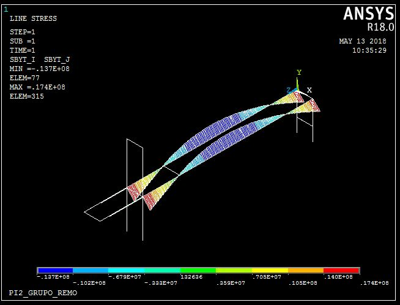{#fig:50502}

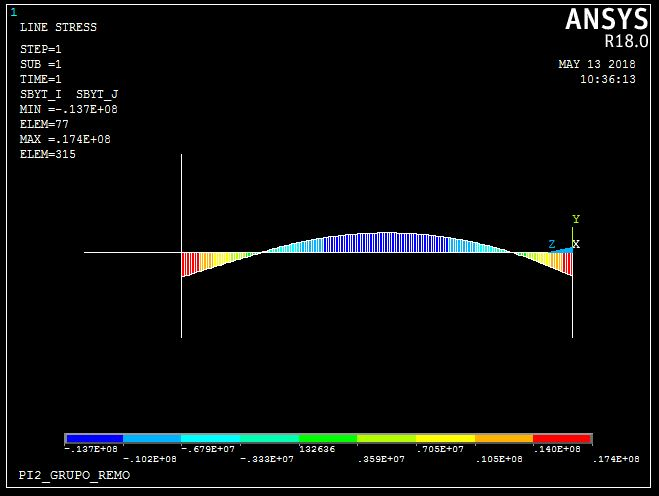{#fig:50503}

O último perfil verificado apresenta baixo deslocamento e tensão máxima muito abaixo do limite de escoamento, foi decidido utilizar tal perfil principalmente pelo fato dos dois perfis anteriores apresentarem deslocamentos muito grandes e o limite de escoamento estar muito distante, uma vez que se utilizou um aço não certificado (Methalon), que possui propriedades mecânicas desconhecidas.

A estrutura construída estará em contato com uma série de cargas dinâmicas, como o eixo de transmissão que apresentará movimento rotacional ou o movimento de remada realizado pelo usuário da maquina, obter as frequências naturais da estrutura é necessário para se averiguar a ocorrência de ressonância ou a necessidade de adicionar amortecimento a estrutura.

Utilizando as mesmas condições de contorno para se obter as frequências naturais obtivemos as seguintes frequências em _Hertz_:

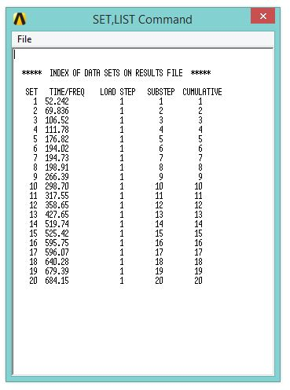{#fig:modos}

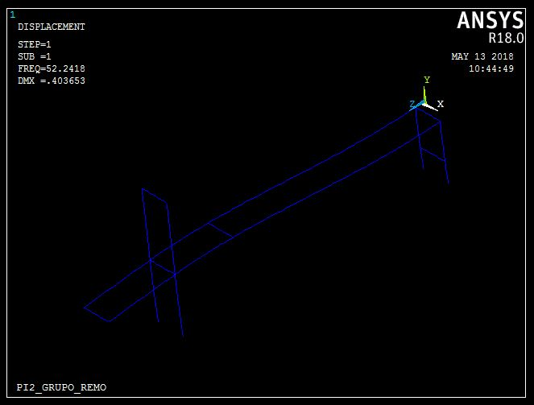{#fig:modo1}

{#fig:modo2}

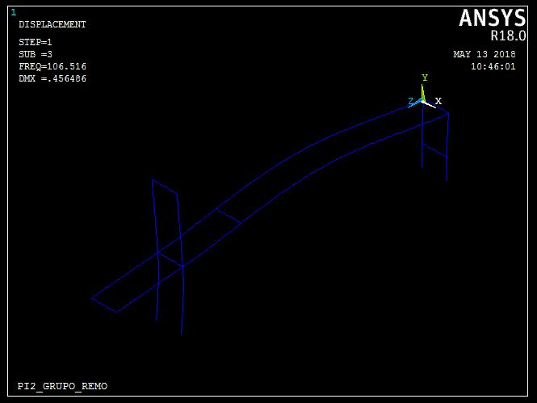{#fig:modo3}

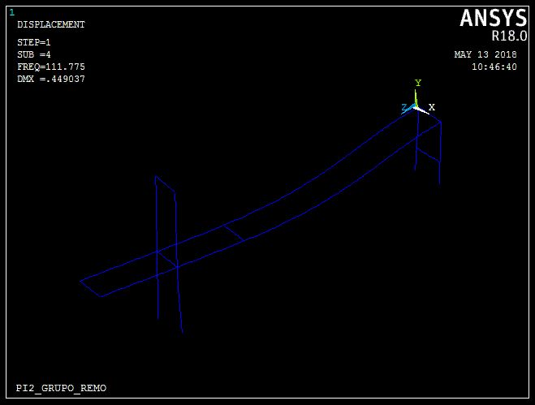{#fig:modo4}

O movimento ideal de remada de um atleta obedece ciclos de 1 segundo, o movimento foi modelado utilizando o software _MSC ADAMS_ para que se determine a amplitude da força que será exercida na estrutura com ciclos de frequência igual a 1 _Hertz_.

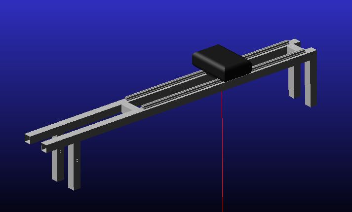{#fig:banco}

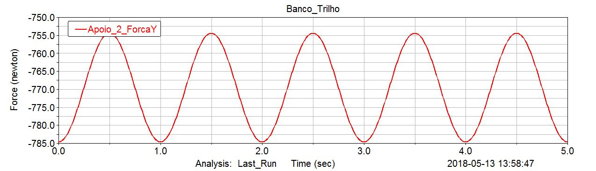{#fig:trilho}

A análise harmônica foi realizada na estrutura com a amplitude de força encontrada através da modelagem do movimento do banco. O espectro de frequências estudado foi de 0 à 150 _Hertz_. A análise da figura [@fig:harmonica] mostra os picos de ressonâncias nas frequências de aproximadamente 52.242 _Hz_ e 106.52 _Hz_.

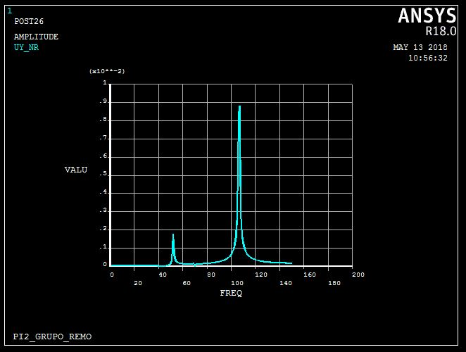{#fig:harmonica}

{#fig:estrutura-1}

{#fig:estrutura-2}

{#fig:estrutura-3}

{#fig:estrutura-4}

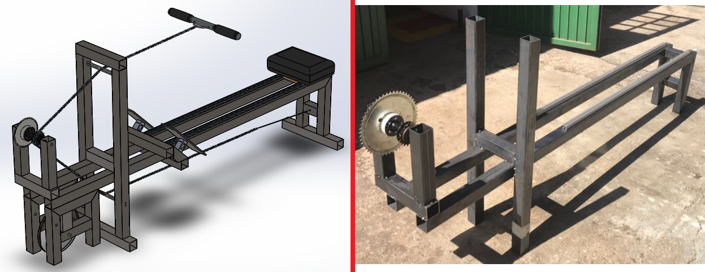{#fig:estrutura-5}
