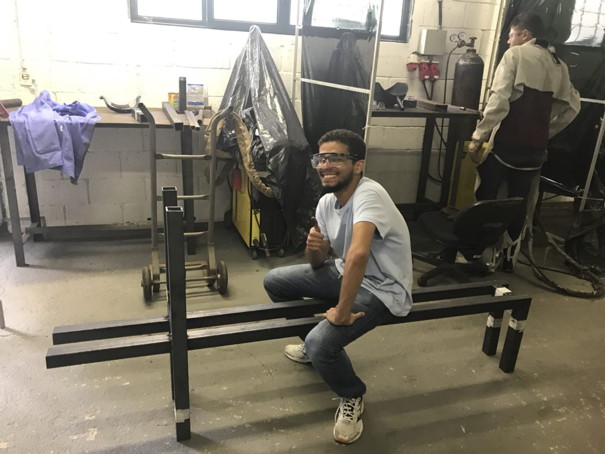
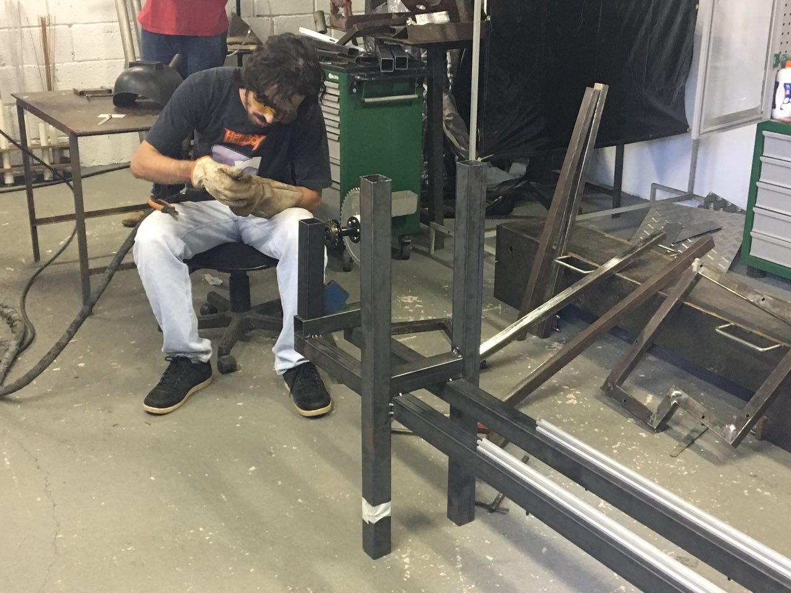
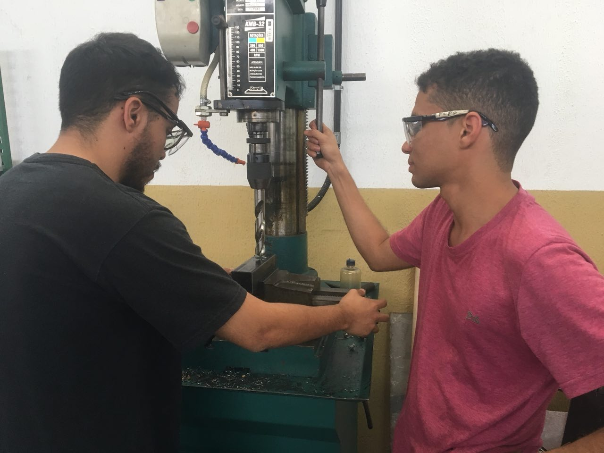
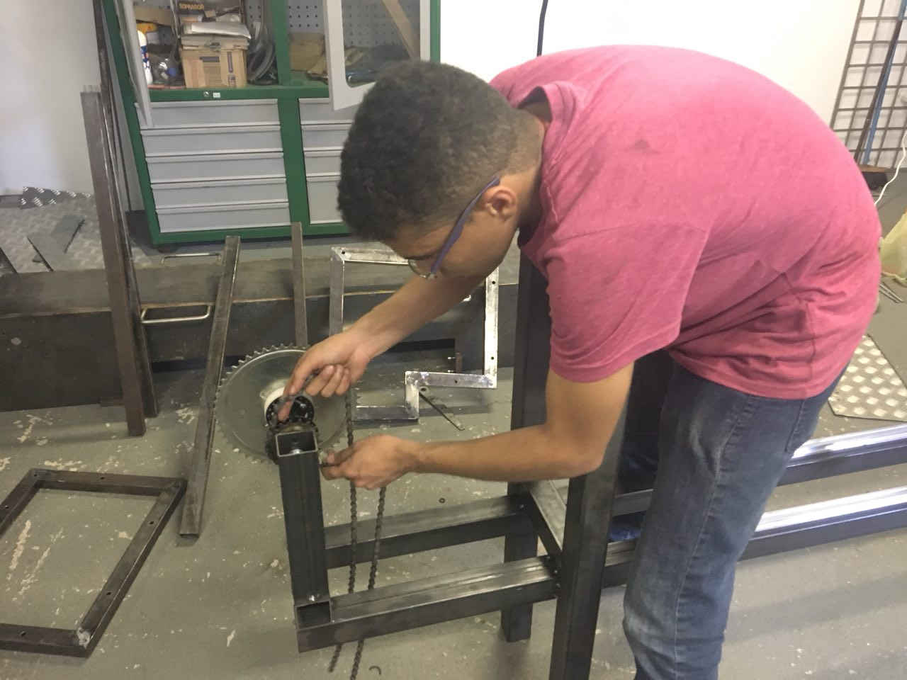
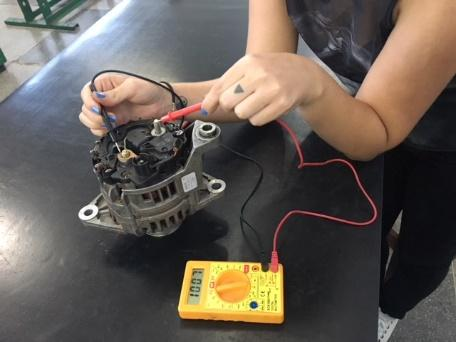
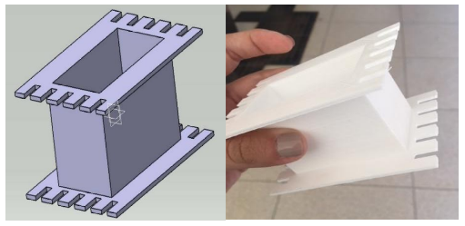
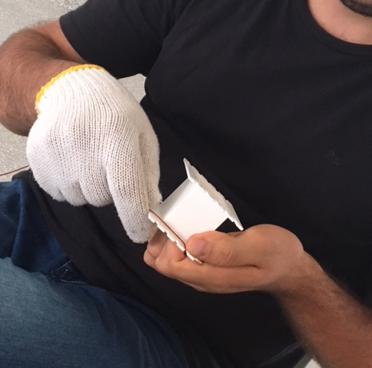
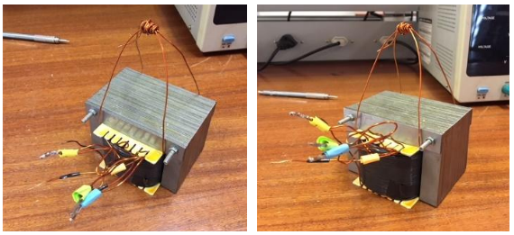
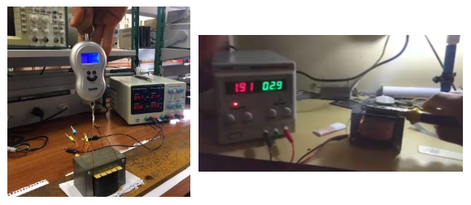
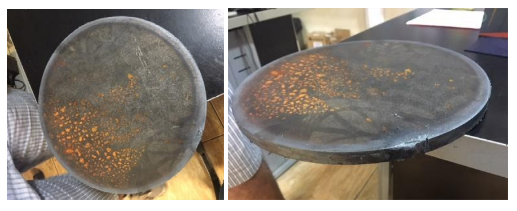

# Soluções e Testes

## 2RBoat

{#fig:estrutura-1}

{#fig:estrutura-2}

{#fig:estrutura-3}

{#fig:estrutura-4}

## 2RPower

O sistema de energia, que tem por objetivo gerar uma carga variável para a remada do atleta, inicialmente, havia escolhido como solução um sistema que empregava um gerador elétrico acoplado a um banco de resistores. Contudo, a construção desse sistema se apresentou muito complexa para ser realizada durante o tempo estipulado para a disciplina, dessa forma, a alternativa foi testar um alternador automotivo, segunda solução encontrada. 
  
Durante os testes o alternador não correspondeu a validação de projeto a qual o grupo estava a procura para satisfazer as necessidades da solução proposta. Sendo assim, a solução escolhida, por fim, para o funcionamento adequado do remo indoor foi a construção de um freio eletromagnético, também conhecido como freio de Foucault.

{#fig:teste_alternador}
  
### Freio Eletromagnético

O uso do efeito de correntes parasitas na frenagem eletromagnética já é bastante difundido, tanto em meios acadêmicos, quanto industriais, um exemplo clássico é o freio de Foucault ou também como é conhecido, freio eletromagnético. Nele, utiliza-se um disco de alumínio ou cobre para interpor uma resistência ao torque de máquinas rotativas no intuito de reduzir a sua velocidade, simular uma variação da carga mecânica acoplada ao seu eixo ou até mesmo abreviar a sua frenagem no momento de seu desligamento, dissipando sua energia inercial na forma de efeito Joule, pela ação das correntes parasitas circulantes no disco [@pinheiro14].

![Ilustração conceitual de um freio eletromagnético [@medeiros80]](imagens/ilustracao-conceitual-do-freio.png){#fig:freio_eletromag}

O surgimento das correntes parasitas, é uma consequência direta do efeito da indução eletromagnética descrito por Faraday. As tensões elétricas são induzidas em um condutor sempre que este atravessar as linhas de fluxo de campo magnético constante ou quando este condutor for submetido a um campo magnético variável no tempo. Seja qual for o modo, as correntes induzidas percorrem caminhos a fim de manter oposição ao movimento relativo do condutor ou oposição à variação do campo magnético [@pereira06].

Em outras palavras, o efeito eletromagnético que caracteriza esse sistema, pode ser explicado a partir da lei de Ampère, que descreve que uma corrente elétrica circulando em um meio condutor induz um campo magnético cujas linhas de fluxo se posicionam em direção tangencial ao caminho de circulação da corrente. Como dito anteriormente, pela lei da indução de Faraday, sabe-se que uma variação de fluxo magnético resulta na indução de um campo elétrico, consequentemente, se um campo elétrico confinado a um meio condutor na forma de um circuito fechado produz a circulação de uma corrente neste circuito, tem-se que a variação de fluxo magnético concatenado a um circuito fechado leva analogamente à indução de um campo elétrico, e uma corrente proporcional à variação de fluxo que a gerou [@pereira06].

Por fim, a lei de Lenz determina que a corrente induzida (ou o campo elétrico da qual ela resulta) se projeta no sentido de se opor à variação de fluxo que a produziu. Ou, mais especificamente, o sentido da corrente induzida pela variação de um fluxo magnético é tal que ela venha a induzir um novo fluxo magnético (contra-fluxo) que virá a se opor à variação do fluxo que a induziu.

Diante do exposto, o projeto de solução visa a construção de um sistema composto por dois eletroímãs posicionados nas faces de um disco de aço que estará conectado ao eixo que transmite o movimento de remada do atleta, como podemos observar a seguir.

### Eletroímã

O eletroímã é composto por um núcleo metálico envolto por bobinas, que por sua vez são excitadas com corrente contínua controlada através de conversores estáticos (fontes de alimentação). A força de um eletroímã pode ser regulada para mais ou menos, ajustando-se a corrente elétrica que percorre suas bobinas.

A primeira etapa de montagem do eletroímã consistiu na procura de transformadores para serem desmontados e posteriormente transformados em eletroímãs. Reorganizando as finas chapas metálicas que os compõem na mesma direção, foi possível alcançar a construção de um núcleo metálico com geometria do tipo “E”. Para então, confeccionar novas bobinas de fio de cobre AWG 18, que seguiram especificações baseadas nos cálculos que serão apresentados mais adiante.

Para a montagem do segundo eletroímã, foi modelada a base de acordo com as dimensões do primeiro eletroímã, e sua construção foi realizada por meio de impressão 3D utilizando material PLA, termoplástico biodegradável. Após essa etapa, foram seguidos os mesmos passos da construção citados anteriormente.

{#fig:base_eletroima}

O espaço para o enrolamento das bobinas é limitado pelas dimensões do “E”, com a tabela de espessura dos fios de cobre medidos em AWG, foi possível dimensionar o número de voltas para cada espessura de fio de cobre, e relacionar com a força de atração estática teórica que a corrente suportada por aquele fio gerava. Com esses cálculos, concluiu-se que o melhor espessura de fio era a AWG 18.

{#fig:bobina}

Quando decidiu-se trabalhar com eletroímã, foi proposto variar a corrente aplicada ao eletroímã para variar a força de atração, mas devido às dificuldades de trabalhar com um uma corrente variável, optou-se por modular as bobinas do eletroímã em 4 níveis. Como a relação entre o número de espiras e a força de atração não é linear, foi necessário primeiro estabelecer o nível máximo e mínimo de força de atração, encontrar dois valores de força entre esses dois níveis pré-definidos, e estabelecer o número de voltas de cada uma das quatro bobinas.

-----------------------------------------
Nível     Número de espiras em cada nível 
-----     ------------------------------- 
1          191   
2          268
3          307
4          380

{#fig:eletroima}

Os testes foram realizados após a construção do primeiro eletroímã. O mesmo foi excitado com a utilização de fonte de corrente contínua para observar a possível existência de curtos circuitos no enrolamento e se o efeito eletromagnético realmente estava ocorrendo, dessa forma foi consolidado seu funcionamento. 

Em seguida, o mesmo foi testado com uma chapa de metal grossa, de material desconhecido, com o intuito de analisar o quanto de força o eletroímã estava exercendo no material, para tal empregou-se uma balança portátil e observou-se o quanto suportava em relação a massa para cada intensidade de corrente estabelecida pela fonte. Os resultados podem ser observados na tabela a seguir.

-----------------------------------------------------------------------------
Corrente [A]    Teste 1 [Kg]       Teste 2 [Kg]        Teste 3 [Kg]
-------------   --------------   ---------------      -----------------------
4               19,8             21,2                     22,4               

4,5             27,6             25,5                     29,8

5               36,4             36,9                     35,8
-----------------------------------------------------------------------------
:Relação de corrente elétrica e massa{#tbl:corrente_massa}

Analisando os dados colhidos, considerando as especificações do fio de cobre AWG 18 e a premissa que o eletroímã irá trabalhar com uma corrente fixa, foi então escolhido o valor de 4,5 amperes.

Tendo estabelecido o nível máximo de corrente que irá percorrer as bobinas, foram então realizados os testes para cada nível de operação do eletroímã. Na tabela a seguir estão dispostos os resultados desses testes.

-----------------------------------------------------------------------------
Nível           Teste 1 [Kg]       Teste 2 [Kg]        Teste 3 [Kg]
-------------   --------------   ---------------      -----------------------
4               32,4              29,16                  32,33               

3               17,41             17,3                   17,44

2               12,32             13,43                  13,73

1               6,78              7,04                   7,06
-----------------------------------------------------------------------------
:Relação nível de operação e massa{#tbl:nivel_massa}

Dessa maneira, foi possível determinar qual peso o atleta terá que puxar em cada nível de operação do eletroímã.

{#fig:teste_eletroima}

### Fonte de Corrente Constante

Para a energização do eletroímã durante os testes, foi utilizada uma fonte de corrente chaveada do tipo colméia, que na sua saída fornece 12 volts e 5 amperes,

Mas um dos objetivos do trabalho é a construção de uma fonte de corrente constante para a excitação dos eletroímãs...

(Falta completar)

### Disco

O disco que estará localizado entre os eletroímãs e acoplado ao eixo, é composto por aço-carbono 1010, tal determinação foi pensada com base em um das características que o elemento carbono confere aos metais, como por exemplo, quanto maior seu teor na composição destes, menor é a permeabilidade. Assim, foi escolhido o material comercial com o menor teor de carbono, nesse caso a presença é de 10%. 

Já a sua espessura é de 1/2 polegada, o que corresponde a aproximadamente 1,27 centímetros e seu diâmetro é de 27 centímetros, medida estabelecida com base na construção da estrutura e considerando a maior área superficial que estará exposta aos efeitos do eletroímã.

{#fig:disco}

## 2RElectronic

## 2RSystem

# 2RSystem

## Arquitetura

## Módulos

### 2RS-Controller

### 2RS-Processer
O principal objetivo deste módulo é: receber os dados inferidos pelas IMUs e repassados pela **2RS-Controller** e transformá-los em informações necessárias para a renderização dos modelos do corpo humano.

As IMUs são compostas, basicamente, por $3$ instrumentos: $1$ acelerômetro, $1$ giroscópio e $1$ magnetômetro; esses, respectivamente, são capazes de: medir a aceleração do objeto, d direção do objeto e a intensidade, a direção e o sentido de campos magnéticos em sua proximidade. Cada um desses instrumentos possui $3$ eixos de precisão, os quais representam o espaço $3D$ em respeito às suas capacidades próprias, totalizando $9$ dados a serem utilizados por este módulo. 

Esses $9$ dados separadamente não são úteis para a renderização dos modelos. Para que seja possível mapear os movimentos do atleta para a tela, é necessário ter em mãos os ângulos de Euler que representam a orientação. Para obter os ditos ângulos, é necessário inserir esses dados em um algoritmo de fusão sensorial, o qual dá como _output_ os ângulos de Euler.

O algoritmo de fusão sensorial escolhido foi o Madgwick (TODO: adicionar referência). Este algoritmo incorpora compensação de distorção magnética e utiliza a representação de _quaternions_ (que podem ser transformado em ângulos de Euler), o que permite que os dados do acelerômetro e do magnetômetro sejam utilizados para medir e corrigir o erro do giroscópio como uma derivada do _quaternion_ do momento atual, o que seria impossível se as IMUs possuíssem apenas 6 eixos (i.e. não se possuíssem um magnetômetro). 

O algoritmo é dividido em dois processos:
1. As medições do giroscópio são obtidas com um algoritmo de correção (com o objetivo de minimizar os efeitos do efeito de _drift_) e são, então, utilizadas para computar a orientação do corpo com a propagação do _quaternion_ começando da etapa anterior do algoritmo.
2. Logo após, as medições do acelerômetro e do magnetômetro são fundidas com um parâmetro $\beta$. O _output_ dessa fusão é usado para corrigir a orientação estimada no primeiro passo, onde apenas o giroscópio foi considerado. 

O algoritmo foi implementado utilizando a linguagem de programação Python em conjunto com a biblioteca NumPy. O principal motivo pela escolha da linguagem foi a própria NumPy. Como a visualização dos movimentos deve ser feito em tempo real, a eficiência dos cálculos é altamente necessária. Nesse ponto, a NumPy se sobressai: as operações e os cálculos de matrizes, acessos de _arrays_/listas/tuplas etc são escritas, conjuntamente, nas linguages Fortran e C, fazendo com que sejam aproveitadas a rapidez dessas linguagens e a simplicidade da programação na linguagem Python.

### 2RS-Viewer

## Testes

### 2RS-Processer
Como o objetivo deste módulo era receber dados crus das IMUs e dar como _output_ os ângulos de Euler que representam as orientações do corpo, é necessário ter uma forma de testar se os ângulos estão realmente corretos; isto é, se o algoritmo de fusão sensorial está funcionando corretamente. Para tal teste, a ferramenta de visualização **ahrs-visualizer** foi utilizada.

Basicamente, a ferramenta **ahrs-visualizer** recebe uma matriz de rotação (que pode ser derivada do _quaternion_ mantido no Madgwick) e mostra na tela a representação da IMU na tela. Ou seja, uma bateria de dados foi coletada das nossas IMUs, esses dados foram colocados na implementação do Madgwick e as matrizes de rotação de cada momento de tempo foram dadas como _output_. Então, as matrizes de rotação foram dadas como _input_ para o **ahrs-visualizer** e, então, foi checado se as imagens mostradas pelos **ahrs-visualizer** correspondem ao movimentos feitos na IMU.

Algumas imagens do **ahrs-visualizer** podem ser vistas a seguir:
TODO: adicionar as imagens

