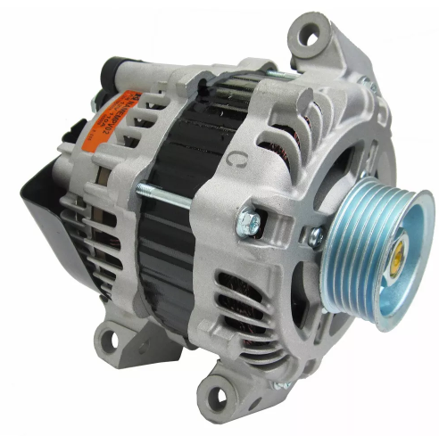
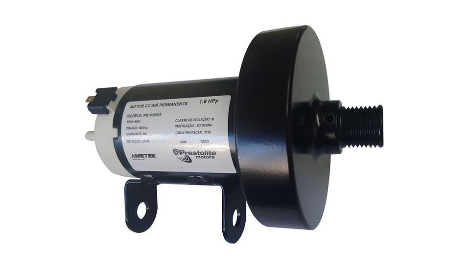
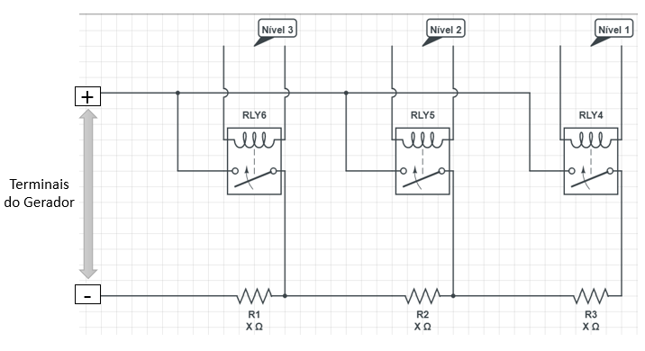

## Características do Produto

<!--
Está na estrutura do pandoc?
- [NÃO]

Validações:

[OK]: Tudo certo!
[TODO]: Falta alguma coisa! Nesse caso, informe o que está faltando

- Software []
> Jonathan [TODO]
>> Cada frente mapear as características e features de cada subsistema

---------------
- Eletrônica []

---------------
- Energia []

---------------
- Estrutura []

---------------
-->

### Características de 2Row

Tem-se por objetivo projetar uma estrutura de remo _indoor_. Basicamente a estrutura é composta por um trilho que permite que o banco se mova suavimente e que caiba a perna toda do usuário, por uma alça ergonomica que permite ao usuário uma posicionamento de braços e mãos em um posicionamento confortável, base para o posicionamento dos pés que permite um ajuste fácil e rápido, corda de alta resistencia , assento para a acomodação do atleta, e pernas para a sustentarem a estrutura, cabos adequados para transmissão da força.  

#### 2RB-Primary  

A estrutura física primária do equipamento, composta pela trave que contem os demais subsistemas de todas as áreas;

#### 2RB-Seat  

A estrutura de acomodação do usuário, é ligada a estrutura primária por um trilho que permite movimento;

#### 2RB-Row 

Formada por um conjunto de polias e correias que transmitem o movimento da remada e do sistema de restituição feito por cordas elásticas;

{#fig:TRANSMISSÃO}

#### 2RB-Case 

Estrutura que abriga os componentes eletrônicos responsáveis pelo controle dos sistemas embarcados.

### Características de 2RPower

O sistema planejado para gerar uma carga variável para a remada do atleta será baseado em um Dinamômetro Eletrônico.

Quando o gerador opera sem carga (resistência), haverá uma tensão induzida, mas nenhuma corrente. Ao inserirmos uma carga, uma corrente passará a circular pelas bobinas do gerador e pela carga. Com isso, o gerador deve gerar energia para alimentar a carga.

Quanto mais corrente exigida, mais força será necessária para girar o eixo do gerador.

Partindo desse princípio, o movimento que simula a remada do atleta irá puxar um cabo que será conectado a um gerador, que por sua vez irá gerar uma potência que será dissipada no banco de resistores.

O banco de resistores será útil para regular a corrente e consequentemente a força necessária para que o atleta realize o exercício.

O controlador de carga que irá carregar a bateria e alimentar o sistema será acoplado em paralelo com o módulo de resistores.

#### 2RP-Generator

Os critérios considerados para escolher os geradores foram:

* Preço;

* Facilidade de acesso;

* Necessidade de poucas adaptações;

* Geração de energia em baixas rotações.

Considerando esses critério, dois sistemas foram selecionados como soluções para a geração de energia: o alternador automotivo [@fig:alter] e um motor de esteira ergométrica [@fig:motorest].

{#fig:alter}
{#fig:motorest}
O motor de esteira pode ser usado no modo gerador, e dentre os critérios de seleção ele foi o mais viável economicamente e tecnicamente. Dessa forma ele é o mais indicado para confecção do sistema.

#### 2RP-Resistance

Sabendo a potência máxima possível que pode ser obtida com a remada do atleta, poderemos dimensionar a potência que os resistores e os relés iram ter que suportar.

O sistema será composto por:

* 3 relés que irão controlar os níveis de resistência
* 3 resistores que irão controlar a corrente do gerador

Usaremos relés de caminhão (80A) ou de carro (40A). Estamos considerando usar resistores de chuveiro elétrico ou de fornos elétricos. A determinação da corrente suportada pelos relés e da potência suportada pelos resistores dependerá da determinação da potência da remada do atleta.

Usaremos uma margem de erro de 100% para dimensionar os resistores e relés.

Os níveis do exercício será acionado pelo sub grupo de eletrônica de acordo com a figura [@fig:circuitobr].

{#fig:circuitobr}

#### 2RP-Battery

O armazenamento de energia será realizado por meio da utilização de uma bateria, o qual será feito por um controlador de carga acoplado em paralelo com o módulo de resistores. Dessa forma, o sistema de armazenamento será capaz de alimentar o sistema eletrônico aproveitando a energia gerada pela movimentação do atleta durante o ciclo de remada.

### Características de 2REletronic

<!-- Eletrônica 

# Solução de eletrônica

O subsistema de eletrônica possui a finalidade de criar  os circuitos de aquisição dos parâmetros vinculados ao desempenho dos atletas de base do esporte, os quais são de suma importância para a avaliação de cada movimento realizado. A aquisição será realizada de forma não-invasiva. 

Outrora era realizado uma avaliação do atleta a partir da observação do treinador ao olhar um vídeo feito durante o movimento. A nova formulação permitirá uma padronização dos parâmetros adquiridos e possível comparação entre o desempenho de diversos atletas, dessa forma, um iniciante teria seu desempenho aumentado em relação aos outros, pois a forma de treinar desde o início, com os movimentos corretos, contribuiria para uma melhor performance. 

Para  que seja possível a padronização dos parâmetros o subsistema eletrônica dividiu a solução em três tópicos: sistema de sensoriamento, aquisição e embarcado.

## Sistema de sensoreamento

Para analisar os fatores biomecânico e biomédico e consequentemente a influência que isso causa no desempenho, de um atleta ou iniciante no esporte remo, é necessário ter a atuação da instrumentação eletrônica, em que são aplicados os sensores e suas respectivas calibrações. A seguir, está descrito as tecnologias que foram selecionados para resolver o problema proposto.

### Sensor inercial (IMU)

A postura é um parâmetro essencial para aprender e aprimorar nesse esporte. Além de se sentir confortável, o remador tem de ser capaz de realizar os quatro ciclos principais, em suma podem ser ditos como entrada, propulsão, finalização e recuperação. Cada ciclo possui uma postura adequada. para iniciantes no remo é importante que as devidas correções nesse quesito sejam realizadas para que o rendimento seja garantido. 

Desse modo, é necessário avaliar o movimento dos membros para identificar um modelo padrão. Para que isso, serão utilizados sensores de medidas inerciais...
Os IMUs são capazes de realizar o monitoramento da velocidade e aceleração, tanto linear, quanto a angular. Isso porque ele é composto por acelerômetros e giroscópios. O giroscópio é comumente usado em sistemas de estabilização e orientação, principalmente no controle de motores de drone. entretanto sua função nesse trabalho será de obter a velocidade das remadas realizadas. Ademais, de acordo com os estudos de  …., esse tipo de tecnologia vem sendo empregada para analisar o movimento tanto dos remador quanto do barco. Nesse trabalho, será adquirido e analisado apenas o movimento do membro inferior do remador.

O acelerômetro é regido pela Segunda Lei de Newton, ou seja, pode-se obter a partir dele medições de aceleração, linear ou angular e possíveis inclinações. Dessa forma, esses dados serão utilizados  para a obtenção dos ângulos do membro inferior direito. Será realizado esse estudo em apenas um membro inferior, pois no esporte os ciclos da remada são bem síncronos. 

### Sensor de batimento cardíaco

O módulo de frequência cardíaca possibilita obter informações acerca de como o atleta iniciante está se portando fisiologicamente, dados como fadiga rápida e excessiva podem ser vistas como indicativos de um exercício não tão bem realizado. Para ter esse acompanhamento será utilizado o sensor de frequência cardíaca 4MD69, com tamanho 16 x 2,7mm, baixo consumo de energia (cerca de 4 mA) e tensão de operação de 3 a 5 V.

 ### Wattímetro

Um dos principais parâmetros relacionados à remada é a potência do movimento realizado durante o exercício. Para fazer a medida se faz necessário construir um curcuito conversor analógico-digital, dessa forma, com divisões significativas, será possível saber a tensão instantânea coptada no gerador. Sabendo qual o valor de resistências chaveada para uso em dado momento sabe-se a potência elétrica instantânea. Por meio de software, será obtido um modelo de conversão de potência elétrica para mecânica, sendo esta a esperada e importante para o projeto.

Outro artifício para completo para saber a potência do movimento é a instalação de um sensor óptico de fim de curso, que será adaptado abaixo do banco em que o remador se senta, e que ao passar sabe-se que o movimento terminou e começou um novo. Assim obtém-se os tempos de cada movimento. Ao se integrar a potência mecânica por períodos de cada movimento encontra-se a potência da remada.

## Sistema de aquisição e condicionamento

A aquisição dos sinais será realizado por meio de circuitos de instrumentação, filtros, conversores, microcontroladores e microcomputadores, quando for o caso. Inicialmente, os sensores O sensor IMU será englobado em uma vestimenta de velcro que o remador deverá utilizar. Esse tipo de instrumento vestível foi escolhido por ser de baixo custo e prático.

## Sistema embarcado e de interface
O sistema eletrônico será integrado juntamente com o de software pelo microcomputador Raspberry Pi 3.

Para a atuação de captação e processamento de sinais a Raspberry será fundamental, integrada com outros dispositivos como MSP430 e display próprio para Raspberry será possível adquirir sinais inclusive analógicos, visto que a Raspberry não possui conversor A/D utilizando o conversor do MSP430, transmitir os sinais para a Raspberry processar e fazer as tomadas de decisão e ao final mostrar através da interface do display touchscreen.

### Raspberry Pi 3

A Raspberry Pi 3 Modelo B foi lançada em fevereiro de 2016. Ela tem se mostrado muito útil para o desenvolvimento de sistemas embarcados relacionados à aquisição e processamento de sinais para aplicações diversas, como no controle de drones, robótica, processamento de imagens, entre outros. 

Para a atuação de captação e processamento de sinais a Raspberry será fundamental, integrada com outros dispositivos como MSP430 e display próprio para Raspberry será possível adquirir sinais inclusive analógicos, visto que a Raspberry não possui conversor A/D utilizando o conversor do MSP430, transmitir os sinais para a Raspberry processar e fazer as tomadas de decisão e ao final mostrar através da interface do display touchscreen.

![Raspberry Pi 3^[Fonte: ]](./imagens/Raspberry.jpg){#fig:Raspberry_Pi_3}

Características:

Quad Core 1.2GHz Broadcom BCM2837 64bit CPU

1GB RAM

BCM43438 wireless LAN e Bluetooth de baixo consumo (BLE)

40-pin físicos GPIO

4 USB 2 portas

4 Polos stereo output and composite video port

Full HDMI

Porta CSI para câmera para conexão com a câmera de Raspberry

Porta DSI display para conexão ao display Raspberry Pi touchscreen

Entrada Micro SD para adição do sistema operacional

### MSP 430

Os microprocessadores são componentes aritméticos e lógicos, em que não utilizam sistemas operacionais, mas sim um software específico. Aprensentam em sua estrutura interna memórias para armazenamento de dados de escrita e leitura, interfaces com o usuário de entrada e saída, elementos de converão analógio/digital de até 16 bits, conversor digital/analógico, timers que possuem diversos modos de funcionamento. 

Os MSP430 podem ser chamados de chips, os quais possuem baixo consumo de corrente causado devido a forma de trabalho da CPU, da ordem de 0,1µA. A tensão de operação é baixa, em que permite que operem de 1,8V a 3,6V. Esses microprocessadores são utilizados para desenvolver atividades complexas tendo em vista as instruções objetivas em um período de tempo relativamente pequeno. Ele utiliza um barramento de 16  bits, o endereçamento é permito para qualquer operação o que facilita o processo de compilação. Os resgistrados usados para diversas atividades são de R4 a R15.
 
Os seis modos de operação do MSP430 exitentes- do LPM0 a LPM4- auxiliam no controle do consumo de corrente, ou seja, faz com que não haja disperdício de energia quando o mesmo não estiver sendo utilizado. A mudança do funcionamento normal para um de baixo consumo pode ser feita, como foi o caso desse experimento, a partir da habilitação de uma interrupção, em que depois de executada retorna novamente ao baixo consumo. O modo de baixo consumo trabalhado no programa foi o LPM4, em que a CPU e todos os sinais de clock são desativados.

O MSP apresenta um sistema de clock, sendo o Timer_A o mais completo. Esse sistema possui um registrador de 16 bits e este é incrementado de acordo com o sinal de clock utilizado. O Timer_A pode-se trabalhar com os canais de captura ou de comparação. Nos canais de captura pode-se armazenar nos registradores TACCRx o valor contido no registrador TAR no instante em que o sinal escolhido foi mudado. Já nos canais de comparação a saída de escolha é mudada quando TAR = TACCRx. Ambos canais permitem gerar uma interrupção. O número de canais varia de acordo com a família do microcontrolador, no caso no Timer_A, o canal 0 é meramente importante, pois ele possui um endereço de interrupção de maior prioridade e o mesmo controla todo o funcionamento do Timer estudado. 

![MSP430^[Fonte: ]](./imagens/msp430.jpg){#fig:MSP_430}

### ESP 8266

O ESP8266 é um microcontrolador com um processamento considerável para a aplicação em questão e possui um excelente diferencial, o módulo WI-FI acoplado. Além disso já traz consigo, conversor analógico-digital(ADC) e vários protocolos de comunicações, isso traria ao sistema versatilidade para aquisição e trato de sinais.

![ESP8266^[Fonte: ]](./imagens/esp8266.jpg){#fig:ESP_8266}

Características

CPU 32-bit RISC: Tensilica Xtensa LX106 rodando a 80 MHz;

64 KB de memória RAM de instruções, 96 KB de dados;

Flash QSPI Externo - de 512 KB a 4 MB;

IEEE 802.11 b / g / n Wi-Fi;

16 pinos de GPIO;

SPI, I²C, UART;

Tensão de operação ->3.3V.

-->

#### Características do 2RE-Suit

O 2RE-Suit é um subproduto de _eletrônica_ e sua aplicação se baseia em medições de posição das pernas através do 2RE-IMU e do 2RE-CARDIO, respectivamente sendo os produtos de **Subsistema de unidade de medidas inerciais** e **Subsistema monitor de frequência cardíaca**.

#### 2RE-CARDIO -  Subsistema monitor de frequência cardíaca
É o subsistema responsável pela aquisição dos dados de frequência cardíaca do atleta que está utilizando o aparelho de remo.

Suas principais características são:

* **Característica 2RE-CARDIO-1**: É composto pelo sensor  de frequência cardíaca 4MD69 e por um microcontrolador;
* **Característica 2RE-CARDIO-2**: Pode necessitar de condicionamento de sinal;
* **Característica 2RE-CARDIO-3**: O sensor utilizado apresenta baixo consumo de energia (cerca de 4 mA) e tensão de operação de 3 a 5 V;
* **Característica 2RE-CARDIO-4**:  A transmissão dos dados pode ser feita via cabos ou wifi;
* **Característica 2RE-CARDIO-5**: Tem comunicação com o **2RE-Kernel**.

Suas principais funcionalidades são:

* **_Feature_ 2RE-CARDIO-1**: Aquisição dos sinais cardíacos do usuário do remo;
* **_Feature_ 2RE-CARDIO-2**: Condicionamento do sinal para tratamento de ruídos;
* **_Feature_ 2RE-CARDIO-3**: Transmissão do sinal para o subsistema **2RE-Kernel**;

Detalhando as caracteríticas, os microcontroladores escolhidos para trabalhar foram MSP 430 e o outro será descrito mais abaixo.
O MSP 430 foi escolhido, porque possue baixo consumo de corrente causado devido a forma de trabalho da CPU, da ordem de 0,1µA. A tensão de operação é baixa, em que permite que operem de 1,8V a 3,6V. Esse microprocessador é utilizado para desenvolver atividades complexas tendo em vista as instruções objetivas em um período de tempo relativamente pequeno. Ele utiliza um barramento de 16  bits, o endereçamento é permito para qualquer operação o que facilita o processo de compilação. Os resgistrados usados para diversas atividades são de R4 a R15.
 
Os seis modos de operação do MSP430 exitentes- do LPM0 a LPM4- auxiliam no controle do consumo de corrente, ou seja, faz com que não haja disperdício de energia quando o mesmo não estiver sendo utilizado. O MSP apresenta um sistema de clock, sendo o Timer_A o mais completo. 

![MSP430^[Fonte: ]](./imagens/msp430.jpg){#fig:MSP_430}

#### 2RE-IMU - Subsistema de unidade de medidas inerciais
É o subsistema responsável por adquirir medidas por meio dos IMU's alocados nas pernas do atleta para saber a posição exata do movimento e poder comparar com modelos padrões para ajustar a execução da remada.

Suas principais características são:

* **Característica 2RE-IMU-1**: Composto por sensores de unidades de medida inerciais MPU-5091 e um microcontrolador;
* **Característica 2RE-IMU-2**:  Pode ser necessário condicionar o sinal;
* **Característica 2RE-IMU-3**: Comunica com o **Subsistema da central de processamento de eletrônica (2RE-Kernel)**;
* **Característica 2RE-IMU-4**: Transmissão dos sinais é feita com cabos;
* **Característica 2RE-IMU-5**: Alocado por meio de elásticos com velcro em pontos da coxa e panturrilha;

Suas principais funcionalidades são:

* **_Feature_ 2RE-IMU-1**: Sensor capaz de medir por meio do acelerômetro, magnetômetro e giroscópio a posição e ângulo em que a parte monitorada da perna está;
* **_Feature_ 2RE-IMU-2**: Medição do ângulo na perna posterior ao joelho;
* **_Feature_ 2RE-IMU-3**: Transmissão dos dados para o **Subsistema da central de processamento de eletrônica (2RE-Kernel)**;
* **_Feature_ 2RE-IMU-4**: Cada ciclo de remada possui uma postura adequada, para iniciantes no remo é importante que as devidas correções nesse quesito sejam realizadas para que o rendimento seja garantido.

#### 2RE-Volt - Subsistema medidor de tensão na cargas do gerador

Subsistema responsável por obter a tensão nas cargas do gerador e transmitir a informação para o **Subsistema da central de processamento de eletrônica (2RE-Kernel)** para obtenção da potência elétrica e tratamento para obtenção do valor de potência mecânica realizada durante o ciclo de remada.

Suas principais características são:

* **Característica 2RE-Volt-1**: Composto por um conversor analógico-digital, um circuito e um microcontrolador;
* **Característica 2RE-Volt-2**: Comunica com o **Subsistema da central de processamento de eletrônica (2RE-Kernel)**;
* **Característica 2RE-Volt-3**: Mínima interferência no valor das cargas presentes no gerador;
* **Característica 2RE-Volt-4**: Resolução da conversão binária feita conforme a necessidade de exatidão.

Suas principais funcionalidades são:

* **_Feature_ 2RE-Volt-1**: Quando o **gerador (2RP-Generator)** é ativado, a medida da tensão nas cargas começa a ser realizada e a ocorre a conversão para binário;
* **_Feature_ 2RE-Volt-2**: A transmissão para o **Subsistema da central de processamento de eletrônica (2RE-Kernel)** é feita por meio de cabos;

#### 2RE-Relay - Subsistema controlador dos relés ativadores das cargas no gerador

Subsistema que controla, a partir da escolha realizada pelo **Subsistema de interface de botões (2RE-UI)**, os relés chaveados nas resistências dos geradores para aumentar e diminuir o esforço a ser realizado pelo atleta durante o movimento de remo.

Suas principais características são:
* **Característica 2RE-Relay-1**: Composto por um circuito de conversão de sinal analógico para digital e um microcontrolador;
* **Característica 2RE-Relay-2**: Utiliza componentes eletrônicos para o funcionamento;
* **Característica 2RE-Relay-3**: Transmissão por meio de fios;
* **Característica 2RE-Relay-4**: **Comunica com o Subsistema da central de processamento de eletrônica (2RE-Kernel)**

Suas principais funcionalidades são:

* **_Feature_ 2RE-Relay-1**:  A partir da requisição do atleta nos botões do **Subsistema de interface de botões (2RE-UI)** e transmitido para o **Subsistema da central de processamento de eletrônica (2RE-Kernel)**, o comando para chavear os relés e mudar a carga presente no gerador **(2RP-Generator)** é recebido;
* **_Feature_ 2RE-Relay-2**: Cada relé será responsável por acionar a atuação de um nível de carga, ou seja, essa carga a pincípio é controlada.

#### 2RE-Kernel - Subsistema da central de processamento de eletrônica

Subsistema que processa todas as informações de sensores do **Subsistema monitor de frequência cardíaca (2RE-CARDIO)**, do **Subsistema de unidade de medidas inerciais (2RE-IMU)**, dos botões do **Subsistema de interface de botões (2RE-UI)** e do **Subsistema medidor de tensão na cargas do gerador (2RE-Volt)**, processa e transmite os sinais para os atuadores do **Subsistema controlador dos relés ativadores das cargas no gerador (2RE-Relay)** e para o **Subsistema de Aquisição de Dados (2RS-Receiver)**.

Suas principais características são:

* **Característica 2RE-Kernel-1**: Composta por uma Raspberry Pi 3 e os cabos de entrada e saída para os diversos sensores e atuadores;
* **Característica 2RE-Kernel-2**: Composta por Microcontrolador ESP 8266;
* **Característica 2RE-Kernel-3**: Processa as informações sem atraso significativo;
* **Característica 2RE-Kernel-4**: Alocada no **2RB-Case**;

Suas principais funcionalidades são:

* **_Feature_ 2RE-Kernel-1**: Recebe os sinais do **Subsistema monitor de frequência cardíaca (2RE-CARDIO)**;
* **_Feature_ 2RE-Kernel-2**: Recebe os sinais do **Subsistema de unidade de medidas inerciais (2RE-IMU)**;
* **_Feature_ 2RE-Kernel-3**: Recebe os sinais do **Subsistema medidor de tensão na cargas do gerador (2RE-Volt)**;
* **_Feature_ 2RE-Kernel-4**: Recebe os sinais do **Subsistema de interface de botões (2RE-UI);
* **_Feature_ 2RE-Kernel-5**: Envia os comandos para chaveamento do **Subsistema controlador dos relés ativadores das cargas no gerador (2RE-Relay)**;
* **_Feature_ 2RE-Kernel-6**: Envia sinais para o **Subsistema de Aquisição de Dados (2RS-Receiver)**.

Detalhando um pouco mais a solução, para atuar na captação e processamento de sinais a Raspberry será fundamental, integrada com outros dispositivos como MSP430, circutos de condicionamento, será possível adquirir sinais analógicos. Visto que a Raspberry não possui conversor A/D pode-se utilizar o conversor do MSP430. Para transmitir os sinais para a Raspberry uma ideia foi utilizar um protocolo de comunicação ou um módulo wi-fi. O ESP8266 é um microcontrolador com um processamento considerável para a aplicação em questão e possui um excelente diferencial, o módulo WI-FI acoplado. Além disso já traz consigo, conversor analógico-digital(ADC) e vários protocolos de comunicações, isso traria ao sistema versatilidade para aquisição e trato de sinais.

![Raspberry Pi 3^[Fonte: ]](./imagens/Raspberry.jpg){#fig:Raspberry_Pi_3}
![ESP8266^[Fonte: ]](./imagens/esp8266.jpg){#fig:ESP_8266}

#### 2RE-UI - Subsistema de interface de botões
Subsistema alocado com botões próximos à interface de vídeo com o usuário para que o mesmo possa controlar o aumento e diminuição das cargas no gerador, chaveadas pelo **Subsistema controlador dos relés ativadores das cargas no gerador (2RE-Relay)** e assim poder aumentar e diminuir o esforço na aplicação do movimento do remo.

Suas principais características são:
* **Característica 2RE-UI-1**:  Composta por botões e um circuito para _debouncer_;
* **Característica 2RE-UI-2**: Transmissão do sinal via cabos;
* **Característica 2RE-UI-3**: Comunicação com o **Subsistema da central de processamento de eletrônica (2RE-Kernel)**;

Suas principais funcionalidades são:

* **_Feature_ 2RE-UI-1**:  Receber a informação do usuário do desejo de mudar o peso nas cargas;
* **_Feature_ 2RE-UI-2**: Tratar o sinal com _debouncer_ para que não haja duplo aperto tanto na falha de leitura, quanto na recepção do sinal ao clicar no _push-button_;
* **_Feature_ 2RE-UI-3**: Transmitir o sinal do usuário para o **Subsistema da central de processamento de eletrônica (2RE-Kernel)**;

### Características de 2RSystem

A arquitetura do subproduto de _software_ do projeto, de nome **2RSystem**, é definida por um conjunto de subsistemas encapsulados, de tal forma que cada um realize suas tarefas específicas e, quando necessário, troquem dados e informações entre sí.

Levando a arquitetura em conta, foram projetados 5 subsistemas: **Subsistema de Controle** (**2RS-Controller - 2RSystem _Controller_**), **Subsistema de Aquisição de Dados** (**2RS-Receiver - 2RSystem _Data Receiver_**), **Subsistema de Processamento** (**2RS-Processer - 2RSystem _Processer_**), **Subsistema de Visualização de Performance** (**2RS-Viewer - 2RSystem _View_**) e **Subsistema Atuador** (**2RSystem _Data Transmitter_**). A interação entre eles pode ser visualizada na diagramação a seguir:

![Arquitetura de Software^[Arquitetura de Software]](./imagens/arquitetura_software2.png){#fig:arquiteturasoftware}

#### 2RS-Controller - Subsistema de Controle

Este subsistema é responsável por intercambiar dados, informações e tarefas entre os outros subsistemas. **2RS-Controller** é um delegador de tarefas que tem ciência de todas as operações que acontecem no **2RSystem**.

Suas principais características são:

* **Característica 2RS-Controller-1**: É um _software_ embarcado na **2Row**;
* **Característica 2RS-Controller-2**: Possui otimização de uso de memória;
* **Característica 2RS-Controller-3**: Não utiliza armazenamento de dados em disco rígido;
* **Característica 2RS-Controller-4**: Possui interface de comunicação com todos os outros subsistemas do **2RSystem**;
* **Característica 2RS-Controller-5**: Seu código-fonte é modularizado através do SRP (_Single-Responsibility Principle_, Príncipio da Responsabilidade Única);
* **Característica 2RS-Controller-6**: Sua estrutura é definida de acordo com o _design pattern Delegation_.

Suas principais funcionalidades são:

* **_Feature_ 2RS-Controller-1**: Receber informações do **Subsistema de Aquisição de Dados (2RS-Receiver)** sobre requisições de início de treino e inicializar todos os subsistemas do **2RSystem**;
* **_Feature_ 2RS-Controller-2**: Receber informações do **Subsistema de Aquisição de Dados (2RS-Receiver)** sobre requisições de fim de treino e inicializar as ações de restauração para o estado inicial de todos os subsistemas do **2RSystem**;
* **_Feature_ 2RS-Controller-3**: Receber informações do **Subsistema de Aquisição de Dados (2RS-Receiver)** sobre requisições de mudança da carga de dificuldade e delegar para o **Subsistema Atuador (2RS-Transmitter)**;
* **_Feature_ 2RS-Controller-4**: Receber informação do **Subsistema de Aquisição de Dados (2RS-Receiver)** sobre a carga de dificuldade atual e transmitir a informação para o **Subsistema de Processamento (2RS-Processer)**;
* **_Feature_ 2RS-Controller-5**: Receber informações do **Subsistema de Aquisição de Dados (2RS-Receiver)** sobre os sensores cinemáticos/cinéticos e delegar o processamento para o **Subsistema de Processamento (2RS-Processer)**;
* **_Feature_ 2RS-Controller-6**: Receber informações processadas pelo **Subsistema de Processamento (2RS-Processer)** e delegar a apresentação para o **Subsistema de Visualização de Performance (2RS-Viewer)**;

#### 2RS-Receiver - Subsistema de Aquisição de Dados

Este subsistema é responsável por receber e preprocessar, se necessário, os dados oriundos dos sensores cinemáticos e cinéticos e dos botões de ação presentes na interface do **2Row**. Após tais etapas, os dados são, então, repassados para o **Subsistema de Controle (2RS-Controller)**, este que direciona os dados ao subsistema responsável pelas próximas tarefas do **2RSystem**.

Suas principais características são:

* **Característica 2RS-Receiver-1**: É um _software_ embarcado na **2Row**;
* **Característica 2RS-Receiver-2**: Possui otimização de uso de memória;
* **Característica 2RS-Receiver-3**: Não utiliza armazenamento de dados em disco rígido;
* **Característica 2RS-Receiver-4**: Possui interface de comunicação com o **2RS-Controller**;
* **Característica 2RS-Receiver-5**: Possui interface para receber dados do **2RSuit**;
* **Característica 2RS-Receiver-6**: Possui interface para receber dados dos botões de ação do **2Row**;
* **Característica 2RS-Receiver-7**: Possui interface para receber dados sobre a potência do atleta, enviada pelo sensor no **2Row**;
* **Característica 2RS-Receiver-8**: Possui interface para receber dados do microcontrolador de controle de carga;
* **Característica 2RS-Receiver-9**: Seu código-fonte é modularizado através do SRP (_Single-Responsibility Principle_, Príncipio da Responsabilidade Única);

Suas principais funcionalidades são:

* **_Feature_ 2RS-Receiver-1**: Receber dados dos botões de ação do **2Row**, convertê-los em modelo e transmitir a informação para o **2RS-Controller**;
* **_Feature_ 2RS-Receiver-2**: Receber dados do sensor de potência do **2Row**, convertê-los em modelo e transmitir a informação para o **2RS-Controller**;
* **_Feature_ 2RS-Receiver-3**: Receber dados do **2RSuit**, convertê-los em modelo e transmitir a informação para o **2RS-Controller**;
* **_Feature_ 2RS-Receiver-4**: Receber dados do microcotrolador do controle de carga, convertê-los em modelo e transmitir a informação para o **2RS-Controller**;

#### 2RS-Processer - Subsistema de Processamento

Este subsistema é responsável por processar e calcular dados transmitidos pelo **Subsistema de Controle (2RS-Controller)**, principalmente sobre o desempenho do atleta. Os dados processados são devolvidos para o **Subsistema de Controle (2RS-Controller)**, este que direciona para o subsistema do **2RSystem**, responsável pelo uso dos dados processados.

Suas principais características são:

* **Característica 2RS-Processer-1**: É um _software_ embarcado na **2Row**;
* **Característica 2RS-Processer-2**: Possui otimização de uso de memória;
* **Característica 2RS-Processer-3**: Possui otimização em termos de complexidade de algoritmos;
* **Característica 2RS-Processer-4**: Possui interface de comunicação com o **2RS-Controller**;

Suas principais funcionalidades são:

* **_Feature_ 2RS-Processer-1**: Receber informações do **2RS-Controller** sobre as métricas do atleta e definir a performance do atleta;
* **_Feature_ 2RS-Processer-2**: Definir o modelo de performance ideal;
* **_Feature_ 2RS-Processer-3**: Comparar a performance do atleta com o modelo de performance ideal;
* **_Feature_ 2RS-Processer-4**: Realizar cálculos de renderização e conversões lineares da performance do atleta e da performance ideal para um modelo de animação do corpo humano;
* **_Feature_ 2RS-Processer-5**: Gerar estatísticas relevantes para o contexto do projeto;
* **_Feature_ 2RS-Processer-6**: Transmitir as informações processadas para o **2RS-Controller**.

#### 2RS-Viewer - Subsistema de Visualização de Performance

Este subsistema é responsável por tornar visível as informações de interesse do atleta, as quais são providas pelo **Subsistema de Controle (2RS-Controller)**.

Suas principais características são:

* **Característica 2RS-Viewer-1**: É um _software_ embarcado na **2Row**;
* **Característica 2RS-Viewer-2**: Possui interface para receber dados do **2RS-Controller**;
* **Característica 2RS-Viewer-3**: Possui interface para transmitir dados para o _hardware_ de visualização (monitor);
* **Característica 2RS-Viewer-4**: Utiliza um motor (_engine_) para renderizar a interface gráfica de usário (GUI - _Graphic User Interface_).

A GUI é definida pelas seções:

* **_Feature_ 2RS-Viewer-1**: De apresentação do movimento atual do atleta;
* **_Feature_ 2RS-Viewer-2**: De apresentação do movimento ideal;
* **_Feature_ 2RS-Viewer-3**: De apresentação dos batimentos cardíacos;
* **_Feature_ 2RS-Viewer-4**: De apresentação da potência atual do atleta;
* **_Feature_ 2RS-Viewer-5**: De apresentação da velocidade atual do atleta, em $rev/min$ (RPM - _rotations per minute_);
* **_Feature_ 2RS-Viewer-6**: De apresentação do nível atual da carga de dificuldade;
* **_Feature_ 2RS-Viewer-7**: De apresentação do tempo de treino do atleta.

#### 2RS-Transmitter - Subsistema Atuador

Este subsistema é responsável por enviar sinais para os microcontroladores eletrônicos responsáveis pela ação de mudança da carga de dificuldade requisitada pelo atleta através dos botões de controle de dificuldade.

Os pedidos de mudança (i.e., o aperto de botões) são, primeiramente, recebidos pelo **Subsistema de Aquisição de Dados (2RS-Receiver)**, repassados para o **Subsistema de Controle (2RS-Controller)** e, então, delegados para este subsistema.

Suas principais características são:

* **Característica 2RS-Transmitter-1**: É um _software_ embarcado na **2Row**;
* **Característica 2RS-Transmitter-2**: Possui interface para receber dados do **2RS-Controller**;
* **Característica 2RS-Transmitter-3**: Possui interface para transmitir dados para o microcontrolador de controle de carga;

Sua principal funcionalidade é:

* **_Feature_ 2RS-Transmitter-1**: Receber o fator de mudança de carga de dificuldade da **2RS-Controller**, serializar o fator e transmitir o fator para o microcontrolador de controle de carga.

<!--
### Características de Energia

1.  disponibilização de resistência mecânica para o atleta, por meio da utilização de um gerador elétrico conectado a um banco de resistências elétricas;
2. fornecimento de diferentes níveis de dificuldade para o atleta durante o treinamento, através do controle de carga;
3. geração e armazenamento de energia elétrica.

### Características da Estrutura

A estrutura é caracterizada por ser um aparelho de remo _in_ _door_ que visa auxiliar atletas iniciantes no esporte de remo. Estruturalmente o remo indoor é composto basicamente por:
1. Suporte para os pés;
2. Transmissão de esforços através cabos;
3. Ajuste eletrônico da resistência;
4. Assento móvel deslizante;
5. Trilho guia para o assento;
6. Sistema de restituição da polia;

### Características da _Eletrônica_
1. Utilização de sensores IMU para extração de parâmetros relativos à posição das pernas durante os movimentos;
2. Utilização de encoder e torquímetro para medição de potência no eixo rotatório; ***Confirmar***
3. Utilização de sensor para caracterização dos batimentos cardíacos do indivíduo que utiliza o remo;
4. Aquisição dos sinais advindos dos sensores utilizando os microcontroladores ESP e MSP-430;
5. Sinais ruidosos necessitam de um circuito de condicionamento de sinal;
6. Calibração dos sensores IMU e cardíaco para a obtenção correta de daos;
-->
