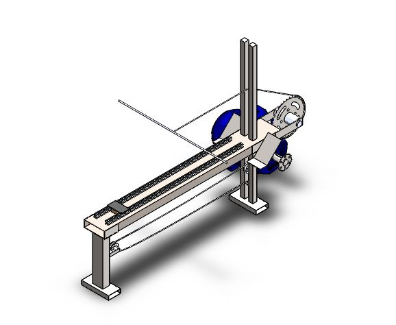
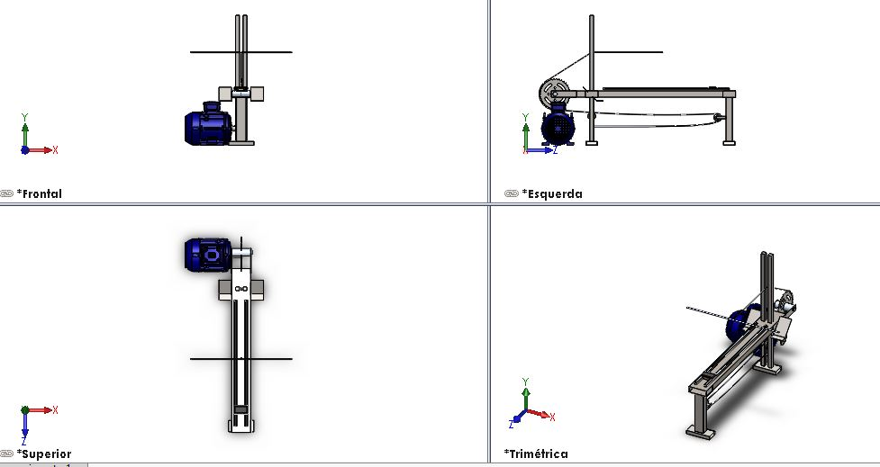
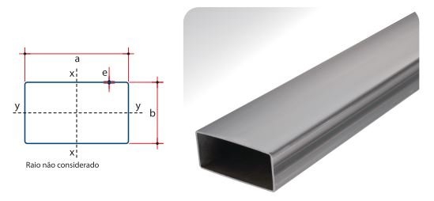
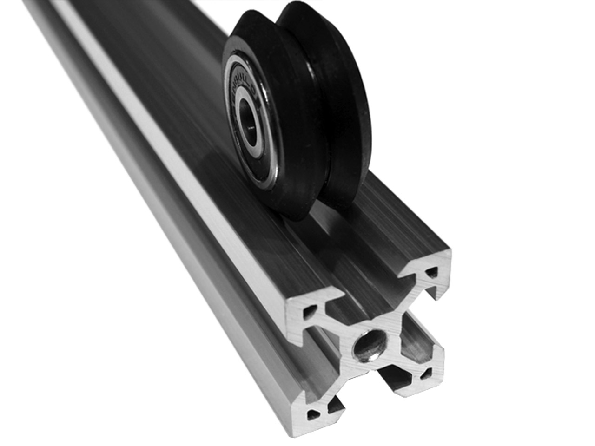
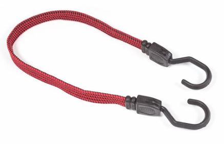

## Características do Produto

<!--
Jonathan: [OK]
-->

### Características de 2RBoat

2RBoat é uma estrutura de remo _indoor_ composta por:

* Um cavalete;
* Um trilho no cavalete para a movimentação suave do assento;
* Um assento ergonômico;
* Uma base ajustável para os pés do atleta;
* Uma corda de alta resistência;
* Suportes para os sistemas;
* Cabos de transmissão de força.

{#fig:2rboat}

{#fig:2rboat_iso}

#### 2RB-Primary  

A estrutura física primária do equipamento composta pela trave que contem os demais subsistemas. O perfil dessa trave, que é a maior parte dos esforços da estrutura, está representado na [@fig:2rb-primary].

{#fig:2rb-primary}

#### 2RB-Seat  

A estrutura de acomodação do usuário, é ligada a estrutura primária por um trilho que permite movimento. A [@fig:2rb-seat] descreve o perfil que será utilizado no trilho para receber o banco.

{#fig:2rb-seat}

#### 2RB-Row

Formada por um conjunto de polias e correias que transmitem o movimento da remada e do sistema de restituição feito por cordas elásticas. A [@fig:2rb-row] ilustra o que tem no mercado no que tange sistemas de restituição. A [@fig:2rb-row_2] descreve o outro componente que será utilizado nesse sistema.

![Conjunto para transmissão de força^[Fonte: http://www.riffel.com.br/kit-relacao-transmissao-suzuki-gsr-150i-13-42z-x-15z-c-corrente-428h-x-116l-premium/p]](imagens/Conjunto_Relacao.JPG){#fig:2rb-row}

{#fig:2rb-row_2}

#### 2RB-Case

Estrutura que abriga os componentes eletrônicos responsáveis pelo controle dos sistemas embarcados.

### Características de 2RPower

O sistema planejado para gerar uma carga variável para a remada do atleta será baseado em um Dinamômetro Eletrônico.

Quando o gerador opera sem carga (resistência), haverá uma tensão induzida, mas nenhuma corrente. Ao inserirmos uma carga, uma corrente passará a circular pelas bobinas do gerador e pela carga. Com isso, o gerador deve gerar energia para alimentar a carga.

Quanto mais corrente exigida, mais força será necessária para girar o eixo do gerador.

Partindo desse princípio, o movimento que simula a remada do atleta irá puxar um cabo que será conectado a um gerador, que por sua vez irá gerar uma potência que será dissipada no banco de resistores.

O banco de resistores será útil para regular a corrente e consequentemente a força necessária para que o atleta realize o exercício.

O controlador de carga que irá carregar a bateria e alimentar o sistema será acoplado em paralelo com o módulo de resistores.

#### 2RP-Generator

Os critérios considerados para escolher os geradores foram:

* Preço;
* Facilidade de acesso;
* Necessidade de poucas adaptações;
* Geração de energia em baixas rotações.

Considerando esses critério, dois sistemas foram selecionados como soluções para a geração de energia: o alternador automotivo ([@fig:alter]) e um motor de esteira ergométrica ([@fig:motorest]).

{#fig:alter}

{#fig:motorest}

O motor de esteira pode ser usado no modo gerador, e dentre os critérios de seleção ele foi o mais viável economicamente e tecnicamente. Dessa forma ele é o mais indicado para confecção do sistema.

#### 2RP-Resistance

Sabendo a potência máxima possível que pode ser obtida com a remada do atleta, poderemos dimensionar a potência que os resistores e os relés irão ter que suportar.

O sistema será composto por:

* 3 relés que irão controlar os níveis de resistência
* 3 resistores que irão controlar a corrente do gerador

Usaremos relés de caminhão (80A) ou de carro (40A). Estamos considerando usar resistores de chuveiro elétrico ou de fornos elétricos. A determinação da corrente suportada pelos relés e da potência suportada pelos resistores dependerá da determinação da potência da remada do atleta.

Usaremos uma margem de segurança de 100% para dimensionar os resistores e relés.

Os níveis do exercício será acionado pelo 2RElectronic de acordo com a figura [@fig:circuitobr].

{#fig:circuitobr}

#### 2RP-Battery

O armazenamento de energia será realizado por meio da utilização de uma bateria, o qual será feito por um controlador de carga acoplado em paralelo com o módulo de resistores. Dessa forma, o sistema de armazenamento será capaz de alimentar o sistema eletrônico aproveitando a energia gerada pela movimentação do atleta durante o ciclo de remada.

### Características de 2REletronic

![Diagrama_Eletrônica^[Fonte: do autor]](./imagens/diagrama_eletronica.png){#fig:Diagrama_Eletrônica}

#### Características do 2RE-Suit

O 2RE-Suit é um subproduto de eletrônica e sua aplicação se baseia em medições de posição das pernas através do 2RE-IMU e do 2RE-CARDIO, respectivamente sendo os produtos de **Subsistema de unidade de medidas inerciais** e **Subsistema monitor de frequência cardíaca**.

#### 2RE-Cardio - Subsistema Monitor de Frequência Cardíaca

É o subsistema responsável pela aquisição dos dados de frequência cardíaca do atleta que está utilizando o aparelho de remo.

![Sensor_Cardiaco^[Fonte:https://www.filipeflop.com/produto/sensor-de-frequencia-cardiaca/ ]](./imagens/sensor_cardiaco.jpg){#fig:Sensor_cardiaco}

Suas principais características são:

* **Característica 2RE-Cardio-1**: É composto pelo sensor de frequência cardíaca 4MD69 e por um microcontrolador;
* **Característica 2RE-Cardio-2**: Pode necessitar de condicionamento de sinal;
* **Característica 2RE-Cardio-3**: O sensor utilizado apresenta baixo consumo de energia (cerca de 4 mA) e tensão de operação de 3 a 5 V;
* **Característica 2RE-Cardio-4**: A transmissão dos dados pode ser feita via cabos ou _wi-fi_;
* **Característica 2RE-Cardio-5**: Tem comunicação com o 2RE-Kernel.

Suas principais funcionalidades são:

* **_Feature_ 2RE-Cardio-1**: Aquisição dos sinais cardíacos do usuário do remo;
* **_Feature_ 2RE-Cardio-2**: Condicionamento do sinal para tratamento de ruídos;
* **_Feature_ 2RE-Cardio-3**: Transmissão do sinal para o subsistema 2RE-Kernel.

O MSP 430, será um dos microcontroladores utilizados, isso porque comporta um conversor analógico/digital de 10 bits, além de possuir baixo consumo de corrente causado, devido a forma de trabalho da CPU, da ordem de 0,1µA. A tensão de operação é baixa, o permite que opere de 1,8V a 3,6V. Esse microcontrolador é utilizado para desenvolver atividades complexas tendo em vista as instruções objetivas em um período de tempo relativamente pequeno. Ele utiliza um barramento de 16 bits, o endereçamento é permitido para qualquer operação o que facilita o processo de compilação. Os registrados usados para diversas atividades vão de R4 a R15.

O MSP apresenta um sistema de clock, sendo o Timer_A o mais completo e mais usado.

![MSP430^[Fonte: https://www.embarcados.com.br/msp430-com-iar/]](./imagens/msp430.jpg){#fig:MSP_430}

#### 2RE-IMU - Subsistema de Unidade de Medidas Inerciais

É o subsistema responsável por adquirir medidas por meio dos IMU's alocados nas pernas do atleta para saber a posição exata do movimento e poder comparar com modelos padrões para ajustar a execução da remada.

Suas principais características são:

* **Característica 2RE-IMU-1**: Composto por sensores de unidades de medida inerciais MPU-5091 e um microcontrolador;
* **Característica 2RE-IMU-2**:  Pode ser necessário condicionar o sinal;
* **Característica 2RE-IMU-3**: Comunica com o 2RE-Kernel;
* **Característica 2RE-IMU-4**: Transmissão dos sinais é feita com cabos;
* **Característica 2RE-IMU-5**: Alocado por meio de elásticos com velcro em pontos da coxa e panturrilha.

Suas principais funcionalidades são:

* **_Feature_ 2RE-IMU-1**: Sensor capaz de medir por meio do acelerômetro, magnetômetro e giroscópio a posição e ângulo em que a parte monitorada da perna está;
* **_Feature_ 2RE-IMU-2**: Medição do ângulo na perna posterior ao joelho;
* **_Feature_ 2RE-IMU-3**: Transmissão dos dados para o 2RE-Kernel;
* **_Feature_ 2RE-IMU-4**: Cada ciclo de remada possui uma postura adequada, para iniciantes no remo é importante que as devidas correções nesse quesito sejam realizadas para que o rendimento seja garantido.

#### 2RE-Volt - Subsistema Medidor de Tensão nas Cargas do Gerador

Subsistema responsável por obter a tensão nas cargas do gerador e transmitir a informação para o 2RE-Kernel para obtenção da potência elétrica e tratamento para obtenção do valor de potência mecânica realizada durante o ciclo de remada.

Suas principais características são:

* **Característica 2RE-Volt-1**: Composto por um conversor analógico-digital, um circuito e um microcontrolador;
* **Característica 2RE-Volt-2**: Comunica com o 2RE-Kernel;
* **Característica 2RE-Volt-3**: Mínima interferência no valor das cargas presentes no gerador;
* **Característica 2RE-Volt-4**: Resolução da conversão binária feita conforme a necessidade de exatidão.

Suas principais funcionalidades são:

* **_Feature_ 2RE-Volt-1**: Quando o 2RP-Generator é ativado, a medida da tensão nas cargas começa a ser realizada e ocorre a conversão para binário;
* **_Feature_ 2RE-Volt-2**: A transmissão para o 2RE-Kernel é feita por meio de cabos;

#### 2RE-Relay - Subsistema Controlador dos Relés Ativadores das Cargas no Gerador

Subsistema que controla, a partir da escolha realizada pelo 2RE-UI, os relés chaveados nas resistências dos geradores para aumentar e diminuir o esforço a ser realizado pelo atleta durante o movimento de remo.

Suas principais características são:

* **Característica 2RE-Relay-1**: Composto por um circuito de conversão de sinal analógico para digital e um microcontrolador;
* **Característica 2RE-Relay-2**: Utiliza componentes eletrônicos para o funcionamento;
* **Característica 2RE-Relay-3**: Transmissão por meio de fios;
* **Característica 2RE-Relay-4**: Comunica com o 2RE-Kernel.

Suas principais funcionalidades são:

* **_Feature_ 2RE-Relay-1**:  A partir da requisição do atleta nos botões do 2RE-UI e transmitido para o 2RE-Kernel, o comando para chavear os relés e mudar a carga presente no 2RP-Generator é recebido;
* **_Feature_ 2RE-Relay-2**: Cada relé será responsável por acionar a atuação de um nível de carga, ou seja, essa carga a pincípio é controlada.

#### 2RE-Kernel - Subsistema da Central de Processamento de Eletrônica

Subsistema que processa todas as informações de sensores do 2RE-Cardio, do 2RE-IMU, dos botões do 2RE-UI e do 2RE-Volt, processa e transmite os sinais para os atuadores do 2RE-Relay e para o 2RS-Receiver.

Suas principais características são:

* **Característica 2RE-Kernel-1**: Composta por uma Raspberry Pi 3 e os cabos de entrada e saída para os diversos sensores e atuadores;
* **Característica 2RE-Kernel-2**: Composta por Microcontrolador ESP 8266;
* **Característica 2RE-Kernel-3**: Processa as informações sem atraso significativo;
* **Característica 2RE-Kernel-4**: Alocada no 2RB-Case.

Suas principais funcionalidades são:

* **_Feature_ 2RE-Kernel-1**: Recebe os sinais do 2RE-Cardio;
* **_Feature_ 2RE-Kernel-2**: Recebe os sinais do 2RE-IMU;
* **_Feature_ 2RE-Kernel-3**: Recebe os sinais do 2RE-Volt;
* **_Feature_ 2RE-Kernel-4**: Recebe os sinais do 2RE-UI;
* **_Feature_ 2RE-Kernel-5**: Envia os comandos para chaveamento do 2RE-Relay;
* **_Feature_ 2RE-Kernel-6**: Envia sinais para o 2RE-Receiver.

Detalhando um pouco mais a solução, para atuar na captação e processamento de sinais a Raspberry será fundamental, integrada com outros dispositivos como MSP430, circutos de condicionamento, será possível adquirir sinais analógicos. Visto que a Raspberry não possui conversor A/D pode-se utilizar o conversor do MSP430. Para transmitir os sinais para a Raspberry uma ideia foi utilizar um protocolo de comunicação ou um módulo _wi-fi_. O ESP8266 é um microcontrolador com um processamento considerável para a aplicação em questão e possui um excelente diferencial, o módulo _wi-fi_ acoplado. Além disso já traz consigo, conversor analógico-digital (ADC) e vários protocolos de comunicações, isso traria ao sistema versatilidade para aquisição e trato de sinais.

![Raspberry Pi 3^[Fonte: https://www.raspberrypi.org/products/raspberry-pi-3-model-b/]](./imagens/Raspberry.jpg){#fig:Raspberry_Pi_3}

![ESP8266^[Fonte: https://www.robocore.net/loja/produtos/nodemcu-esp8266-12-v2.html]](./imagens/esp8266.jpg){#fig:ESP_8266}

#### 2RE-UI - Subsistema de Interface de Botões

Subsistema alocado com botões próximos à interface de vídeo (monitor) com o usuário para que o mesmo possa controlar o aumento e diminuição das cargas no gerador, chaveadas pelo 2RE-Relay e assim poder aumentar e diminuir o esforço na aplicação do movimento do remo.

Suas principais características são:

* **Característica 2RE-UI-1**:  Composta por botões e um circuito para _debouncer_;
* **Característica 2RE-UI-2**: Transmissão do sinal via cabos;
* **Característica 2RE-UI-3**: Comunicação com o 2RE-Kernel.

Suas principais funcionalidades são:

* **_Feature_ 2RE-UI-1**:  Receber a informação do usuário do desejo de mudar o peso nas cargas;
* **_Feature_ 2RE-UI-2**: Tratar o sinal com _debouncer_ para que não haja duplo aperto tanto na falha de leitura, quanto na recepção do sinal ao clicar no _push-button_;
* **_Feature_ 2RE-UI-3**: Transmitir o sinal do usuário para o 2RE-Kernel;

### Características de 2RSystem

A arquitetura do subproduto de _software_ do projeto, de nome **2RSystem**, é definida por um conjunto de subsistemas encapsulados, de tal forma que cada um realize suas tarefas específicas e, quando necessário, troquem dados e informações entre sí.

Levando a arquitetura em conta, foram projetados 5 subsistemas:

* **Subsistema de Controle** (**2RS-Controller**);
* **Subsistema de Aquisição de Dados** (**2RS-Receiver**);
* **Subsistema de Processamento** (**2RS-Processer**);
* **Subsistema de Visualização de Performance** (**2RS-Viewer**) e;
* **Subsistema Atuador** (**2RS-Transmitter**).

A interação entre eles pode ser visualizada na diagramação a seguir:

![Arquitetura de Software^[Fonte: Do autor.]](./imagens/arquitetura_software2.png){#fig:arquiteturasoftware}

#### 2RS-Controller - Subsistema de Controle

Este subsistema é responsável por intercambiar dados, informações e tarefas entre os outros subsistemas. 2RS-Controller é um delegador de tarefas que tem ciência de todas as operações que acontecem no 2RSystem.

Suas principais características são:

* **Característica 2RS-Controller-1**: É um _software_ embarcado na 2Row;
* **Característica 2RS-Controller-2**: Possui otimização de uso de memória;
* **Característica 2RS-Controller-3**: Não utiliza armazenamento de dados em disco rígido;
* **Característica 2RS-Controller-4**: Possui interface de comunicação com todos os outros subsistemas do 2RSystem;
* **Característica 2RS-Controller-5**: Seu código-fonte é modularizado através do SRP (_Single-Responsibility Principle_, Príncipio da Responsabilidade Única);
* **Característica 2RS-Controller-6**: Sua estrutura é definida de acordo com o _design pattern Delegation_.

Suas principais funcionalidades são:

* **_Feature_ 2RS-Controller-1**: Receber informações do 2RS-Receiver sobre requisições de início de treino e inicializar todos os subsistemas do 2RSystem;
* **_Feature_ 2RS-Controller-2**: Receber informações do 2RS-Receiver sobre requisições de fim de treino e inicializar as ações de restauração para o estado inicial de todos os subsistemas do 2RSystem;
* **_Feature_ 2RS-Controller-3**: Receber informações do 2RS-Receiver sobre requisições de mudança da carga de dificuldade e delegar para o 2RS-Transmitter;
* **_Feature_ 2RS-Controller-4**: Receber informação do 2RS-Receiver sobre a carga de dificuldade atual e transmitir a informação para o 2RS-Processer;
* **_Feature_ 2RS-Controller-5**: Receber informações do 2RS-Receiver sobre os sensores cinemáticos/cinéticos e delegar o processamento para o 2RS-Processer;
* **_Feature_ 2RS-Controller-6**: Receber informações processadas pelo 2RS-Processer e delegar a apresentação para o 2RS-Viewer.

#### 2RS-Receiver - Subsistema de Aquisição de Dados

Este subsistema é responsável por receber e preprocessar, se necessário, os dados oriundos dos sensores cinemáticos e cinéticos e dos botões de ação presentes na interface do 2Row. Após tais etapas, os dados são, então, repassados para o 2RS-Controller, este que direciona os dados ao subsistema responsável pelas próximas tarefas do 2RSystem.

Suas principais características são:

* **Característica 2RS-Receiver-1**: É um _software_ embarcado na 2Row;
* **Característica 2RS-Receiver-2**: Possui otimização de uso de memória;
* **Característica 2RS-Receiver-3**: Não utiliza armazenamento de dados em disco rígido;
* **Característica 2RS-Receiver-4**: Possui interface de comunicação com o 2RS-Controller;
* **Característica 2RS-Receiver-5**: Possui interface para receber dados do 2RE-Suit;
* **Característica 2RS-Receiver-6**: Possui interface para receber dados dos botões de ação do 2RE-UI, entregue pelo 2RE-Kernel;
* **Característica 2RS-Receiver-7**: Possui interface para receber dados sobre a potência do atleta, entrege pelo 2RE-Kernel;
* **Característica 2RS-Receiver-8**: Possui interface para receber dados do 2RE-Kernel;
* **Característica 2RS-Receiver-9**: Seu código-fonte é modularizado através do SRP (_Single-Responsibility Principle_, Príncipio da Responsabilidade Única);

Suas principais funcionalidades são:

* **_Feature_ 2RS-Receiver-1**: Receber dados dos botões de ação do 2RE-UI, entregue pelo 2RE-Kernel, convertê-los em modelo e transmitir a informação para o 2RS-Controller;
* **_Feature_ 2RS-Receiver-2**: Receber dados do sensor de potência, entregue pelo 2RE-Kernel, convertê-los em modelo e transmitir a informação para o 2RS-Controller;
* **_Feature_ 2RS-Receiver-3**: Receber dados do 2RE-Suit, convertê-los em modelo e transmitir a informação para o 2RS-Controller;
* **_Feature_ 2RS-Receiver-4**: Receber dados do controlador de carga, entregue pelo 2RE-Kernel, convertê-los em modelo e transmitir a informação para o 2RS-Controller;

#### 2RS-Processer - Subsistema de Processamento

Este subsistema é responsável por processar e calcular dados transmitidos pelo 2RS-Controller, principalmente sobre o desempenho do atleta. Os dados processados são devolvidos para o 2RS-Controller, este que direciona para o subsistema do 2RSystem responsável pelo uso dos dados processados.

Suas principais características são:

* **Característica 2RS-Processer-1**: É um _software_ embarcado na 2Row;
* **Característica 2RS-Processer-2**: Possui otimização de uso de memória;
* **Característica 2RS-Processer-3**: Possui otimização em termos de complexidade de algoritmos;
* **Característica 2RS-Processer-4**: Possui interface de comunicação com o 2RS-Controller;

Suas principais funcionalidades são:

* **_Feature_ 2RS-Processer-1**: Receber informações do 2RS-Controller sobre as métricas do atleta e definir a performance do atleta;
* **_Feature_ 2RS-Processer-2**: Definir o modelo de performance ideal;
* **_Feature_ 2RS-Processer-3**: Comparar a performance do atleta com o modelo de performance ideal;
* **_Feature_ 2RS-Processer-4**: Realizar cálculos de renderização e conversões lineares da performance do atleta e da performance ideal para um modelo de animação do corpo humano;
* **_Feature_ 2RS-Processer-5**: Gerar estatísticas relevantes para o contexto do projeto;
* **_Feature_ 2RS-Processer-6**: Transmitir as informações processadas para o 2RS-Controller.

#### 2RS-Viewer - Subsistema de Visualização de Performance

Este subsistema é responsável por tornar visível as informações de interesse do atleta, as quais são providas pelo 2RS-Controller.

Suas principais características são:

* **Característica 2RS-Viewer-1**: É um _software_ embarcado na 2Row;
* **Característica 2RS-Viewer-2**: Possui interface para receber dados do 2RS-Controller;
* **Característica 2RS-Viewer-3**: Possui interface para transmitir dados para o _hardware_ de visualização (monitor);
* **Característica 2RS-Viewer-4**: Utiliza um motor (_engine_) para renderizar a interface gráfica de usário (GUI - _Graphic User Interface_).

A GUI é definida pelas seções:

* **_Feature_ 2RS-Viewer-1**: De apresentação do movimento atual do atleta;
* **_Feature_ 2RS-Viewer-2**: De apresentação do movimento ideal;
* **_Feature_ 2RS-Viewer-3**: De apresentação dos batimentos cardíacos;
* **_Feature_ 2RS-Viewer-4**: De apresentação da potência atual do atleta;
* **_Feature_ 2RS-Viewer-5**: De apresentação da velocidade atual do atleta, em $rev/min$ (RPM - _rotations per minute_);
* **_Feature_ 2RS-Viewer-6**: De apresentação do nível atual da carga de dificuldade;
* **_Feature_ 2RS-Viewer-7**: De apresentação do tempo de treino do atleta.

#### 2RS-Transmitter - Subsistema Atuador

Este subsistema é responsável por enviar sinais para os microcontroladores eletrônicos responsáveis pela ação de mudança da carga de dificuldade requisitada pelo atleta através dos botões no 2RE-UI.

Os pedidos de mudança (i.e., o aperto de botões) são, primeiramente, recebidos pelo 2RS-Receiver, repassados para o 2RS-Controller e, então, delegados para este subsistema.

Suas principais características são:

* **Característica 2RS-Transmitter-1**: É um _software_ embarcado na 2Row;
* **Característica 2RS-Transmitter-2**: Possui interface para receber dados do 2RS-Controller;
* **Característica 2RS-Transmitter-3**: Possui interface para transmitir dados para o 2RE-Kernel;

Sua principal funcionalidade é:

* **_Feature_ 2RS-Transmitter-1**: Receber o fator de mudança de carga de dificuldade da 2RS-Controller, serializar o fator e transmitir o fator para o 2RE-Kernel.
