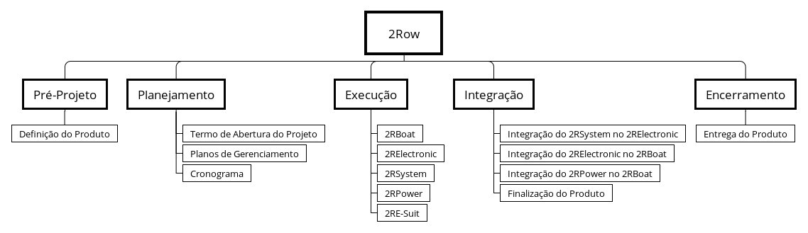

# Estrutura Analítica do Projeto

A Estrutura Analítica do Projeto (EAP) é um processo de subdivisão das entregas do projeto em componentes menores e mais facilmente gerenciáveis, que fornece uma visão estruturada do que será entregue, o que facilita o entendimento das partes interessadas em relação ao escopo do projeto além de servir como base no planejamento das outras áreas de conhecimento.

O projeto será desenvolvido dentro da disciplina de Projeto Integrador 2, que se subdivide em 3 pontos de controle. Para o primeiro ponto de controle serão executadas as etapas de Pré-projeto e Planejamento, que tem como objetivo a definição do produto, o Termo de Abertura do Projeto, os planos de gerenciamento e o cronograma.

Já o segundo ponto de controle contempla a fase de Execução onde todos os subsistemas planejados inicialmente serão desenvolvidos e testados para garantir o seu total funcionamento de acordo com as necessidades do projeto. Para esse ponto de controle, nomeamos os subsistemas relacionando o nome do subsistema com a atividade que o mesmo vai desenvolver.

Por fim, o terceiro ponto de controle engloba a fase de Integração e Encerramento do projeto, onde todos os subsistemas serão integrados a fim de finalizar e entregar o produto.

{#fig:eap}
