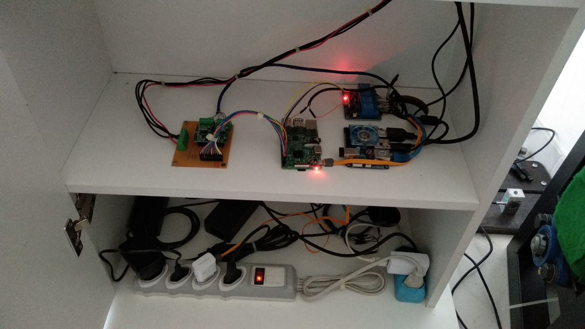

## Integração – 2RBoat/2RElectronic

O sistema 2RE-Watt foi alocado sob os apoios dos pés que o usuário tem na estrutura exatamente para captar a força realizada durante o movimento. foi contruido uma estrutura de apoio em que a célula ficou posicionada com um ângulo de 45 graus em relação a estrutura de perfil. Esse ângulo foi utilizado para o cálculo da força. A lixa 
que localiza-se na superfície permite que o pé do atleta não deslize, proporcionando maior estabilidade. O velcro localizado penas na parte superior permite que a parte inferior dos pés possa se movimentar para alcançar maior amplitude da remada.
Um cabo saiu de cada célula de carga e foi dirigido até o case de maneira que não fosse possível notar esse percurso do cabo para que a estética da estrutura ficasse o mais profissional possível. Ao realizar os testes com a célula de carga no local, foi possível calibrá-la pois os apoios dos pés têm um peso e isso deve ser descontado. Todas as leituras são feitas pela Raspberry e então passam para o Kernel as informações de força e são transformadas em potência por meio do software embarcado.

{width=290 height=295px}

Para a disposição dos componentes eletrônicos, para que os fios não ficassem espalhados e pudessem ter um bom funcionamento sem possíveis danos e mal contatos, foi desenvolvido o case, ele dispõe de parteleiras, em que foi possível acoplar todos os fios, módulo relé, placa de conexão, raspberry Pi 3, botões e o visualizador. Desse modo, os componentes ficaram organizados e livremente distribuidos. A Figura XX apresenta  a parte externa do case e a Figura XX mostra o interior com os componentes eletrônicos em seus lugares específicos.

{width=290 height=295px}
