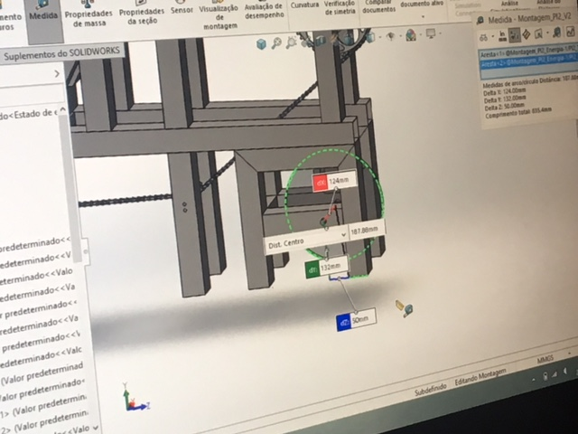
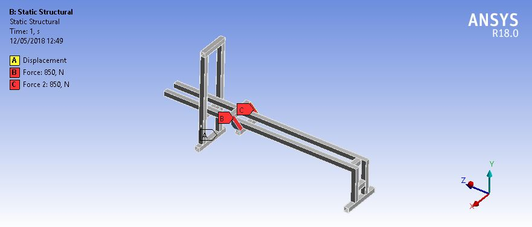
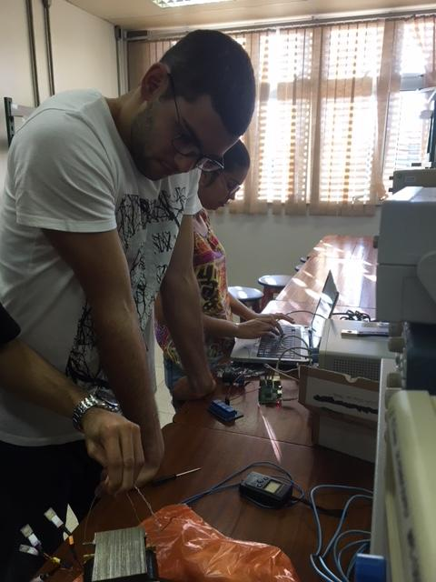
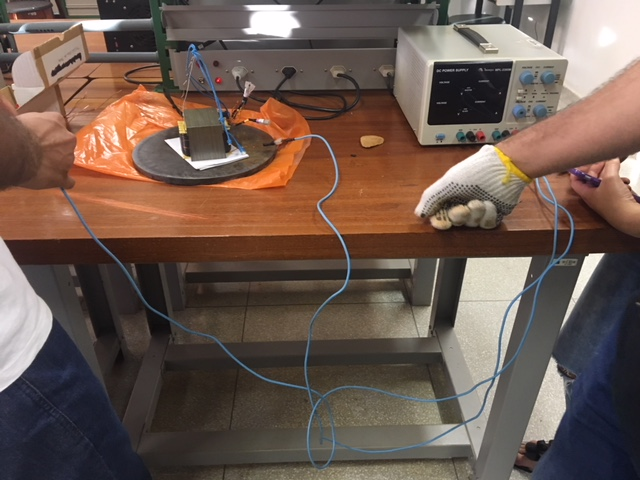
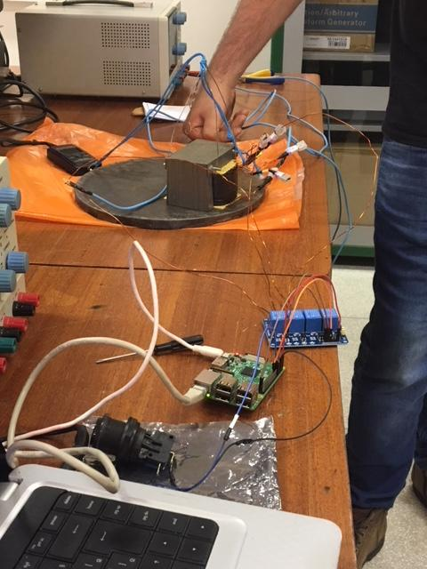

# Plano de Integração

## Integração – 2RBoat/2RPower

A integração do sistema de estrutura com o sistema energia baseou-se nos vínculos da estrutura primária com o disco que compõem o freio eletromagnético e os eletroímas. O atleta irá puxar uma barra conectada a um sistema de catracas e coroas por uma corrente de bicicleta. Esse sistema tem o intuito de reduzir a força aplicada pelo atleta no freio eletromagnético. Além disso o acoplamento entre as duas áreas mostrou-se afinado durante todo o ponto de controle 2, justificado pela modelagem do sistema de energia com o auxílio da equipe de estrutura.

{#id .class width=290 height=295px}

## Integração – 2RBoat/2RElectronic

 A integração do sistema de eletrônica com estrutura consiste em duas situações. A primeira trata-se da estrutura, a qual supotará as células de cargas (Estrutura de apoio aos pés), adequada para comportar o sensor e a passagem dos fios do mesmo. A segunda, trata-se do fornecimento da estrutura do case para alocar os sistemas emcados, incluindo os botões, a raspberry Pi 3 e os demais sistemas da parte de software.

 Ademais, para validar o cálculo da força de reação para dimensionar a célula de carga, o sistema 2RBoat fez a simulação estática da força para o aparato dos pés, apresentado na figura [@fig:simuforca], observou-se que essa estrutura, suporta em cada lado uma força de 850 N. A força máxima é de aproximadamente 848 N para, vale ressaltar que o cálculo foi feito para a potência máxima de remada (600 W).

{#fig:simuforca}

## Integração - 2RElectronic/2RPower

A integração do sistema de eletrônica com energia se baseia em fazer as conexões necessárias para chavear as bobinas utilizando o circuito com relés já mencionados anteriormente, testes já foram feitos para o acionamento de cada bobina separadamente e eles se mostraram bem executados.

O acionamento será realizado conforme demonstrado no diagrama a seguir.

![reles^[Fonte: Do_autor]](imagens/reles.png){#fig:Reles}

Adiante, podemos observar a realização dos testes de acionamento dos níveis.

{#fig:integracao_electronic_power1}

{#id .class width=290 height=295px}

{#id .class width=290 height=370px}

## Integração – 2RElectronic/2RSystem

A troca de informação entre Eletrônica e software é bastante importante para o correto funcionamento do projeto. Essa relevância se dá pelo fato de ocorrer a troca de várias informações referentes ao desenvolvimento do atleta.
Será entregue a parte de software os dados referêntes as IMU's, um tempo de ciclo, a potência desenvolvida pelo atleta e os estados dos botôes. A interação entre esses dados entregues tratá como retorno as ações que o kernel deverá delegar aos dispositivos as tarefas relacionadas ao movimento.

O vetor enviado como uma mensagem para software tem o seguinte formato:
vetor[]=(accelx1, accely1, accelz1, girox1, giroy1, giroz1, magnx1, magny1, magnz1, accelx2, accely2, accelz2, girox2, giroy2, giroz2, magnx2, magny2, magnz2, pot, t, estado 1,estado2,estado3)

### Paho Client
Toda a comuniação entre o Kernel e a parte de software será feita usando o paho client. Ele já tem métodos especificos para que essa comunicação eficiente.
