# Plano de Integração

## Integração – 2RBoat/2RPower

A integração do sistema de estrutura com o sistema energia baseou-se nos vínculos da estrutura primária com o disco que compõem o freio eletromagnético e os eletroímãs. O atleta irá puxar uma barra conectada a um sistema de catracas e coroas por uma corrente de bicicleta. Esse sistema tem o intuito de reduzir a força aplicada pelo atleta no freio eletromagnético. Além disso, o acoplamento entre as duas áreas mostrou-se afinado durante todo o ponto de controle 2, justificado pela modelagem do sistema de energia com o auxílio da equipe de estrutura.

{width=290 height=295px}

### Dimensionamento da transmissão

Tendo a natureza interativa do processo de desenho de uma transmissão, foi decidido utilizar os livros Elementos de Máquina de Shigley 8 ed de BUDYNAS e KEITCH além do Projeto de engenharia mecânica de SHIGLEY, MISCHKE e BUDYNAS.

Seguindo as necessidades da mudança do projeto, foi necessário criar um sistema de transmissão de potência, utilizando o atleta como fonte. Segundo BUDYNAS, O desenho de um sistema para transmitir potência requer atenção ao desenho e seleção de componentes individuais (engrenagens, mancais, eixo, etc). Contudo, como é frequente no caso do projeto, esses componentes não são independentes.

Não há uma sequência precisa de passos para qualquer processo de projeto. Por natureza, projetar é um processo iterativo, é necessário fazer algumas escolhas de teste, construir um esqueleto de um projeto e determinar quais partes do desenho são críticas. Contudo, bastante tempo pode ser economizado ao entendermos as dependências entre as partes do problema, permitindo ao desenhador saber quais partes serão afetadas por qual mudança dada.

#### Especificação do problema

Tendo em mente as necessidades pertinentes que a natureza do projeto determina, algumas especificações foram levantadas, e a solução proposta deve comportar esses requerimentos:

* Força de entrada é transmitida por corrente;
* Movimento tracionado somente no sentido da puxada, sentido da restituição livre;
* Mínimo de dois estágios;
* As relações de torque e diâmetro das rodas dentadas e disco de freio já determinados;
* Disco de freio deve ficar a aproximadamente 2 mm dos eletroímãs;
*Geralmente níveis de choque baixos, ocasionalmente choques moderados;
* Vida dos mancais > 12 000 horas;
* Eixo com vida infinita;

Baseado no Cap 18 - 1 SEQUENCIA DE PROJETO PARA TRANSMISSÂO DE POTENCIA, foi criado um resumo contendo cada passo crucial do projeto da transmissão.

* Projeto inicial, escolha do tipo de transmissão;
* Especificação das rodas;
* Disposição do Eixo, localização axial das rodas dentadas (Coroas), Cilindro (Disco de freio) e mancais;
* Analise de forças, diagrama de corpo livre, força cortante e momento fletor para os eixo;
* Seleção do material do eixo, desenho de fadiga depende do material;
* Desenho do eixo por tensão, de fadiga e estática, estimativa do diâmetro do eixo;
* Desenho do eixo por deflexão;
* Seleção de mancais;
* Analise final.

#### Projeto Inicial

 A máquina de remo proposta tem como característica o funcionamento cíclico em baixas velocidades por conta da tração humana, por essa questão foi decidido utilizar correntes de rolo como método de transmissão de forças. Segundo MACHADO, corrente de rolos é um meio altamente eficiênte e versátil para transmitir potência mecânica. O método de funcionamento consiste em uma roda dentada motriz e uma roda dentada movida por um lance de correntes.

{width=290 height=295px}

Segundo SHIGLEY, as características básicas das transmissões de corrente incluem razão constante, visto que nenhum deslizamento ou deformação lenta estão envolvidas, e vida longa. A corrente é tão flexível como as correias e tão eficiênte como as engrenagens, e possuem as seguintes vantagens que foram consideradas para aplicação desse método no produto:

* Versatilidade de operação;
* Absorvem choques devido a película de óleo entre seus componentes e sua elasticidade;
* Leve e compacta, melhor relação de peso x potência por Cavalo Vapor transmitido;
* Maior durabilidade, distribuição de cargas entre os vários dentes da engrenagem. Garante longa vida útil a corrente.
* Facilidade de manutenção e instalação;
* Possibilidade da compra do kit de corrente roda dentada com maior facilidade.

#### Especificação das rodas dentadas

Para atingir a potência necessária exigida pelo 2R-Power, foi especificado os raios e os torques dos elementos que compõem a transmissão. As rodas dentadas foram escolhidas seguindo essas especificações da [@tbl:roda_dentada].
 
| Elemento    | R1 (Disco)   | R2    | R3      | R4      |
|-------------|------|------|--------|--------|
| Raio(mm)    | 135  | 34,5 | 100    | 34,5   |
| Toque (N.m)      | 43,5 | 43,5 | 130,06 | 130,06 |
| Massa (kg)  | 6    | 0.5  | 0.75   | 0.5    |

:Especificações da roda dentada. {#tbl:roda_dentada}

Com os diâmetros especificados, foi decidido utilizar rodas dentadas de bicicleta que atendiam as dimensões do projeto e são de fácil aquisição. Duas coroas de 16 dentes e 1 de 52 dentes, mantendo uma relação aproximada de 1:3.

#### Disposição dos eixos

Segundo SHIGLEY, o posicionamento axial de componentes é frequentemente ditado pela posição do compartimento e por outros componentes engrenantes. Em geral, é melhor suportar componentes condutores de carga entre mancais, em vez de em balanço fora dos mancais. Os eixos devem ser mantidos curtos para minimizar momentos fletores e deflexões e seus componentes devem ser situados acuradamente no eixo para alinhar totalmente com outros componentes.

Os eixos de transmissão do 2Row tem como princípio de disposição a posição do pinhão que recebe a tração humana, esta roda dentada foi posicionada mais ao centro possível. A partir dessa posição foi feito um esboço da disposição dos componentes, cada eixo terá 4 componentes sendo duas rodas dentadas e dois mancais com rolamento no primeiro estágio e uma roda dentada, um disco de freio e dois mancais com rolamentos no segundo estágio. O Primeiro estagio será tratado a parte dessa metodologia.

##### primeiro estagio da transmissão 

Por uma questão de facilidade de compra e custo x beneficio, foi decidido que o primeiro estagio da transmissão seria composta por um cubo traseiro de bicicleta com uma catraca acoplada uma extremidade e na outra ponta do cubo seria instalado a roda dentada de 52 dentes. A escolha do cubo se dá ao fato de ele já vir montado com os rolamentos, fuso e principalmente com o roscado para os padrões de rodas dentadas de bicicleta.

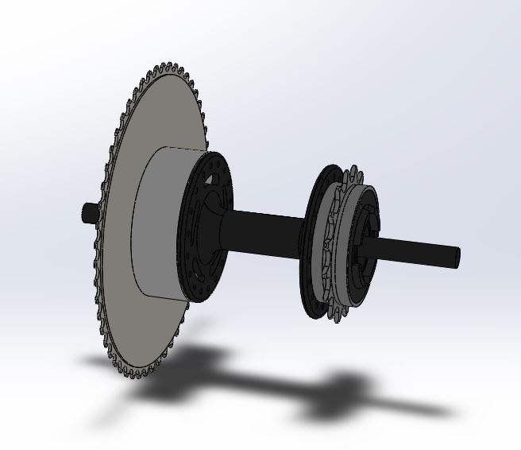{width=290 height=295px}

Para a montagem da roda dentada de 52 dentes, foi fabricado uma flange em poliacetal ,Polióxido de metileno. O poliacetal é um termoplástico de alta rigidez e tem sua utilização na engenharia difundida por suas características, sendo algumas: elevada rigidez, excelente estabilidade dimensional, boa usinabilidade, resistência mecânica, absorção de vibrações e baixa densidade.

O projeto da flange tem como requerimento:

* Diametro suficiente para parafusar uma extremidade no cubo;
* Escalonamento de diametro igual ao diametro interno da roda dentada;
* Furos internos que permitam a montagem no cubo mas que essa montagem não gere resistência ao giro do conjunto do cubo-roda dentada.

{width=290 height=295px}

Partindo desses requerimentos foi feito um esboço de uma flange, dimensões na figura acima, com 5 furos M3.5 para parafuso Allen de cabeça arredondada além do rebaixo. E nesse rebaixo foi desenhado uma rosca métrica fina de passo 1.5, para fixação da roda dentada com uma porca. A fabricação se deu no galpão da FGA, executada pelo técnico Clovis.

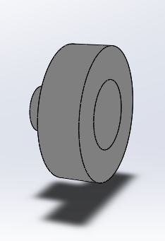{width=290 height=295px}

O cubo de bicicleta foi montado diretamente nas barras verticais de apoio, sendo fixados por um conjunto de porcas e arruelas, foi fabricado um canal para deslizar o conjunto em uma das traves de apoio, na outra foi feito furo.

{width=290 height=295px}

#### Analise de forças
Prosseguindo com o dimensionamento, agora só olhando para o segundo estágio da transmissão. Conhecido os diâmetros da engrenagem e do disco de freio e suas localizações axiais, foi criado um diagrama de corpo livre e com isso os diagramas de força cortante e momento flexor para o eixo a ser produzido, figura #. Fazendo analogia de roda dentada com engrenagem, onde em geral as forças e momentos tem componentes em dois planos ao longo do eixo, no caso desse eixo foi escolhido trabalhar somente com a magnitude dos dois planos, foram determinadas as cargas axiais e tangenciais transmitida pela roda dentada, utilizando as seguintes formulas para força tangencial e radial em R1 e R2 

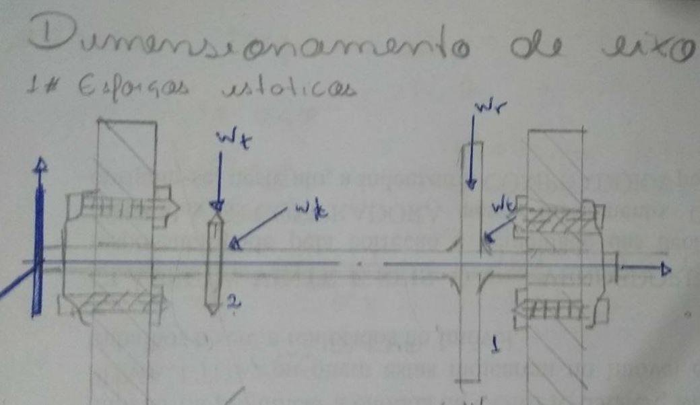{width=290 height=295px}

$$ W_{t}=m*g $$
$$ W_{r}= \frac{2*T}{ d_{0} } $$

| Elementos             | R2 (Roda dentada)  | R1 ( Disco) |
|-----------------------|--------------------|-------------|
| Força Tangencial (Wt) | 3.04 N             | 0.87 N      |
| Força Radial (Wr)     | 5.00 N             | 60.0 N      |

Resolvendo as forças radiais utilizando software disponivel em viga.online. link para a resolução completa da viga (http://viga.online/#L(0.2):P(0)P(0.2):F(0.07,5)F(0.148,60)

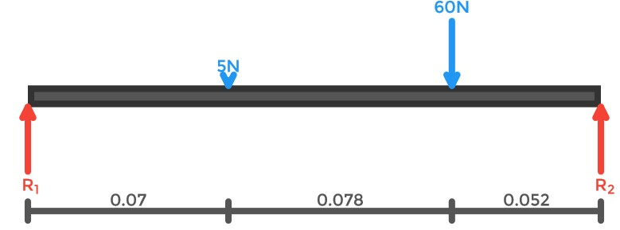{width=290 height=295px}

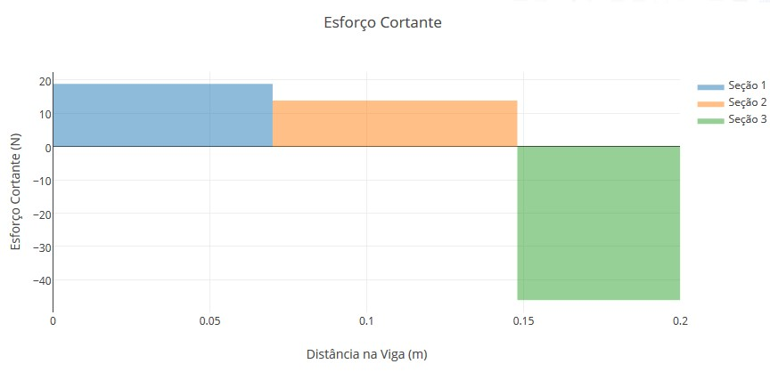{width=290 height=295px}

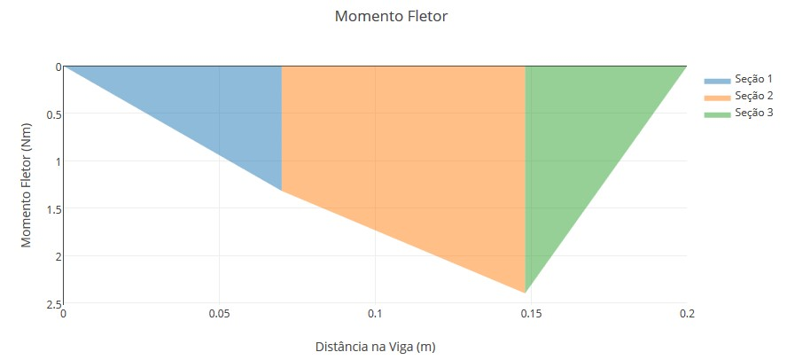{width=290 height=295px}

Resolvendo as forças tangenciais, link para a resolução completa da viga (http://viga.online/#L(0.2):P(0)P(0.2):F(0.07,3.04)F(0.148,0.87)

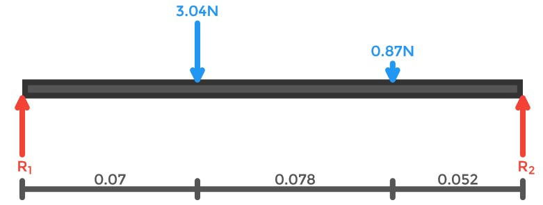{width=290 height=295px}

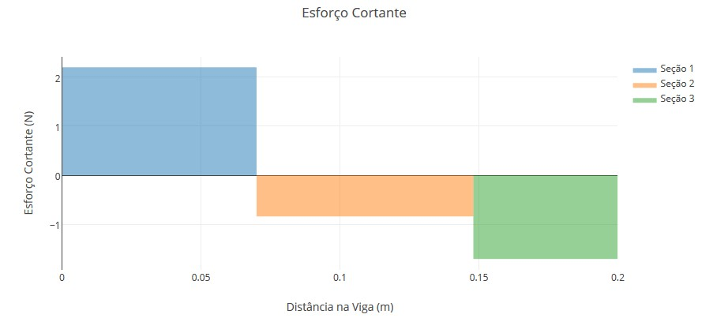{width=290 height=295px}

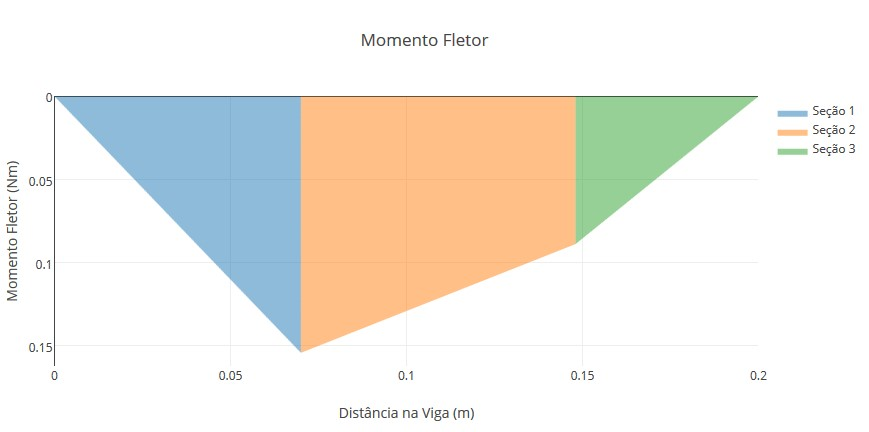{width=290 height=295px}

 Com esses dados foi possível obter a combinação dos planos ortogonais, analisando a disposição dos elementos na barra e os gráficos de momento fletor, como o eixo possui somente um diâmetro, foi escolhido o ponto onde o disco se encontra, o momento resultante nele é de Md = 2.55882 N*m e T = 43,5 N.m

#### Seleção de material

Segundo SHIGLEY, o material para o eixo pode ser selecionado, por tentativa, em qualquer ponto antes do projeto por tensão do eixo, e ser modificado, se necessário, durante o processo de desenho por tensão.

Foi escolhido o aço 1005-1009 Estirado a frio (CD) laminado, de acordo com a Tabela A-21 do Shigley, possui resistência a tração Sut = 415 Mpa. Esse aço foi escolhido por ser próximo ao aço 1010, metalon, já utilizado no projeto.
#### Desenho do eixo por tensão
O diâmetro do eixo deve ser determinado por analise de tensão nas localidades críticas, onde está montado o disco de freio, para uma primeira estimativa do diâmetro, foi utilizado o critério de DE-Goodman, este critério é bom para o desenho inicial, visto que é um cálculo simples e conservativo.

Equação de DE-Goodman

$$d =  \big( \frac{16n}{ \pi } \big\{ \frac{1}{S_{e} }[4( K_{f}  M_{a})^{2} + 3( K_{fs}  T_{m})^{2}]^{ \frac{1}{2}} + \frac{1}{ S_{ut} }[4( K_{f}  M_{m})^{2} + 3( K_{fs}  T_{m})^{2}]^{ \frac{1}{2}}  \big\} \big) ^{ \frac{1}{3} }$$

Sendo Mn e Ma os momentos flexores médio e alternante, Tm e Ta são os torques médios e alternante, e Kf e Kfs são os fatores de concentração de fadiga para flexão e torção. Com Mn = Ta = 0, a equação reduz a: 

Formula reduzida
$$d =  \big\{ \frac{16n}{ \pi } \big( \frac{2  (K_{f}  M_{a})  }{ S_{e} } + \frac{ [3 (K_{fs}  T_{m})^2  ]^{ \frac{1}{2} } }{ S_{ut} } \big)  \big\} ^{ \frac{1}{3} }$$

Pela tabela 7-1 do Shigley, foi estipulado um filete de ressalto – pontudo com a relação de r/d = 0.02 tendo kt=2,7 e Kts = 2.2, isso para assegurar a situação mais critica. Para um primeiro passo rápido e conservativo, foi assumido Kf = Kt e Kfs = Kts.

A equação de DE-Goodman utiliza do fator de Marin
 $$Se = ka . kb. kc . kd . ke . Kf . Se’$$ 
 calculando o fator de superfície Ka sendo 
  $$ka = aSut^b$$ ,
  retirando valores a e b da tabela 6-2 do Shigley e o valor de Sut para um aço 1005-1009 CD laminado sendo de 415 Mpa, o valor de Ka = 0.913

Admitindo Kb=0.9 e Kc=Kd=Ke= 1, resolvendo a equação de marin se chega ao valor de 
$$Se = 0.913 * 0.9 * 0.5 * 415 = 170.5 Mpa $$

Substituindo todas as variais na equação de DE-Goodman e utilizando fator de segurança de n=5. O diâmetro mínimo do eixo é de aproximadamente d=23mm.

Foi escolhido um eixo de 25 mm de diâmetro, adquirido de refugo do galpão da FGA.
#### Desenho do eixo por deflexão

A análise de deflexão requer informações completas, a deflexão do eixo deve ser verificado em todos os mancais e engrenagens acoplados, a característica de não escalonamento e

Foi utilizado o software Ansys Mechanical APDL para calcular as deflexões e angulações nos elementos montados no eixo, 

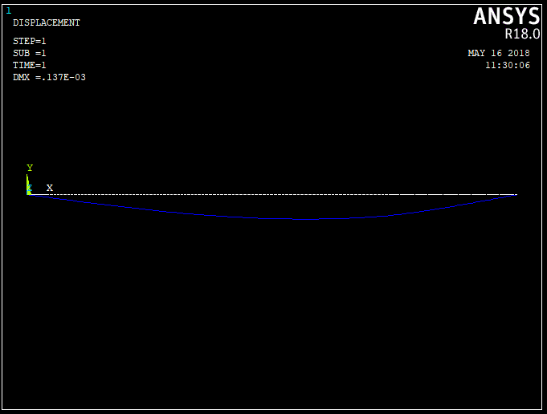{width=290 height=295px}

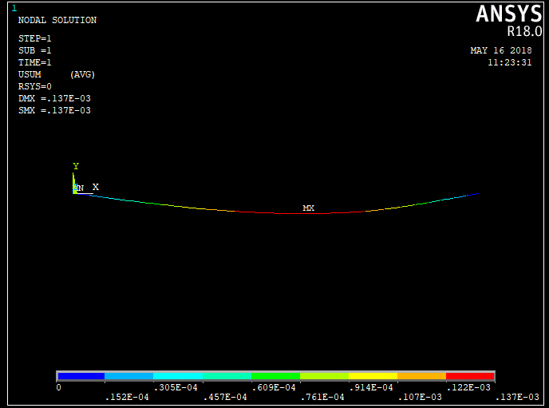{width=290 height=295px}

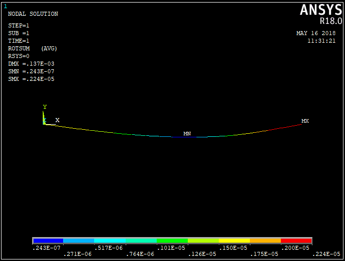{width=290 height=295px}

As deflexões e angulações encontradas ao longo do eixo estão dentro dos limites permitidos segundo a tabela abaixo para rolamentos esféricos.
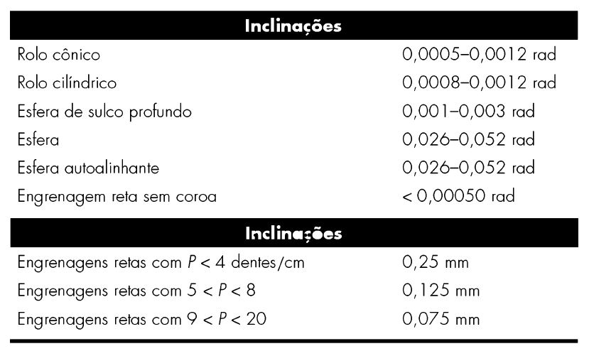{width=290 height=295px}

#### Seleção de Mancais
Para a escolha do mancal apropriado para o eixo determinado, se estipulou uma série de requisitos:
* 12 000 horas de vida útil
* Confiabilidade de 99%
* A velocidade do eixo estipulada para o projeto foi de 60 rev/min
* Diametro interno do rolamento de 25 mm

Como a carga desejada no mancal não é a carga de teste do fabricando ou entrada do catalogo, além de outras variáveis, é necessário relacionar a carga, vida e a confiabilidade do mancal. Foi calculado a vida do mancal de acordo com a velocidade de estipulada para o projeto.

$$Ld = vida do projeto * velocidade do eixo$$

$$Ld = 12000 h * 60 min/h * 60 rev/min = 0.432 *10^8 rev$$

Utilizando a equação de 11-7 do Shigley de Carga para uma função Weibull com confiabilidade acima de 90%, considerando o argumento Xd = Ld e C10 = entrada do catalogo. Os parâmetros de Weibull são x0 = 0.02 , (Tetha –x0) = 4.439 , b = 1.483 e Rd = 0.99.

$$C_{10} = F_D \left [ \frac{x_D}{x_0 + \left ( \theta - x_{0} \right ) \left ( 1 - R_D \right )^{1/b}} \right ]^{1/a} \ \ \ \ \ \ R \geq 0.90$$
$$C_{10} =0.349 kN$$
Com essa carga foi escolhido o mancal flangeado em Y com esferas ovais SKF FYTWK 25 YTH

| Dados de Cálculo                        |    |       |       |
|-----------------------------------------|----|-------|-------|
|  Classificação de carga dinamica básica | C  | 11.9  | kN    |
| Classificação de carga estatica basica  | C0 | 7.8   | kN    |
| Limite de carga de fadiga               | Pu | 0.335 | kN    |
| Velocidade-Limite                       |    | 4300  | r/min |

#### Analise Final

Com os mancais dimensionados, a transmissão em 2 etapas tem no segundo estágio tolerância de furo e eixo H7/h6, segundo a ANSI B4.2-1978, um tipo de ajuste com folga, que permite ajuste perfeito para a localização de peças estacionarias, mas podem ser livremente montadas e desmontadas. A mesma tolerância será utilizada para o disco e a montagem da roda dentada, uma limitação emposta pelo método de fabricação, ferramental e técnica disponível.

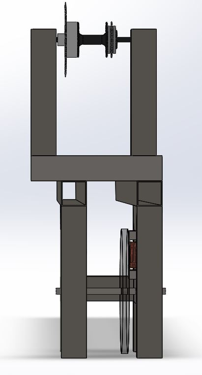{width=290 height=295px}

## Integração – 2RBoat/2RElectronic

 A integração do sistema de eletrônica com estrutura consiste em duas situações. A primeira trata-se da estrutura, a qual supotará as células de cargas (Estrutura de apoio aos pés), adequada para comportar o sensor e a passagem dos fios do mesmo. A segunda, trata-se do fornecimento da estrutura do case para alocar os sistemas emcados, incluindo os botões, a raspberry Pi 3 e os demais sistemas da parte de software.

 Ademais, para validar o cálculo da força de reação para dimensionar a célula de carga, o sistema 2RBoat fez a simulação estática da força para o aparato dos pés, apresentado na figura [@fig:simuforca], observou-se que essa estrutura, suporta em cada lado uma força de 850 N. A força máxima é de aproximadamente 848 N para, vale ressaltar que o cálculo foi feito para a potência máxima de remada (600 W).

{#fig:simuforca}

## Integração - 2RElectronic/2RPower

A integração do sistema de eletrônica com energia se baseia em fazer as conexões necessárias para chavear as bobinas utilizando o circuito com relés já mencionados anteriormente, testes já foram feitos para o acionamento de cada bobina separadamente e eles se mostraram bem executados.

O acionamento será realizado conforme demonstrado no diagrama a seguir.

![Integração dos sistemas 2R-Eletronic e 2R-Power^[Fonte: Do_autor]](imagens/reles.png){#fig:Reles}

Adiante, podemos observar a realização dos testes de acionamento dos níveis.

{#fig:integracao_electronic_power1}

{width=290 height=295px}

{width=290 height=370px}

## Integração – 2RElectronic/2RSystem

A integração entre **2RElectronic** e **2RSystem** será feita com os submódulos **2RE-Kernel** e **2RS-Receiver**. O primeiro é o núcleo do módulo **2RElectronic** e responsável por concentrar e delegar os dados e informações para seus submódulos e submódulos de outras engenharias. O segundo é o submódulo receptor do **2RSystem**, que tem como objetivo receber e desserializar dados providos por outros módulos e repassá-los para a **2RS-Controller**.

A comunicação entre esses dois submódulos será feita utilizando o protocolo **MQTT**. Basta que os dois submódulos estejam publicando e escutando (n)os tópicos do **MQTT** corretos para que essa comunicação seja feita.

Toda a comunicação entre o **2RE-Kernel** e o **2RSystem** será feita utilizando a biblioteca _open source_ **Paho-MQTT Client**. A mesma provê implementações do **MQTT** já consolidadas pela comunidade em seu _core_, incluindo o protocolo de _publish_ e _subscribe_, além de ter suporte a diversas linguagens de programação, especialmente **C++** e **Python**, as quais são utilizadas pelos módulos **2RElectronic** e **2RSystem**.

Por fim, os dados a serem trocados pelo módulos  são: 

* $3$ valores númericos que representam os eixos $X$, $Y$ e $Z$ do acelerômetro de cada IMU
* $3$ valores númericos que representam os eixos $X$, $Y$ e $Z$ do giroscópio de cada IMU
* $3$ valores númericos que representam os eixos $X$, $Y$ e $Z$ do magnetômetro de cada IMU
* $1$ valor númerico do conjunto {$0$, $1$, $2$, $3$} que representa a dificuldade requerida pelo atleta
* $1$ valor númerico que representa a potência do **2RE-Watt**
* $1$ valor númerico que representa a temporização discreta do ciclo de exercício
