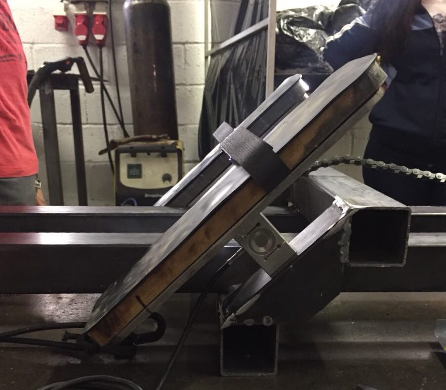

# Plano de Integração

## Integração – 2RBoat/2RPower

A integração do sistema de estrutura com o sistema energia baseou-se nos vínculos da estrutura primária com o disco que compõem o freio eletromagnético e os eletroímãs. O atleta irá puxar uma barra conectada a um sistema de catracas e coroas por uma corrente de bicicleta. Esse sistema tem o intuito de reduzir a força aplicada pelo atleta no freio eletromagnético. Além disso, o acoplamento entre as duas áreas mostrou-se afinado durante todo o ponto de controle 2, justificado pela modelagem do sistema de energia com o auxílio da equipe de estrutura.

{width=290 height=295px}

## Integração – 2RBoat/2RElectronic

 A integração do sistema de eletrônica com estrutura consiste em duas situações. A primeira trata-se da estrutura, a qual supotará as células de cargas (Estrutura de apoio aos pés), adequada para comportar o sensor e a passagem dos fios do mesmo. A segunda, trata-se do fornecimento da estrutura do case para alocar os sistemas embarcados, incluindo os botões, a raspberry Pi 3 e os demais sistemas da parte de software.

 Ademais, para validar o cálculo da força de reação para dimensionar a célula de carga, o sistema 2RBoat fez a simulação estática da força para o aparato dos pés, apresentado na figura [@fig:simuforca], observou-se que essa estrutura, suporta em cada lado uma força de 850 N. A força máxima é de aproximadamente 848 N para, vale ressaltar que o cálculo foi feito para a potência máxima de remada (600 W).

{#fig:simuforca}

O sistema 2RE-Watt foi alocado sob os apoios dos pés que o usuário tem na estrutura exatamente para captar a força realizada durante o movimento. foi contruido uma estrutura de apoio em que a célula ficou posicionada com um ângulo de 45 graus em relação a estrutura de perfil. Esse ângulo foi utilizado para o cálculo da força. A lixa 
que localiza-se na superfície permite que o pé do atleta não deslize, proporcionando maior estabilidade. O velcro localizado penas na parte superior permite que a parte inferior dos pés possa se movimentar para alcançar maior amplitude da remada.
Um cabo saiu de cada célula de carga e foi dirigido até o case de maneira que não fosse possível notar esse percurso do cabo para que a estética da estrutura ficasse o mais profissional possível. Ao realizar os testes com a célula de carga no local, foi possível calibrá-la pois os apoios dos pés têm um peso e isso deve ser descontado. Todas as leituras são feitas pela Raspberry e então passam para o Kernel as informações de força e são transformadas em potência por meio do software embarcado.

{width=290 height=295px}

Para a disposição dos componentes eletrônicos, para que os fios não ficassem espalhados e pudessem ter um bom funcionamento sem possíveis danos e mal contatos, foi desenvolvido o case, ele dispõe de parteleiras, em que foi possível acoplar todos os fios, módulo relé, placa de conexão, raspberry Pi 3, botões e o visualizador. Desse modo, os componentes ficaram organizados e livremente distribuidos. A Figura XX apresenta  a parte externa do case e a Figura XX mostra o interior com os componentes eletrônicos em seus lugares específicos.

Figuras Case externo/interno
## Integração - 2RElectronic/2RPower

A integração do sistema de eletrônica com energia se baseia em fazer as conexões necessárias para chavear as bobinas utilizando o circuito com relés já mencionados anteriormente, testes já foram feitos para o acionamento de cada bobina separadamente e eles se mostraram bem executados.

O acionamento será realizado conforme demonstrado no diagrama a seguir.

![Integração dos sistemas 2R-Eletronic e 2R-Power^[Fonte: Do_autor]](imagens/reles.png){#fig:Reles}

Adiante, podemos observar a realização dos testes de acionamento dos níveis.

{#fig:integracao_electronic_power1}

{width=290 height=295px}

{width=290 height=370px}

## Integração – 2RElectronic/2RSystem

A integração entre **2RElectronic** e **2RSystem** será feita com os submódulos **2RE-Kernel** e **2RS-Receiver**. O primeiro é o núcleo do módulo **2RElectronic** e responsável por concentrar e delegar os dados e informações para seus submódulos e submódulos de outras engenharias. O segundo é o submódulo receptor do **2RSystem**, que tem como objetivo receber e desserializar dados providos por outros módulos e repassá-los para a **2RS-Controller**.

A comunicação entre esses dois submódulos será feita utilizando o protocolo **MQTT**. Basta que os dois submódulos estejam publicando e escutando (n)os tópicos do **MQTT** corretos para que essa comunicação seja feita.

Toda a comunicação entre o **2RE-Kernel** e o **2RSystem** será feita utilizando a biblioteca _open source_ **Paho-MQTT Client**. A mesma provê implementações do **MQTT** já consolidadas pela comunidade em seu _core_, incluindo o protocolo de _publish_ e _subscribe_, além de ter suporte a diversas linguagens de programação, especialmente **C++** e **Python**, as quais são utilizadas pelos módulos **2RElectronic** e **2RSystem**.

Por fim, os dados a serem trocados pelo módulos  são: 

* $3$ valores númericos que representam os eixos $X$, $Y$ e $Z$ do acelerômetro de cada IMU
* $3$ valores númericos que representam os eixos $X$, $Y$ e $Z$ do giroscópio de cada IMU
* $3$ valores númericos que representam os eixos $X$, $Y$ e $Z$ do magnetômetro de cada IMU
* $1$ valor númerico do conjunto {$0$, $1$, $2$, $3$} que representa a dificuldade requerida pelo atleta
* $1$ valor númerico que representa a potência do **2RE-Watt**
* $1$ valor númerico que representa a temporização discreta do ciclo de exercício
