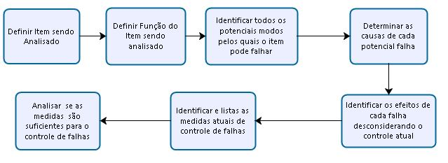

## Plano de Gerenciamento de Riscos

O gerenciamento de riscos fornece a estrutura necessária para o entendimento e avaliação de riscos, sua aceitabilidade por técnicas de ponderamento de riscos e práticas que determinem como lidar caso tais riscos venham a ocorrer. O gerenciamento de risco gira em torno de 3 práticas:

1. Reconhecer e avaliar potenciais riscos e seus efeitos;
1. Identificar e priorizar ações que podem eliminar potenciais falhas, reduzir a chance de ocorrência e aproveitamento de oportunidades;
1. Documentação das avaliações de riscos e atividades corretivas para que o controle de qualidade aumente ao longo do tempo.

O uso de ferramentas de gerenciamento de riscos ao longo das diversas fases do projeto e seu ciclo de operação compõem uma metodologia. Os benefícios que o gerenciamento de riscos provê ao projeto é uma estratégia sistemáticas e disciplinadas para entender os meios pelo qual o produto pode vir a falhar.

Os tópicos a seguir são alguns dos benefícios que o gerenciamento de riscos fornece ao projeto:

* Fornece meios para revisão do produto e projeto;
* Ajuda a identificar características criticas do produto e processo;
* Aumenta a produtividade, qualidade, segurança e eficiência de gastos;
* Ajuda a determinar a necessidade de selecionar materiais, dispositivos, componentes e peças alternativas;
* Fornece meios de comunicação entre diferentes departamentos do projeto;
* Garante que potenciais falhas e seus efeitos no sistema serão identificados e avaliados, consequentemente ajudando a identificar erros e definir ações corretivas.

A [@fig:riscos_fluxo] descreve o fluxograma de avaliação de medidas corretivas, principal processo de gerenciamento de riscos definido para este projeto.

{#fig:riscos_fluxo}
