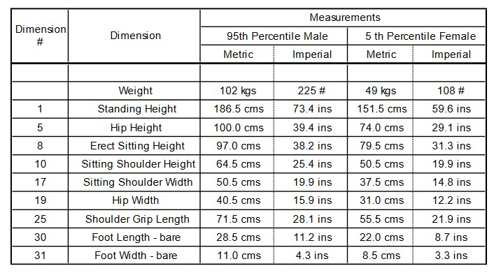
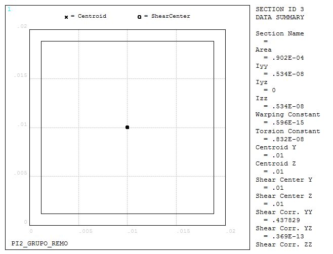
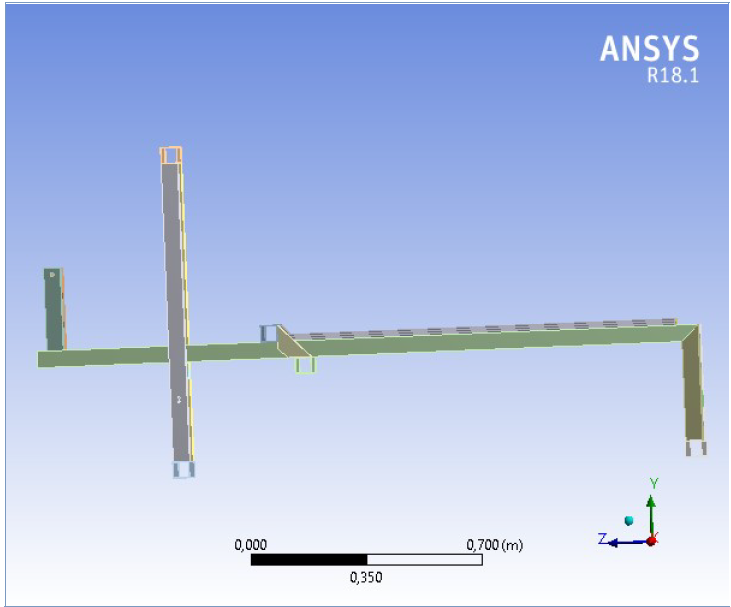
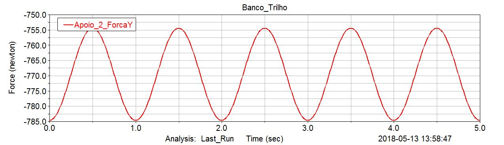
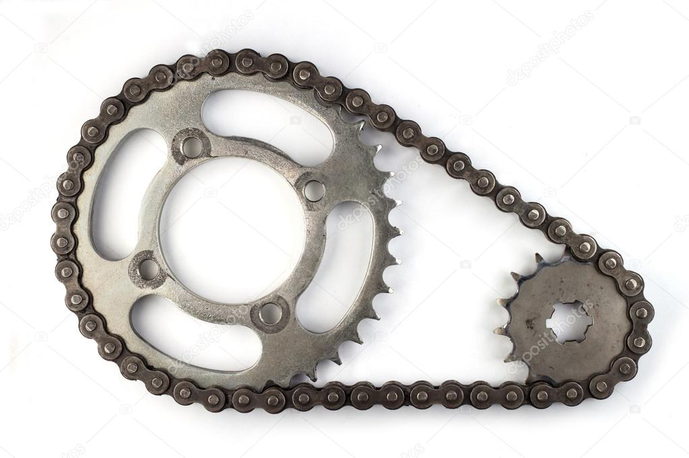
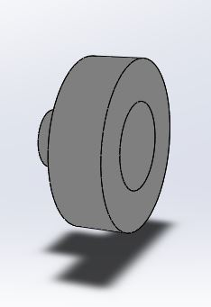
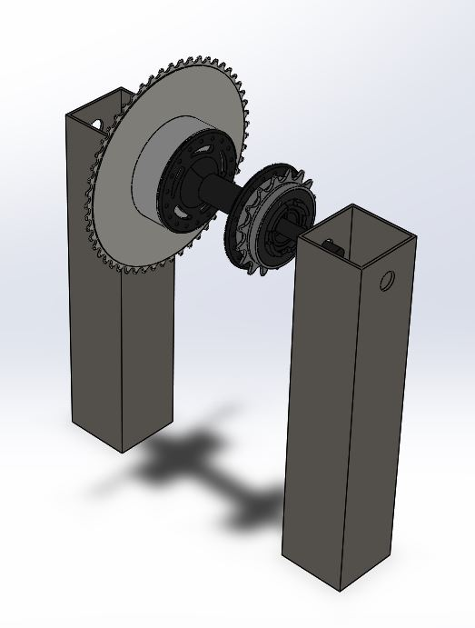
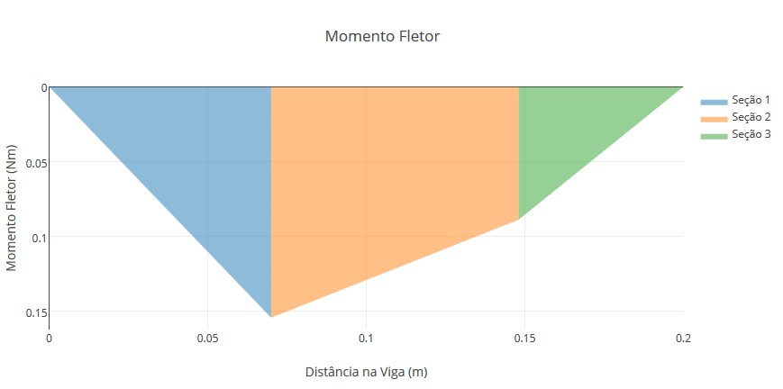
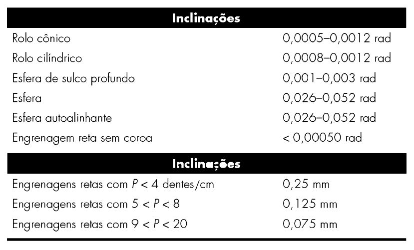

## 2RBoat

### Analise Ergonômica

O projeto tem como objetivo ser utilizado por pessoas de estaturas diferentes, para tanto foi necessário recorrer a tabelas antropométricas. Antropometria é definida como estudo das medidas de tamanho e proporções do corpo humano. Essas medidas englobam dados como peso, altura, circunferência da cintura e circunferência de quadril

Essas medidas foram utilizadas para determinar as dimensões mínimas do equipamento, principalmente o comprimento máximo do trilho do banco. A característica deslizante do banco permite acomodar uma quantidade variável de pessoas no aparelho por isso somente foi utilizado o percentil masculino americano de 95%. A validação desses dados foi executada no pacote Ergonomics Design and Analisys do software CATIA V5.

### Simulações Estruturais

Para se definir o perfil a ser utilizado para construção da estrutura se construiu um modelo em elementos finitos no software _Ansys  Mechanical APDL_. A escolha da ferramenta utilizado se deu principalmente por dois fatores:

* Velocidade de Simulação: A estrutura principal, formada pela trave, é composta por perfis de aço unidos por solda. É uma estrutura que pode ser simplificada através de elementos lineares em um _software_ de elementos finitos. Elementos lineares são computacionalmente mais leves e propiciam resultados altamente precisos em estruturas simples.
* Parametrização da Estrutura: A princípio o principal objetivo das simulações era a escolha do perfil a ser utilizado, o _Mechanical APDL_ permite mudar o perfil estrutural escolhido com a alteração de apenas uma linha de comando. Eliminando o processo de alterar o CAD, exportar geometria, importar no _ANSYS_ e realizar a simulação.

{#fig:PERFIL1 width=500 height=360}

{#fig:PERFIL2 width=500 height=360}

{#fig:PERFIL3 width=500 height=360}

O _ANSYS MAPDL_ requer que o usuário alimente o programa com as informações referentes ao material utilizado nas simulações, para tal utilizamos as informações para o Aço 1020 retiradas do Apêndice B da referência [@callister].

|Material | Aço 1020 |
|:--------|:----------|
|Módulo de Elasticidade | 207 _GPa_|
|Coef. de Poisson | 0.33 |
|Densidade | 7850 _kg/m^3_|

O Elemento linear utilizado foi o _BEAM188_, apesar das vantagens mencionas ao se utilizar o elemento linear, o elemento possui limitações quanto aos resultados que pode fornecer. O programa não é capaz de calcular tensão equivalente de Von-Mises ou tensão de cisalhamento na seção transversal. O elemento, porém, é capaz de calcular uma tensão média na seção tranversal causada por efeitos de flexão, o que se encaixa na situação particular da trave, que estará submetida a uma carga distribuída na sua direção vertical. Logo, não foi utilizado critério de falha nessa etapa. O principal critério para a escolha do perfil foi o deslocamento máximo da estrutura e a tensão normal  média da seção transversal.

As condições de contorno utilizadas para a simulação foram as de deslocamento restrito nos pés da estrutura e a aplicação de um força distribuída sobre o comprimento que se encontrará o trilho, simulando o peso que o usuário fará na estrutura principal, além disso o peso próprio da estrutura foi contabilizado ao se inserir na simulação uma aceleração na direção vertical de valor equivalente a 1 gravidade.

{#fig:BC1 width=500 height=360}

{#fig:BC2 width=500 height=360}

Todos os perfis simulados são de formato quadrado, o primeiro a ser simulado possui dimensões de 20x20x1.2mm. O deslocamento máximo da estrutura foi de 12,9mm e a tensão máxima foi de 184 _MPa_.

{#fig:20201 width=500 height=360}

{#fig:20202 width=500 height=360}

{#fig:20203 width=500 height=360}

O segundo perfil simulado tinha dimensões de 30x30x1.5mm. O deslocamento máximo encontrado foi de aproximadamente 3mm. A tensão máxima causada por flexão foi de 64.3 _MPa_.

{#fig:30301 width=500 height=360}

{#fig:30302 width=500 height=360}

{#fig:30303 width=500 height=360}

O último perfil escolhido tinha dimensões 50x50x2mm. O deslocamento máximo encontrado foi de 0.508mm, e a tensão máxima 17.4 _MPa_.

{#fig:50501 width=500 height=360}

{#fig:50502 width=500 height=360}

{#fig:50503 width=500 height=360}

O último perfil verificado apresenta baixo deslocamento e tensão máxima muito abaixo do limite de escoamento, foi decidido utilizar tal perfil principalmente pelo fato dos dois perfis anteriores apresentarem deslocamentos muito grandes e o limite de escoamento estar muito distante, uma vez que se utilizou um aço não certificado (Methalon), que possui propriedades mecânicas desconhecidas.

O software Ansys Workbench foi utilizado, que faz a sua análise pelo método de elementos finitos, para auxiliar a análise computacional da estrutura e teve um papel importante no processo de construção da estrutura, pois auxiliou nas tomadas de decisões durante todo o processo de construção e também serviu para realizar a validação do dimensionamento e validação do 2RowBoat.

A análise estrutural estática do _2RowBoat_ feita no _Ansys MAPDL_ foi feita também no ambiente _Ansys Workbench_ para critério de validação. A análise estrutural estática calcula os efeitos dos carregamentos estáticos na estrutura, ignorado os efeitos de inércia e amortecimento. A análise estática foi feita para observar os deslocamentos e as deformações estruturais que os componentes do 2RowBoat sofrem. Assume-se que estáticos e a resposta são aplicados lentamente em relação ao tempo [@fig:forca]. O carregamento que foi aplicado é o de força externa e a análise estática é linear.

As vantagens de se utilizar esse software para a validação de projetos é que de maneira geral programas como essas características permitem a redução do custo e do tempo, pois o resultado da análise é rápida. Ele também serve de orientação na escolha do materiais a serem utilizados nos projetos. E uma vantagem primordial é a redução da probabilidade de falha de componentes e também possibilita a identificação de partes que sofrem os maiores esforços estruturais. Além de ser um software que fornecem resultados gráficos na tela permitindo visualizar a geometria e o resultado, deste modo, a análise e a interpretação dos resultados é facilitada.
As vantagens de se utilizar a análise pelo método dos elementos finitos são diversas, mas as principais são:

* Componentes  com  geometria  complexa  podem  ser  analisados,
* A complexidade geométrica não influencia na análise diferente do que acontece com os cálculos analíticos que é limitado a geometrias mais simples.
* O método pode ser formulado matricialmente, facilitando a análise computacional.
* Pode-se aprimorar a geometria dos componentes reduzindo a quantidade de material e peso.
* A vida útil de um componente, quando submetido a carcas cíclicas que podem causar fadiga, podem ser previstas.

{#fig:forca width=500px height=360px}

A parte da estrutura do 2RowBoat que foi analisada é a primary porque é a parte da estrutura que irá receber os esforços de carregamento e também era essa parte da estrutura que precisava-se verificar a validação da perfil escolhido.  A figura [@fig:estrutura]  abaixo mostra qual o CAD foi realizado a análise estrutural.

{#fig:estrutura width=500px height=360px}

Para esse estrutura foi aplicado uma força de 1500N ou 1,5KN no sentido negativo do eixo y, considerando que o usuário possa chegar a pesar até 150Kg e considerando a gravidade igual a 10m/s^2, essa força pode ser verificada na Figura XX.  A estrutura foi considerada engastada, ou seja, não existe movimentação em nenhum sentidos dos eixos x, y ou z.  A deformação máxima  e o estresse equivalente de Vomises, para a estrutura, podem ser observados nas tabelas a seguir:

|Time (s)|Deslocamento mínimo (m)| Deslocamento máximo (m)|
|:-------|:----------------------|:-----------------------|
|1       | 0                     | 1.86657e-4|        

|Time (s)| mínimo (Pa) | máximo (Pa)|
|:-------|:----------------------|:-----------------------|
|1       | 0                     | 1.8144e+7|        

As [@fig:deformacao;@fig:stress] mostram a deformação máxima que a estrutura sofreu e o máximo do equivalente estresse que a estrutura suporta. Como pode ser observado por esses dados as estrutura se deforma muito pouco e suporta um grande estresse com isso concluísse que a estrutura projetada suportará as cargas estruturais para as quais foram projetadas e a o perfil escolhido se mostrou satisfatório. Não foi escolhido uma malha muito refinada pois devido à complexidade da estrutura analisada a memória RAM do computador era excedida.  

{#fig:deformacao width=500 height=360px}

{#fig:stress width=500 height=360px}

A estrutura construída estará em contato com uma série de cargas dinâmicas, como o eixo de transmissão que apresentará movimento rotacional ou o movimento de remada realizado pelo usuário da maquina, obter as frequências naturais da estrutura é necessário para se averiguar a ocorrência de ressonância ou a necessidade de adicionar amortecimento a estrutura.

Utilizando as mesmas condições de contorno para se obter as frequências naturais utilizando a _Ansys MAPDL_ obtivemos as seguintes frequências em _Hertz_:

{#fig:modos}

{#fig:modo1 width=500 height=360}

{#fig:modo2 width=500 height=360}

{#fig:modo3 width=500 height=360}

{#fig:modo4 width=500 height=360}

O movimento ideal de remada de um atleta obedece ciclos de 1 segundo, o movimento foi modelado utilizando o software _MSC ADAMS_ para que se determine a amplitude da força que será exercida na estrutura com ciclos de frequência igual a 1 _Hertz_.

{#fig:banco}

{#fig:trilho}

A análise harmônica foi realizada na estrutura com a amplitude de força encontrada através da modelagem do movimento do banco. O espectro de frequências estudado foi de 0 à 150 _Hertz_. A análise da figura [@fig:harmonica] mostra os picos de ressonâncias nas frequências de aproximadamente 52.242 _Hz_ e 106.52 _Hz_.

{#fig:harmonica}

### Dimensionamento da transmissão

Seguindo as necessidades da mudança do projeto, foi necessário criar um sistema de transmissão de potência, utilizando o atleta como fonte. O desenho de um sistema para transmitir potência requer atenção ao desenho e seleção de componentes individuais (engrenagens, mancais, eixo, etc) [@Budynas11]. Contudo, como é frequente no caso do projeto, esses componentes não são independentes.

Não há uma sequência precisa de passos para qualquer processo de projeto. Por natureza, projetar é um processo iterativo, é necessário fazer algumas escolhas de teste, construir um esqueleto de um projeto e determinar quais partes do desenho são críticas. Contudo, bastante tempo pode ser economizado ao entendermos as dependências entre as partes do problema, permitindo ao desenhador saber quais partes serão afetadas por qual mudança dada [@Budynas11].

#### Especificação do problema

Tendo em mente as necessidades pertinentes que a natureza do projeto determina, algumas especificações foram levantadas, e a solução proposta deve comportar esses requerimentos:

* Força de entrada é transmitida por corrente;
* Movimento tracionado somente no sentido da puxada, sentido da restituição livre;
* Mínimo de dois estágios;
* As relações de torque e diâmetro das rodas dentadas e disco de freio já determinados;
* Disco de freio deve ficar a aproximadamente 2 mm dos eletroímãs;
*Geralmente níveis de choque baixos, ocasionalmente choques moderados;
* Vida dos mancais > 12 000 horas;
* Eixo com vida infinita;

Baseado no Cap 18 - 1 SEQUENCIA DE PROJETO PARA TRANSMISSÂO DE POTENCIA, foi criado um resumo contendo cada passo crucial do projeto da transmissão.

* Projeto inicial, escolha do tipo de transmissão;
* Especificação das rodas;
* Disposição do Eixo, localização axial das rodas dentadas (Coroas), Cilindro (Disco de freio) e mancais;
* Analise de forças, diagrama de corpo livre, força cortante e momento fletor para os eixo;
* Seleção do material do eixo, desenho de fadiga depende do material;
* Desenho do eixo por tensão, de fadiga e estática, estimativa do diâmetro do eixo;
* Desenho do eixo por deflexão;
* Seleção de mancais;
* Analise final.

#### Projeto Inicial

 A máquina de remo proposta tem como característica o funcionamento cíclico em baixas velocidades por conta da tração humana, por essa questão foi decidido utilizar correntes de rolo como método de transmissão de forças. Corrente de rolos é um meio altamente eficiênte e versátil para transmitir potência mecânica. O método de funcionamento consiste em uma roda dentada motriz e uma roda dentada movida por um lance de correntes.

{width=290 height=295px}

As características básicas das transmissões de corrente incluem razão constante, visto que nenhum deslizamento ou deformação lenta estão envolvidas, e vida longa [@Budynas11]. A corrente é tão flexível como as correias e tão eficiênte como as engrenagens, e possuem as seguintes vantagens que foram consideradas para aplicação desse método no produto:

* Versatilidade de operação;
* Absorvem choques devido a película de óleo entre seus componentes e sua elasticidade;
* Leve e compacta, melhor relação de peso x potência por Cavalo Vapor transmitido;
* Maior durabilidade, distribuição de cargas entre os vários dentes da engrenagem. Garante longa vida útil a corrente.
* Facilidade de manutenção e instalação;
* Possibilidade da compra do kit de corrente roda dentada com maior facilidade.

#### Especificação das rodas dentadas

Para atingir a potência necessária exigida pelo 2R-Power, foi especificado os raios e os torques dos elementos que compõem a transmissão. As rodas dentadas foram escolhidas seguindo essas especificações da [@tbl:roda_dentada].
 
| Elemento    | R1 (Disco)   | R2    | R3      | R4      |
|-------------|------|------|--------|--------|
| Raio(mm)    | 135  | 34,5 | 100    | 34,5   |
| Toque (N.m)      | 43,5 | 43,5 | 130,06 | 130,06 |
| Massa (kg)  | 6    | 0.5  | 0.75   | 0.5    |

:Especificações da roda dentada. {#tbl:roda_dentada}

Com os diâmetros especificados, foi decidido utilizar rodas dentadas de bicicleta que atendiam as dimensões do projeto e são de fácil aquisição. Duas coroas de 16 dentes e 1 de 52 dentes, mantendo uma relação aproximada de 1:3.

#### Disposição dos eixos
O posicionamento axial de componentes é frequentemente ditado pela posição do compartimento e por outros componentes engrenantes. Em geral, é melhor suportar componentes condutores de carga entre mancais, em vez de em balanço fora dos mancais. Os eixos devem ser mantidos curtos para minimizar momentos fletores e deflexões, e seus componentes devem ser situados acuradamente no eixo para alinhar totalmente com outros componentes [@Budynas11].

Os eixos de transmissão do 2Row tem como princípio de disposição a posição do pinhão que recebe a tração humana, esta roda dentada foi posicionada mais ao centro possível. A partir dessa posição foi feito um esboço da disposição dos componentes, cada eixo terá 4 componentes sendo duas rodas dentadas e dois mancais com rolamento no primeiro estágio e uma roda dentada, um disco de freio e dois mancais com rolamentos no segundo estágio. O Primeiro estagio será tratado a parte dessa metodologia.

##### primeiro estagio da transmissão 

Por uma questão de facilidade de compra e a relação custo $\times$ benefício, foi decidido que o primeiro estagio da transmissão seria composta por um cubo traseiro de bicicleta com uma catraca acoplada a uma extremidade e, na outra ponta do cubo, seria instalado a roda dentada de 52 dentes. A escolha do cubo se dá ao fato de ele já vir montado com os rolamentos, fuso e principalmente com o roscado para os padrões de rodas dentadas de bicicleta.

{width=290 height=295px}

Para a montagem da roda dentada de 52 dentes, foi fabricado uma flange em poliacetal ,Polióxido de metileno. O poliacetal é um termoplástico de alta rigidez e tem sua utilização na engenharia difundida por suas características, sendo algumas: elevada rigidez, excelente estabilidade dimensional, boa usinabilidade, resistência mecânica, absorção de vibrações e baixa densidade.

O projeto da flange tem como requerimento:

* Diâmetro suficiente para parafusar uma extremidade no cubo;
* Escalonamento de diâmetro igual ao diâmetro interno da roda dentada;
* Furos internos que permitam a montagem no cubo mas que essa montagem não gere resistência ao giro do conjunto do cubo-roda dentada.

{#fig:flange093 width=290 height=295px}

Partindo desses requerimentos, foi feito um esboço de uma flange ([@fig:flange093]), com 5 furos M3.5 para parafuso Allen de cabeça arredondada além do rebaixo. E nesse rebaixo foi desenhado uma rosca métrica fina de passo 1.5, para fixação da roda dentada com uma porca. A fabricação se deu no galpão da FGA, executada pelo técnico Clovis.

{width=290 height=295px}

O cubo de bicicleta foi montado diretamente nas barras verticais de apoio, sendo fixados por um conjunto de porcas e arruelas. Foi fabricado um canal para deslizar o conjunto em uma das traves de apoio, na outra foi feito furo.

{width=290 height=295px}

#### Análise de forças

Prosseguindo com o dimensionamento, agora só olhando para o segundo estágio da transmissão. Conhecido os diâmetros da engrenagem e do disco de freio e suas localizações axiais, foi criado um diagrama de corpo livre e com isso os diagramas de força cortante e momento flexor para o eixo a ser produzido, [@fig:diagrama_esf_cort]. Fazendo analogia de roda dentada com engrenagem, onde em geral as forças e momentos tem componentes em dois planos ao longo do eixo, no caso desse eixo foi escolhido trabalhar somente com a magnitude dos dois planos, foram determinadas as cargas axiais e tangenciais transmitida pela roda dentada, utilizando as [@eq:est_1;@eq:est_2] para força tangencial e radial em R1 e R2.

{width=290 height=295px}

$$ W_{t}=m*g $$ {#eq:est_1}
$$ W_{r}= \frac{2*T}{ d_{0} } $$ {#eq:est_2}

| Elementos             | R2 (Roda dentada)  | R1 ( Disco) |
|-----------------------|--------------------|-------------|
| Força Tangencial (Wt) | 3.04 N             | 0.87 N      |
| Força Radial (Wr)     | 5.00 N             | 60.0 N      |

Resolvendo as forças radiais utilizando _software_ disponível em viga.online^[Link para resolução: http://viga.online/#L(0.2):P(0)P(0.2):F(0.07,5)F(0.148,60)].

{width=290 height=295px}

{#fig:diagrama_esf_cort width=290 height=295px}

{width=290 height=295px}

Resolvendo as forças tangenciais^[Link para a resolução completa: (http://viga.online/#L(0.2):P(0)P(0.2):F(0.07,3.04)F(0.148,0.87)], temos:

{width=290 height=295px}

{width=290 height=295px}

{width=290 height=295px}

Com esses dados foi possível obter a combinação dos planos ortogonais, analisando a disposição dos elementos na barra e os gráficos de momento fletor. Como o eixo possui somente um diâmetro, foi escolhido o ponto onde o disco se encontra. O momento resultante nele é de

$$Md = 2.55882 N*m,$$
$$T = 43,5 N.m$$

#### Seleção de material

O material para o eixo pode ser selecionado, por tentativa, em qualquer ponto antes do projeto por tensão do eixo. Também pode ser modificado, se necessário, durante o processo de desenho por tensão.

Foi escolhido o aço 1005-1009 Estirado a frio (CD) laminado, de acordo com [@Budynas11], possui resistência a tração $Sut = 415 Mpa$. Esse aço foi escolhido por ser próximo ao aço 1010, metalon, já utilizado no projeto.

#### Desenho do eixo por tensão

O diâmetro do eixo deve ser determinado por análise de tensão nas localidades críticas, onde está montado o disco de freio. Para uma primeira estimativa do diâmetro, foi utilizado o critério de DE-Goodman, [@eq:de_goodman]. Este critério é bom para o desenho inicial, visto que é um cálculo simples e conservativo.

$$d =  \big( \frac{16n}{ \pi } \big\{ \frac{1}{S_{e} }[4( K_{f}  M_{a})^{2} + 3( K_{fs}  T_{m})^{2}]^{ \frac{1}{2}} + \frac{1}{ S_{ut} }[4( K_{f}  M_{m})^{2} + 3( K_{fs}  T_{m})^{2}]^{ \frac{1}{2}}  \big\} \big) ^{ \frac{1}{3} }$$ {#eq:de_goodman}

Sendo $M_n$ e $M_a$ os momentos flexores médio e alternante, $T_m$ e $T_a$ são os torques médios e alternante, e $K_f$ e $K_{fs}$ são os fatores de concentração de fadiga para flexão e torção. Com $M_n = T_a = 0$, a equação reduz a

$$d =  \big\{ \frac{16n}{ \pi } \big( \frac{2  (K_{f}  M_{a})  }{ S_{e} } + \frac{ [3 (K_{fs}  T_{m})^2  ]^{ \frac{1}{2} } }{ S_{ut} } \big)  \big\} ^{ \frac{1}{3} }$$

Foi estipulado um filete de ressalto pontudo com a relação de $r/d = 0.02$ tendo $K_t=2,7$ e $K_{ts} = 2.2$. Isso para assegurar a situação mais critica. Para um primeiro passo rápido e conservativo, foi assumido $K_f = K_t$ e $K_{fs} = K_{ts}$.

A equação de DE-Goodman utiliza do fator de Marin
$$S_e = K_a . K_b. K_c . K_d . K_e . K_f . S_{e’}$$ 
Calculando o fator de superfície com $K_a$ sendo 
$$ka = aSut^b,$$
retirando valores $a$ e $b$ da tabela 6-2 do Shigley e o valor de Sut para um aço 1005-1009 CD laminado sendo de 415 Mpa, o valor de Ka = 0.913

Admitindo $K_b=0.9$ e $K_c=K_d=K_e= 1$, resolvendo a equação de marin se chega ao valor

$$S_e = 0.913 * 0.9 * 0.5 * 415 = 170.5 Mpa $$

Substituindo todas as variáveis na equação de DE-Goodman e utilizando fator de segurança de n=5. O diâmetro mínimo do eixo é de aproximadamente $d=23mm$.

Foi escolhido um eixo de 25mm de diâmetro, adquirido de refugo do galpão da FGA.

#### Desenho do eixo por deflexão

Foi utilizado o _software Ansys Mechanical APDL_ para calcular as deflexões e angulações nos elementos montados no eixo.

{width=290 height=295px}

{width=290 height=295px}

{width=290 height=295px}

As deflexões e angulações encontradas ao longo do eixo estão dentro dos limites permitidos segundo a tabela abaixo para rolamentos esféricos.

{width=290 height=295px}

#### Seleção de Mancais

Para a escolha do mancal apropriado para o eixo determinado, se estipulou uma série de requisitos:

* 12.000 horas de vida útil;
* Confiabilidade de 99%;
* A velocidade do eixo estipulada para o projeto foi de 60rev/min;
* Diâmetro interno do rolamento de 25mm.

Como a carga desejada no mancal não é a carga de teste do fabricante ou entrada do catalogo, além de outras variáveis, é necessário relacionar a carga, vida e a confiabilidade do mancal. Calculamos a vida do mancal de acordo com a velocidade de estipulada para o projeto.

$$L_d = vida do projeto * velocidade do eixo$$

$$L_d = 12000h * 60 min/h * 60 rev/min = 0.432 *10^8 rev$$

Utilizando a equação de 11-7 do Shigley de Carga para uma função Weibull com confiabilidade acima de 90%, considerando o argumento $X_d = L_d$ e $C10 = entrada do catalogo$. Os parâmetros de Weibull são $x_0 = 0.02$ , $\theta – x_0 = 4.439$ , $b = 1.483$ e $R_d = 0.99$.

$$C_{10} = F_D \left [ \frac{x_D}{x_0 + \left ( \theta - x_{0} \right ) \left ( 1 - R_D \right )^{1/b}} \right ]^{1/a} \ \ \ \ \ \ R \geq 0.90$$

$$C_{10} =0.349 kN$$

Com essa carga foi escolhido o mancal flangeado em Y com esferas ovais SKF FYTWK 25 YTH

| Dados de Cálculo                        |    |       |       |
|-----------------------------------------|----|-------|-------|
|  Classificação de carga dinamica básica | C  | 11.9  | kN    |
| Classificação de carga estatica basica  | C0 | 7.8   | kN    |
| Limite de carga de fadiga               | Pu | 0.335 | kN    |
| Velocidade-Limite                       |    | 4300  | r/min |

#### Analise Final

Com os mancais dimensionados, a transmissão em 2 etapas tem no segundo estágio tolerância de furo e eixo H7/h6, segundo a ANSI B4.2-1978, um tipo de ajuste com folga, que permite ajuste perfeito para a localização de peças estacionarias, mas podem ser livremente montadas e desmontadas. A mesma tolerância será utilizada para o disco e a montagem da roda dentada, uma limitação emposta pelo método de fabricação, ferramental e técnica disponível.

{width=290 height=295px}

### Construção

O processo utilizado para unir as peças estruturais do 2RowBoat nesse projeto foi a soldagem. Portanto, essa parte do trabalho consiste em abordar a técnica de soldagem MIG (metal inert gas) utilizado. Esse tipo de técnica utiliza como fonte de calor um arco elétrico mantido entre um eletrodo nu consumível, alimentado continuamente, e a peça a soldar. A projeção de soldagem é feita por um fluxo de gás inerte (MIG). [@wainer]

O processo MIG é adequado à soldagem de aços-carbono, aços de baixa, média e alta liga, aços inoxidáveis, alumínio e liga, magnésio e ligas, cobre e ligas. [@wainer]

Segundo o Sérgio D. Brandi no livro “Soldagem: Processos e Metalurgia” lista algumas vantagens e limitações do processo de soldagem dentre as vantagens e desvantagem que o escritor cita quero dar destaques a algumas delas.
Vantagens:

* Processo semi- automático bastante e que pode ser adaptado com facilidade para a soldagem automática.
*	O eletrodo nu é alimentado continuamente
*	Versatilidade nas posições de soldagem
*	O soldador pode ser facilmente treinado para soldar em diversas posições

Limitações

*	A soldagem deve ser protegida de corrente de ar
*	Dificuldade para soldar em locais de difícil acesso
*	Grande emissão de raios ultravioleta

A Tabela a seguir com mais informações está nesse também nesse livro [@wainer]:

|Tipo de Operação: Semi-automática ou automática| Equipamentos:Gerador, retificador Pistola, Cilindro de gases, unidade de alimentação do eletrodo nu|
|:-----------|:----------|
|Características:Taxa de deposição:1 a 15kg/h|  Custo do equipamento: 5 a 10 vezes o custo do equipamento de eletrodo revestido|
|Espessura soldadas: 3mm mínima na soldagem semi-automática e 1,5 mm na soldagem automática, Posições de soldagem: todas, Faixa de corrente: 60 a 500A| Consumíveis:Eletrodo nu 0,5 a 1,6mm, Bocal, Gases: argônio, hélio, CO2 e misturas (argônio +CO2; argônio +oxigênio)|
|Vantagens:Taxa de deposição elevada, Poucas operações de acabamento, Solda com baixo teor de hidrogênio, Facilidade de execução da soldagem|Limitações:Velocidade de resfriamento elevada com possibilidade de trincas, Dificuldades na soldagem em locais de difícil acesso|
|Segurança:Proteção ocular, Proteção da pele para evitar queimaduras pela radiação ultravioleta e projeções metálicas|

Existem basicamente no processo MIG quatro técnicas distintas de modo de transferência de metal: curto-circuito, globular, arco pulsado e pulverização. Na transferência por curto-circuito a transferência ocorre quando um curto-circuito elétrico é estabelecido. Isso acontece quando o metal fundido na ponta do arame toca a poça de fusão. Na transferência por pulverização pequenas gotas de metal fundido são desprendidas da ponta do arame e projetadas por forças eletromagnéticas em direção à poça de fusão. A transferência globular ocorre quando as gotas de metal fundido são muito grandes e movem-se em direção à poça de fusão sob a influência da gravidade. A transferência com arco pulsado substitui a transferência por pulverização axial no que se refere à posição de soldagem e espessura da chapa.  Os fatores que determinam o modo de transferência de metal são a corrente de soldagem, o diâmetro do arame, o comprimento do arco (tensão), as características da fonte e o gás de proteção. [@wainer]

A corrente de soldagem é caracterizada por: Corrente contínua com polaridade reversa (CCPR+), corrente contínua com polaridade direta (CCPD-), Tensão da soldagem, Fonte de energia, mudança de distância entre pistola e o metal base, mudança na velocidade de alimentação do eletrodo nu e mudança de regulagem da tensão de soldagem na fonte de energia.

O livro “Soldagem: Processos e Metalurgia[@wainer]" traz que:  tanto a distância do arco como a velocidade de alimentação do eletrodo nu influenciam a tensão e a corrente de soldagem, para uma dada regulagem de tensão na fonte de energia. Assim, uma variação momentânea da distância do arco acarreta a mudança da velocidade de alimentação do eletrodo nu, para que a distância do arco volte a se estabilizar...Um aumento na velocidade de alimentação causa o aumento da corrente de soldagem.

Para o 2RowBoat a técnica que foi usada se aproxima mais teoricamente da MIG pulsado e que tem a vantagem de poder se utilizada em várias posições com baixa energia de soldagem e transferência tipo pulverização. Segundo o livro “Soldagem: Processos e Metalurgia[@wainer]" existem seis parâmetros para regular o equipamento teoricamente, na prática muito coisa na regulagem é visual, e tem os seguintes nomes: Destacamento e tamanho da gota, estabilidade do arco, taxa de deposição, volume de gota e frequência do pulso.

A equação que governa o destacamento de gota é:

$$I_{p}^{2}.t_{p}=D$$

Onde Ip é a corrente de pico, tp é o tempo na corrente de pico e Dé constante que depende do material e diâmetro do eletrodo nu e da composição do gás de proteção.

Já o tamanho da gota (d) quando se tem apenas uma gota é regido pela seguinte equação:

$$d=\frac{v}{f}$$

Onde v é a velocidade de alimentação do eletrodo nu e f é a frequência de pulsação.

A taxa de deposição depende de diversos fatores dentre eles se tem a corrente de soldagem e a distância entre tubo de contato/peça. A corrente média é dada por:

$$\bar{I}= \frac{I_{b}.t_{b}+I_{p}.t_{p}}{t_{p}+t_{b}}$$

Já o volume da gota é dado por:

$$\Phi= \frac{v.A}{f}$$

Onde A é a seção transversal do eletrodo nu.

Todas essas equações anteriores são encontradas no livro[@wainer]. Porém, até o momento toda a estrutura encontra-se apenas pontilhada com a solda, pois, ainda falta construir algumas peças para que a soldagem definitiva seja feita.

O projeto da estrutura passou por algumas mudanças desde o ponto de controle 1. A trave é composta por duas barras principais ao invés de uma. Os apoios para os pés do usuário agora contam com uma célula de carga em cada, soulção desenvolvida pela equipe de eletrônica. Um dos eixos da estrutura foi substituído por um cubo de bicicleta, visando facilitar a construção da estrutura. Foi projetada e usinada uma peça para encaixar a coroa no cubo. O desenho técnico atual pode ser observado na [@fig:desenhotec].

{#fig:desenhotec}

Até o momento, a construção da estrutura consistiu no corte dos perfis nos comprimentos especificados, da furação dos perfis que necessitavam de furação e da soldagem pontilhada dos perfis. Os trilhos de alumínio e o cubo contendo a coroa e a catraca também foram montados na estrutura. Uma comparação entre o CAD e a estrutura construída até o momento pode ser observado [@fig:compara]

{#fig:estrutura-1 width=500px height=360px}

{#fig:estrutura-2 width=500px height=360px}

{#fig:estrutura-3 width=500px height=360px}

{#fig:estrutura-4 width=500px height=360px}

{#fig:compara}
