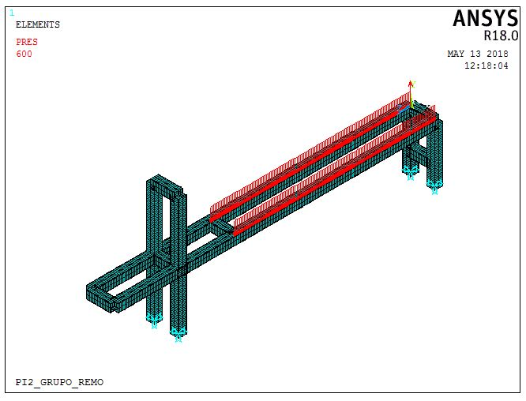
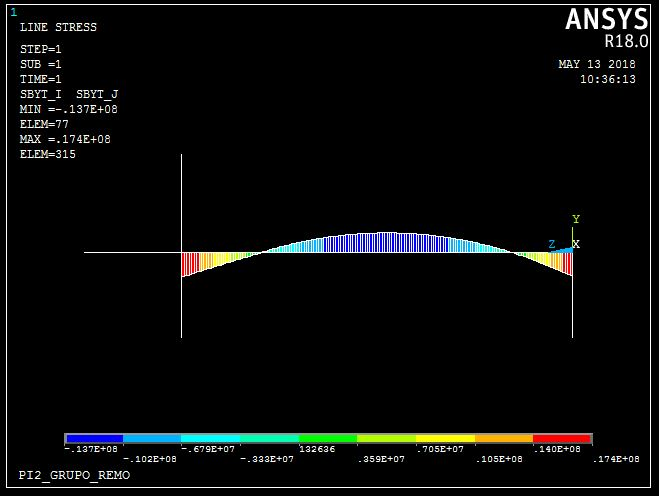
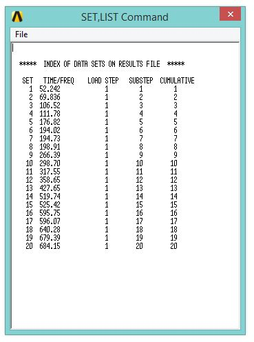

## 2RBoat

### Simulações Estruturais

Para se definir o perfil a ser utilizado para construção da estrutura se construiu um modelo em elementos finitos no software _Ansys Mechanical APDL_. A escolha da ferramenta utilizado se deu principalmente por dois fatores:

* Velocidade de Simulação: A estrutura principal, formada pela trave, é composta por perfis de aço unidos por solda. É uma estrutura que pode ser simplificada através de elementos lineares em um _software_ de elementos finitos. Elementos lineares são computacionalmente mais leves e propiciam resultados altamente precisos em estruturas simples.
* Parametrização da Estrutura: A princípio o principal objetivo das simulações era a escolha do perfil a ser utilizado, o _Mechanical APDL_ permite mudar o perfil estrutural escolhido com a alteração de apenas uma linha de comando. Eliminando o processo de alterar o CAD, exportar geometria, importar no _ANSYS_ e realizar a simulação.

{#fig:PERFIL1}

{#fig:PERFIL2}

{#fig:PERFIL3}

O _ANSYS MAPDL_ requer que o usuário alimente o programa com as informações referentes ao material utilizado nas simulações, para tal utilizamos as informações para o Aço 1020 retiradas do Apêndice B da referência [@callister].

|Material | Aço 1020 |
|:--------|:----------|
|Módulo de Elasticidade | 207 _GPa_|
|Coef. de Poisson | 0.33 |
|Densidade | 7850 _kg/m^3_|

O Elemento linear utilizado foi o _BEAM188_, apesar das vantagens mecionas ao se utilizar o elemento linear, o elemento possui limitações quanto aos resultados que pode fornecer. O programa não é capaz de calcular tensão equivalente de Von-Mises ou tensão de cisalhamento na seção transversal. Os valores que o programa é capaz de entregar são de tensão normal causada por esforço axial e de tensão normal causada por flexão. Logo, não foi utilizado critério de falha nessa etapa. O principal critério para a escolha do perfil foi o deslocamento máximo da estrutura e a tensão normal causada por flexão.

As condições de contorno utilizadas para a simulação foram as de deslocamento restrito nos pés da estrutura e a aplicação de um força distribuída sobre o comprimento que se encontrará o trilho, simulando o peso que o usuário fará na estrutura principal, além disso o peso próprio da estrutura foi contabilizado ao se inserir na simulação uma aceleração na direção vertical de valor equivalente a 1 gravidade.

{#fig:BC1}

{#fig:BC2}

Todos os perfis simulados são de formato quadrado, o primeiro a ser simulado possui dimensões de 20x20x1.2mm. O deslocamento máximo da estrutura foi de 12,9mm e a tensão máxima foi de 184 _MPa_.

{#fig:20201}

{#fig:20202}

{#fig:20203}

O segundo perfil simulado tinha dimensões de 30x30x1.5mm. O deslocamento máximo encontrado foi de aproximadamente 3mm. A tensão máxima causada por flexão foi de 64.3 _MPa_.

{#fig:30301}

{#fig:30302}

{#fig:30303}

O último perfil escolhido tinha dimensões 50x50x2mm. O deslocamento máximo encontrado foi de 0.508mm, e a tensão máxima 17.4 _MPa_.

{#fig:50501}

{#fig:50502}

{#fig:50503}

O último perfil verificado apresenta baixo deslocamento e tensão máxima muito abaixo do limite de escoamento, foi decidido utilizar tal perfil principalmente pelo fato dos dois perfis anteriores apresentarem deslocamentos muito grandes e o limite de escoamento estar muito distante, uma vez que se utilizou um aço não certificado (Methalon), que possui propriedades mecânicas desconhecidas.

*Analise Estática Estrutural*

O software Ansys Workbench foi utilizado, que faz a sua análise pelo método de elementos finitos, para auxiliar a análise computacional da estrutura e teve um papel importante no processo de construção da estrutura, pois auxiliou nas tomadas de decisões durante todo o processo de construção e também serviu para realizar a validação do dimensionamento e validação do 2RowBolt. 

As vantagens de se utilizar esse software para a validação de projetos é que de maneira geral programas como essas características permitem a redução do custo e do tempo, pois o resultado da análise é rápida. Ele também serve de orientação na escolha do materiais a serem utilizados nos projetos. E uma vantagem primordial é a redução da probabilidade de falha de componentes e também possibilita a identificação de partes que sofrem os maiores esforços estruturais. Além de ser um software que fornecem resultados gráficos na tela permitindo visualizar a geometria e o resultado, deste modo, a análise e a interpretação dos resultados é facilitada. 
As vantagens de se utilizar a análise pelo método dos elementos finitos são diversas, mas as principais são:

*Componentes  com  geometria  complexa  podem  ser  analisados, 
*A complexidade geométrica não influencia na análise diferente do que acontece com os cálculos analíticos que é limitado a geometrias mais simples. 
*	O método pode ser formulado matricialmente, facilitando a análise computacional. 
*	Pode-se aprimorar a geometria dos componentes reduzindo a quantidade de material e peso. 
*	A vida útil de um componente, quando submetido a carcas cíclicas que podem causar fadiga, podem ser previstas. 

A análise estrutural feitas para o 2RowBolt, utilizando o workbent, foi a análise estática para validar o perfil da estrutura no Ansys APDL. A análise estrutural estática calcula os efeitos dos carregamentos estáticos na estrutura, ignorado os efeitos de inércia e amortecimento. A análise estática foi feita para observar os deslocamentos e as deformações estruturais que os componentes do 2RowBolt sofrem. Assume-se que estáticos e a resposta são aplicados lentamente em relação ao tempo [@fig:forca]. O carregamento que foi aplicado é o de força externa e a análise estática é linear. 

{#fig:forca}

A parte da estrutura do 2RowBolt que foi analisada é a primary porque é a parte da estrutura que irá receber os esforços de carregamento e também era essa parte da estrutura que precisava-se verificar a validação da perfil escolhido.  A figura [@fig:estrutura]  abaixo mostra qual o CAD foi realizado a análise estrutural.

{#fig:estrutura}

Para esse estrutura foi aplicado uma força de 1500N ou 1,5KN no sentido negativo do eixo y, considerando que o usuário possa chegar a pesar até 150Kg e considerando a gravidade igual a 10m/s^2, essa força pode ser verificada na Figura XX.  A estrutura foi considerada engastada, ou seja, não existe movimentação em nenhum sentidos dos eixos x, y ou z.  A deformação máxima  e o estresse equivalente de Vomises, para a estrutura, podem ser observados nas tabelas a seguir:

|Time (s)|Deslocamento mínimo (m)| Deslocamento máximo (m)|
|:-------|:----------------------|:-----------------------|
|1       | 0                     | 1.86657e-4|        

|Time (s)| mínimo (Pa) | máximo (Pa)|
|:-------|:----------------------|:-----------------------|
|1       | 0                     | 1.8144e+7|        

As figuras ([@fig:deformacao] e [@fig:stress]  ) a seguir mostram a deformação máxima que a estrutura sofreu e o máximo do equivalente estresse que a estrutura suporta. Como pode ser observado por esses dados as estrutura se deforma muito pouco e suporta um grande estresse com isso concluísse que a estrutura projetada suportará as cargas estruturais para as quais foram projetadas e a o perfil escolhido se mostrou satisfatório. Para observar com mais detalhes as como o processo de análise foi feito no software Ansys segue o anexo xx que contém todos os resultados e valores de entrada. Não foi escolhido uma malha muito refinada pois devido à complexidade da estrutura analisada a memória RAM do computador era excedida, mas todos os dados da malha se encontram também nesse mesmo anexo.  

{#fig:deformacao}
{#fig:stress}

A estrutura construída estará em contato com uma série de cargas dinâmicas, como o eixo de transmissão que apresentará movimento rotacional ou o movimento de remada realizado pelo usuário da maquina, obter as frequências naturais da estrutura é necessário para se averiguar a ocorrência de ressonância ou a necessidade de adicionar amortecimento a estrutura.

Utilizando as mesmas condições de contorno para se obter as frequências naturais obtivemos as seguintes frequências em _Hertz_:

{#fig:modos}

{#fig:modo1}

{#fig:modo2}

{#fig:modo3}

{#fig:modo4}

O movimento ideal de remada de um atleta obedece ciclos de 1 segundo, o movimento foi modelado utilizando o software _MSC ADAMS_ para que se determine a amplitude da força que será exercida na estrutura com ciclos de frequência igual a 1 _Hertz_.

{#fig:banco}

{#fig:trilho}

A análise harmônica foi realizada na estrutura com a amplitude de força encontrada através da modelagem do movimento do banco. O espectro de frequências estudado foi de 0 à 150 _Hertz_. A análise da figura [@fig:harmonica] mostra os picos de ressonâncias nas frequências de aproximadamente 52.242 _Hz_ e 106.52 _Hz_.

{#fig:harmonica}

{#fig:estrutura-1}

{#fig:estrutura-2}

{#fig:estrutura-3}

{#fig:estrutura-4}

{#fig:estrutura-5}

### Construção

O processo utilizado para unir as peças estruturais do 2RowBolt nesse projeto foi a soldagem. Portanto, essa parte do trabalho consiste em abordar a técnica de soldagem MIG (metal inert gas) utilizado. Esse tipo de técnica utiliza como fonte de calor um arco elétrico mantido entre um eletrodo nu consumível, alimentado continuamente, e a peça a soldar. A projeção de soldagem é feita por um fluxo de gás inerte (MIG). \cite{cengel2007transferencia}

O processo MIG é adequado à soldagem de aços-carbono, aços de baixa, média e alta liga, aços inoxidáveis, alumínio e liga, magnésio e ligas, cobre e ligas. \cite{cengel2007transferencia}

Segundo o Sérgio D. Brandi no livro “Soldagem: Processos e Metalurgia” lista algumas vantagens e limitações do processo de soldagem dentre as vantagens e desvantagem que o escritor cita quero dar destaques a algumas delas.
Vantagens:

* Processo semi- automático bastante e que pode ser adaptado com facilidade para a soldagem automática.
*	O eletrodo nu é alimentado continuamente 
*	Versatilidade nas posições de soldagem
*	O soldador pode ser facilmente treinado para soldar em diversas posições 

Limitações

*	A soldagem deve ser protegida de corrente de ar
*	Dificuldade para soldar em locais de difícil acesso
*	Grande emissão de raios ultravioleta 

A Tabela a seguir com mais informações está nesse também nesse livro \cite{cengel2007transferencia}:

|Tipo de Operação: Semi-automática ou automática| Equipamentos:Gerador, retificador Pistola, Cilindro de gases, unidade de alimentação do eletrodo nu|
|:-----------|:----------|
|Características:Taxa de deposição:1 a 15kg/h|  Custo do equipamento: 5 a 10 vezes o custo do equipamento de eletrodo revestido|
|Espessura soldadas: 3mm mínima na soldagem semi-automática e 1,5 mm na soldagem automática, Posições de soldagem: todas, Faixa de corrente: 60 a 500A| Consumíveis:Eletrodo nu 0,5 a 1,6mm, Bocal, Gases: argônio, hélio, CO2 e misturas (argônio +CO2; argônio +oxigênio)|
|Vantagens:Taxa de deposição elevada, Poucas operações de acabamento, Solda com baixo teor de hidrogênio, Facilidade de execução da soldagem|Limitações:Velocidade de resfriamento elevada com possibilidade de trincas, Dificuldades na soldagem em locais de difícil acesso|
|Segurança:Proteção ocular, Proteção da pele para evitar queimaduras pela radiação ultravioleta e projeções metálicas|

Existem basicamente no processo MIG quatro técnicas distintas de modo de transferência de metal: curto-circuito, globular, arco pulsado e pulverização. Na transferência por curto-circuito a transferência ocorre quando um curto-circuito elétrico é estabelecido. Isso acontece quando o metal fundido na ponta do arame toca a poça de fusão. Na transferência por pulverização pequenas gotas de metal fundido são desprendidas da ponta do arame e projetadas por forças eletromagnéticas em direção à poça de fusão. A transferência globular ocorre quando as gotas de metal fundido são muito grandes e movem-se em direção à poça de fusão sob a influência da gravidade. A transferência com arco pulsado substitui a transferência por pulverização axial no que se refere à posição de soldagem e espessura da chapa.  Os fatores que determinam o modo de transferência de metal são a corrente de soldagem, o diâmetro do arame, o comprimento do arco (tensão), as características da fonte e o gás de proteção. \cite{cengel2007transferencia}

A corrente de soldagem é caracterizada por: Corrente contínua com polaridade reversa (CCPR+), corrente contínua com polaridade direta (CCPD-), Tensão da soldagem, Fonte de energia, mudança de distância entre pistola e o metal base, mudança na velocidade de alimentação do eletrodo nu e mudança de regulagem da tensão de soldagem na fonte de energia. 

O livro “Soldagem: Processos e Metalurgia” traz que:  tanto a distância do arco como a velocidade de alimentação do eletrodo nu influenciam a tensão e a corrente de soldagem, para uma dada regulagem de tensão na fonte de energia. Assim, uma variação momentânea da distância do arco acarreta a mudança da velocidade de alimentação do eletrodo nu, para que a distância do arco volte a se estabilizar...Um aumento na velocidade de alimentação causa o aumento da corrente de soldagem. 

Para o 2RowBolt a técnica que foi usada se aproxima mais teoricamente da MIG pulsado e que tem a vantagem de poder se utilizada em várias posições com baixa energia de soldagem e transferência tipo pulverização. Segundo o livro “Soldagem: Processos e Metalurgia” existem seis parâmetros para regular o equipamento teoricamente, na prática muito coisa na regulagem é visual, e tem os seguintes nomes: Destacamento e tamanho da gota, estabilidade do arco, taxa de deposição, volume de gota e frequência do pulso.

A equação que governa o destacamento de gota é:

