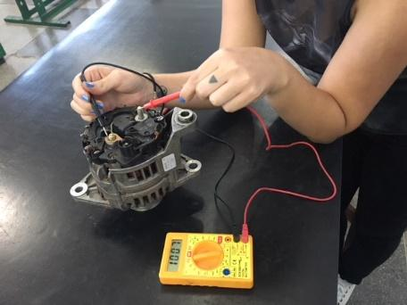
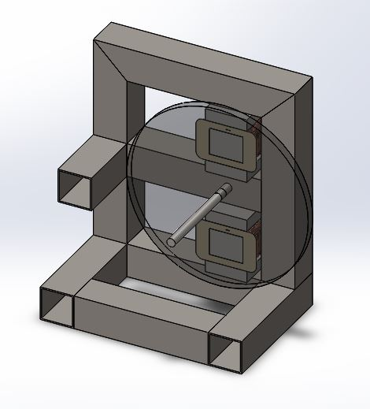
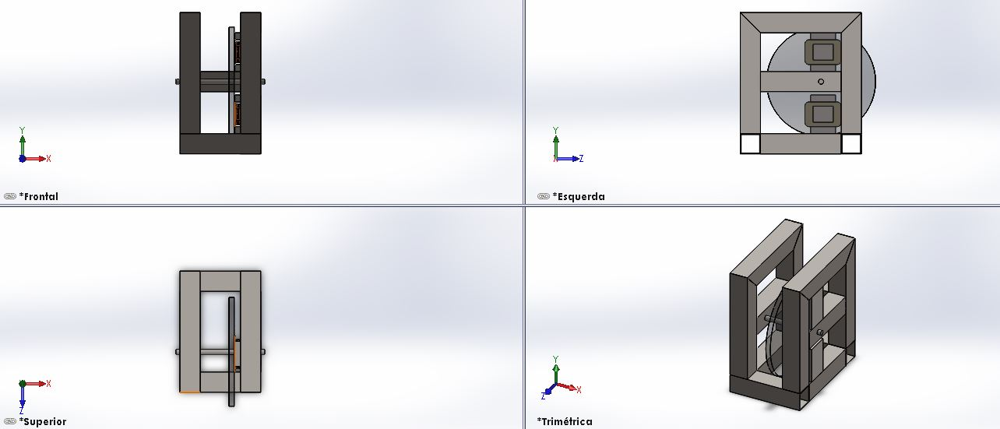
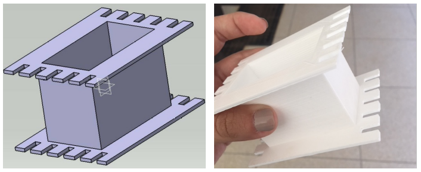
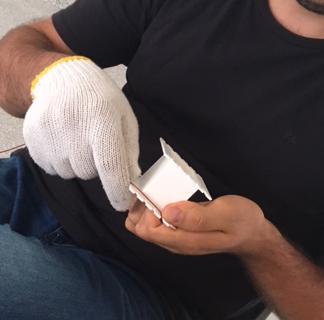
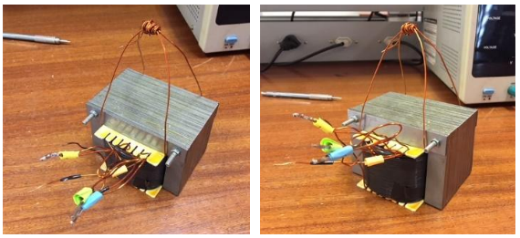
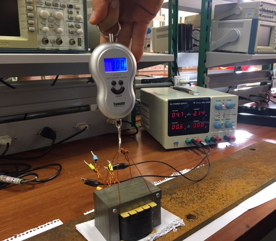
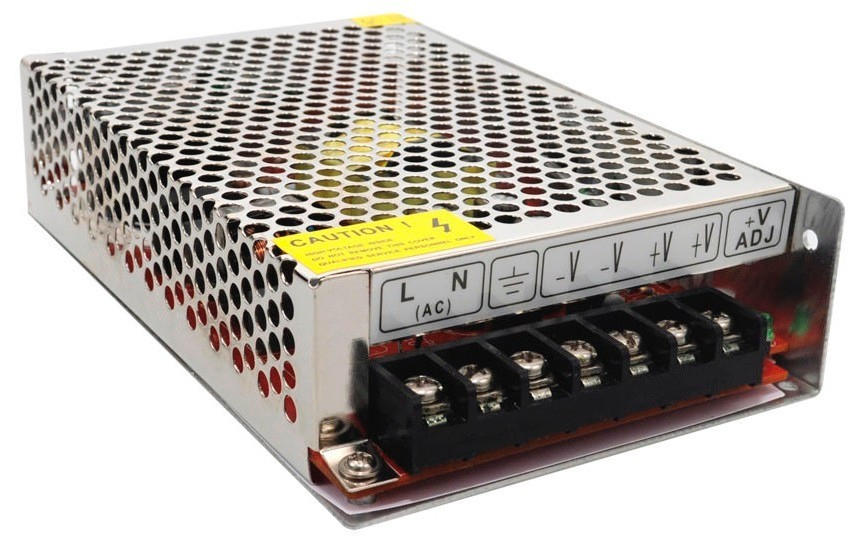
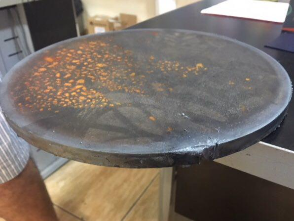

## 2RPower

O sistema de energia, que tem por objetivo gerar uma carga variável para a remada do atleta, inicialmente, havia escolhido como solução um sistema que empregava um gerador elétrico acoplado a um banco de resistores. Contudo, a construção desse sistema se apresentou muito complexa para ser realizada durante o tempo estipulado para a disciplina, dessa forma, a alternativa foi testar um alternador automotivo, segunda solução encontrada.

Durante os testes o alternador não correspondeu a validação de projeto a qual o grupo estava a procura para satisfazer as necessidades da solução proposta. Sendo assim, a solução escolhida, por fim, para o funcionamento adequado do remo indoor foi a construção de um freio eletromagnético, também conhecido como freio de Foucault.

{#id .class width=290 height=235px}

### Freio Eletromagnético

O uso do efeito de correntes parasitas na frenagem eletromagnética já é bastante difundido, tanto em meios acadêmicos, quanto industriais, um exemplo clássico é o freio de Foucault ou também como é conhecido, freio eletromagnético. Nele, utiliza-se um disco de alumínio ou cobre para interpor uma resistência ao torque de máquinas rotativas no intuito de reduzir a sua velocidade, simular uma variação da carga mecânica acoplada ao seu eixo ou até mesmo abreviar a sua frenagem no momento de seu desligamento, dissipando sua energia inercial na forma de efeito Joule, pela ação das correntes parasitas circulantes no disco [@pinheiro14].

![Ilustração conceitual de um freio eletromagnético [@medeiros80].](imagens/ilustracao-conceitual-do-freio.png){#id .class width=310 height=235px}

O surgimento das correntes parasitas, é uma consequência direta do efeito da indução eletromagnética descrito por Faraday. As tensões elétricas são induzidas em um condutor sempre que este atravessar as linhas de fluxo de campo magnético constante ou quando este condutor for submetido a um campo magnético variável no tempo. Seja qual for o modo, as correntes induzidas percorrem caminhos a fim de manter oposição ao movimento relativo do condutor ou oposição à variação do campo magnético [@pereira06].

Em outras palavras, o efeito eletromagnético que caracteriza esse sistema, pode ser explicado a partir da lei de Ampère, que descreve que uma corrente elétrica circulando em um meio condutor induz um campo magnético cujas linhas de fluxo se posicionam em direção tangencial ao caminho de circulação da corrente. Como dito anteriormente, pela lei da indução de Faraday, sabe-se que uma variação de fluxo magnético resulta na indução de um campo elétrico, consequentemente, se um campo elétrico confinado a um meio condutor na forma de um circuito fechado produz a circulação de uma corrente neste circuito, tem-se que a variação de fluxo magnético concatenado a um circuito fechado leva analogamente à indução de um campo elétrico, e uma corrente proporcional à variação de fluxo que a gerou [@pereira06].

Por fim, a lei de Lenz determina que a corrente induzida (ou o campo elétrico da qual ela resulta) se projeta no sentido de se opor à variação de fluxo que a produziu. Ou, mais especificamente, o sentido da corrente induzida pela variação de um fluxo magnético é tal que ela venha a induzir um novo fluxo magnético (contra-fluxo) que virá a se opor à variação do fluxo que a induziu.

Diante do exposto, o projeto de solução visa a construção de um sistema composto por dois eletroímãs posicionados nas faces de um disco de aço que estará conectado ao eixo que transmite o movimento de remada do atleta, como podemos observar a seguir.

{#id .class width=250 height=295px}

{#fig:solucao-freio-eletromag-2}

### Eletroímã

O eletroímã é composto por um núcleo metálico envolto por bobinas, que por sua vez são excitadas com corrente contínua controlada através de conversores estáticos (fontes de alimentação). A força de um eletroímã pode ser regulada para mais ou menos, ajustando-se a corrente elétrica que percorre suas bobinas.

A primeira etapa de montagem do eletroímã consistiu na procura de transformadores para serem desmontados e posteriormente transformados em eletroímãs. Reorganizando as finas chapas metálicas que os compõem na mesma direção, foi possível alcançar a construção de um núcleo metálico com geometria do tipo “E”. Para então, confeccionar novas bobinas de fio de cobre AWG 18, que seguiram especificações baseadas nos cálculos que serão apresentados mais adiante.

Para a montagem do segundo eletroímã, foi modelada a base de acordo com as dimensões do primeiro eletroímã, e sua construção foi realizada por meio de impressão 3D utilizando material PLA, termoplástico biodegradável. Após essa etapa, foram seguidos os mesmos passos da construção citados anteriormente.

{#id .class width=410 height=230px}

O espaço para o enrolamento das bobinas é limitado pelas dimensões do “E”, com a tabela de espessura dos fios de cobre medidos em AWG, foi possível dimensionar o número de voltas para cada espessura de fio de cobre, e relacionar com a força de atração estática teórica que a corrente suportada por aquele fio gerava. Com esses cálculos, concluiu-se que o melhor espessura de fio era a AWG 18.

{#id .class width=290 height=295px}

Quando decidiu-se trabalhar com eletroímã, foi proposto variar a corrente aplicada ao mesmo, com o intuito de variar a força de atração, mas devido às dificuldades de trabalhar com uma corrente variável, optou-se por modular as bobinas do eletroímã em 4 níveis. Como a relação entre o número de espiras e a força de atração não é linear, foi necessário primeiro estabelecer o nível máximo e mínimo dessa força, encontrar dois valores entre esses dois níveis pré-definidos, e por fim, estabelecer o número de voltas de cada uma das quatro bobinas.

---------------------------------------------------------
     Nível            Número de espiras em cada nível
--------------    ---------------------------------------
      1                             191 

      2                             268

      3                             307

      4                             380
--------------------------------------------------------
:Relação do nível e número de espiras.

{#id .class width=450 height=235px}

Os testes foram realizados após a construção do primeiro eletroímã. O mesmo foi excitado com a utilização de fonte de corrente contínua para observar a possível existência de curtos circuitos no enrolamento e se o efeito eletromagnético realmente estava ocorrendo, dessa forma foi consolidado seu funcionamento.

Em seguida, o mesmo foi testado com uma chapa de metal grossa, de material desconhecido, com o intuito de analisar o quanto de força o eletroímã estava exercendo no material, para tal empregou-se uma balança portátil e observou-se o quanto suportava em relação a massa para cada intensidade de corrente estabelecida pela fonte. Os resultados podem ser observados na tabela a seguir.

------------------------------------------------------------------------------
     Corrente [A]        Teste 1 [Kg]      Teste 2 [Kg]       Teste 3 [Kg]
---------------------  ----------------  ----------------  -------------------
         4                  19,8              21,2                22,4               

        4,5                 27,6              25,5                29,8

         5                  36,4              36,9                35,8
------------------------------------------------------------------------------
:Relação de corrente elétrica e massa.

Analisando os dados colhidos, considerando as especificações do fio de cobre AWG 18 e a premissa que o eletroímã irá trabalhar com uma corrente fixa, foi então escolhido o valor de 4,5 amperes.

Tendo estabelecido o nível máximo de corrente que irá percorrer as bobinas, foram então realizados os testes para cada nível de operação do eletroímã. Na tabela a seguir estão dispostos os resultados desses testes.

------------------------------------------------------------------------------
        Nível            Teste 1 [Kg]      Teste 2 [Kg]       Teste 3 [Kg]
---------------------  ----------------  ----------------  -------------------
         4                   32,4             29,16              32,33               

         3                   17,41            17,3               17,44

         2                   12,32            13,43              13,73

         1                   6,78             7,04               7,06
-----------------------------------------------------------------------------
:Relação nível de operação e massa.

Dessa maneira, foi possível determinar qual peso o atleta terá que puxar em cada nível de operação do eletroímã.

{#id .class width=290 height=235px}

### Fonte de Corrente Constante

Para a energização do eletroímã durante os testes, foram utilizadas as fontes de alimentação do laboratório de eletrônica da FGA. A mesma foi configurada para operar nos testes com uma corrente igual a 4,5 amperes e uma tensão que variou até 12 volts. 

Uma fonte de corrente chaveada do tipo colméia, que na sua saída fornece 12 volts e 5 amperes, também pode ser aplicada nesse processo e é a que será utilizada no protótipo para energizar os eletroímãs. 

A ideia da fonte de corrente é empregada quando se deseja manter constante a corrente circulante por uma carga mesmo quando a tensão e resistência variam, como no caso desse projeto. Os valores irão mudar de acordo com os níveis de carga do atleta, mas a corrente continuará a mesma. 

{#id .class width=290 height=235px}

### Disco

O disco que estará localizado entre os eletroímãs e acoplado ao eixo, é composto por aço-carbono 1010, tal determinação foi pensada com base em um das características que o elemento carbono confere aos metais, como por exemplo, quanto maior seu teor na composição destes, menor é a permeabilidade. Assim, foi escolhido o material comercial com o menor teor de carbono, nesse caso a presença é de 0,10%.

Já a sua espessura é de 1/2 polegada, o que corresponde a aproximadamente 1,27 centímetros e seu diâmetro é de 27 centímetros, medida estabelecida com base na construção da estrutura e considerando a maior área superficial que estará exposta aos efeitos do eletroímã.

{#id .class width=290 height=235px}
