## 2RSystem

Responsável pela inovação em _software_ do 2Row, 2RSystem é capaz de receber, processar e transmitir dados dos sensores eletrônicos.

Cada módulo do 2RSystem é responsável por uma etapa específica do fluxo de informação do sistema. Este se comunica diretamente com 2RE-Kernel e transmite informações processadas para o atleta através do 2RS-Viewer.

### Arquitetura

O sistema não necessitará de um banco de dados, toda sua execução será em nível de memória visto que não faz parte do escopo armazenar as informações de cada treinamento do atleta. Partindo desse ponto, é evidente a necessidade de uma arquitetura performática e eficiente em relação ao fluxo de processamento dos dados que serão exibidos para o usuário em tempo real.

Uma aplicação _single core_ e _mono threaded_ subutilizaria os já limitados recursos de processamento da Raspberry Pi 3, 64bit ARMv8 Cortex-A53 Quad-Core com Clock de 1.2 GHz. Optamos, assim, pela expansão dos diferentes módulos em pequenos serviços especializados que possuem seus próprios processos e _threads_, que resultou em fluxo de processamento paralelo e não blocante que otimiza a utilização do processador _Quad-Core_ e multiplica por quatro, escusando outros processos concorrentes e variações dos algorítmos de escalonamento de processos, o tempo de permanência em CPU do _software_.

### Módulos

#### 2RS-Controller

#### 2RS-Processer

O principal objetivo deste módulo é: receber os dados inferidos pelas IMUs e repassados pela **2RS-Controller** e transformá-los em informações necessárias para a renderização dos modelos do corpo humano.

As IMUs são compostas, basicamente, por $3$ instrumentos: $1$ acelerômetro, $1$ giroscópio e $1$ magnetômetro; esses, respectivamente, são capazes de: medir a aceleração do objeto, d direção do objeto e a intensidade, a direção e o sentido de campos magnéticos em sua proximidade. Cada um desses instrumentos possui $3$ eixos de precisão, os quais representam o espaço $3D$ em respeito às suas capacidades próprias, totalizando $9$ dados a serem utilizados por este módulo.

Esses $9$ dados separadamente não são úteis para a renderização dos modelos. Para que seja possível mapear os movimentos do atleta para a tela, é necessário ter em mãos os ângulos de Euler que representam a orientação. Para obter os ditos ângulos, é necessário inserir esses dados em um algoritmo de fusão sensorial, o qual dá como _output_ os ângulos de Euler.

O algoritmo de fusão sensorial escolhido foi o Madgwick ^[Paper original do algoritmo: [http://x-io.co.uk/res/doc/madgwick_internal_report.pdf](http://x-io.co.uk/res/doc/madgwick_internal_report.pdf)]. Este algoritmo incorpora compensação de distorção magnética e utiliza a representação de _quaternions_ (que podem ser transformado em ângulos de Euler), o que permite que os dados do acelerômetro e do magnetômetro sejam utilizados para medir e corrigir o erro do giroscópio como uma derivada do _quaternion_ do momento atual, o que seria impossível se as IMUs possuíssem apenas 6 eixos (i.e. não se possuíssem um magnetômetro).

O algoritmo é dividido em dois processos:
1. As medições do giroscópio são obtidas com um algoritmo de correção (com o objetivo de minimizar os efeitos do efeito de _drift_) e são, então, utilizadas para computar a orientação do corpo com a propagação do _quaternion_ começando da etapa anterior do algoritmo.
2. Logo após, as medições do acelerômetro e do magnetômetro são fundidas com um parâmetro $\beta$. O _output_ dessa fusão é usado para corrigir a orientaçpor Exocortex ão estimada no primeiro passo, onde apenas o giroscópio foi considerado.

O algoritmo foi implementado utilizando a linguagem de programação Python em conjunto com a biblioteca NumPy. O principal motivo pela escolha da linguagem foi a própria NumPy. Como a visualização dos movimentos deve ser feito em tempo real, a eficiência dos cálculos é altamente necessária. Nesse ponto, a NumPy se sobressai: as operações e os cálculos de matrizes, acessos de _arrays_/listas/tuplas etc são escritas, conjuntamente, nas linguages Fortran e C, fazendo com que sejam aproveitadas a rapidez dessas linguagens e a simplicidade da programação na linguagem Python.

Como o objetivo deste módulo era receber dados crus das IMUs e dar como _output_ os ângulos de Euler que representam as orientações do corpo, é necessário ter uma forma de testar se os ângulos estão realmente corretos; isto é, se o algoritmo de fusão sensorial está funcionando corretamente. Para tal teste, a ferramenta de visualização **ahrs-visualizer** foi utilizada.

Basicamente, a ferramenta **ahrs-visualizer** recebe uma matriz de rotação (que pode ser derivada do _quaternion_ mantido no Madgwick) e mostra na tela a representação da IMU na tela. Ou seja, uma bateria de dados foi coletada das nossas IMUs, esses dados foram colocados na implementação do Madgwick e as matrizes de rotação de cada momento de tempo foram dadas como _output_. Então, as matrizes de rotação foram dadas como _input_ para o **ahrs-visualizer** e, então, foi checado se as imagens mostradas pelos **ahrs-visualizer** correspondem ao movimentos feitos na IMU.

Algumas imagens do **ahrs-visualizer** podem ser vistas a seguir:
TODO: adicionar as imagens

#### 2RS-Viewer

Módulo responsável por renderizar e apresentar informações para o atleta, 2RS-Viewer é um programa binário desenvolvido através do uso da _engine free-source_ Godot^[Godot é uma _engine_ argentina para desenvolvimento de jogos. Página oficial: [https://godotengine.org/](https://godotengine.org/)] com algoritmos em GDScript^[GDScript é a linguagem de programação oficial do Godot, semelhante ao Python]. As principais informações apresentadas são:

* Potência atual do atleta, em Watts;
* Velocidade atual do atleta, em remadas por minuto;
* Timer da atividade do atleta, em minutos e segundos;
* Carga de dificuldade do remo, em unidade natural;
* _Performance_ do atleta, em modelo tridimensional;
* _Performance_ ideal, em modelo tridimensional.

O modelo tridimensional foi desenvolvido por Exocortex e disponibilizado em formato Collada^[Collada é um formato de arquivo para definição de elementos em 3D] para uso por Ben Houston^[Fonte: [https://clara.io/view/d49ee603-8e6c-4720-bd20-9e3d7b13978a](https://clara.io/view/d49ee603-8e6c-4720-bd20-9e3d7b13978a)]. A armadura de animação do modelo foi produzida manualmente através do uso da ferramenta _free-source_ Blender^[Blender é uma ferramenta para criação e animação de elementos em 3D. Página oficial: [https://www.blender.org/](https://www.blender.org/)].

Os dados atuais da atividade do atleta são requisitados para a 2RS-Controller 10 vezes por segundo através do protocolo HTTP via _socket_ TCP/IP, no formato JSON, conforme exemplo:

~~~~ {#viewerjson .json .numberLines}
{
  "power": 100,
  "speed": 33,
  "timer": 99,
  "difficulty": 1,
  "athlete": {
    "arm_l": [
      [0, 0, 0],
      [0, 0, 0],
      [0, 0, 0]
    ],
    "arm_r": [
      [0, 0, 0],
      [0, 0, 0],
      [0, 0, 0]
    ],
    "leg_l": [
      [0, 0, 0],
      [0, 0, 0],
      [0, 0, 0]
    ],
    "leg_r": [
      [0, 0, 0],
      [0, 0, 0],
      [0, 0, 0]
    ]
  },
  "ideal": {
    "arm_l": [
      [0, 0, 0],
      [0, 0, 0],
      [0, 0, 0]
    ],
    "arm_r": [
      [0, 0, 0],
      [0, 0, 0],
      [0, 0, 0]
    ],
    "leg_l": [
      [0, 0, 0],
      [0, 0, 0],
      [0, 0, 0]
    ],
    "leg_r": [
      [0, 0, 0],
      [0, 0, 0],
      [0, 0, 0]
    ]
  }
}
~~~~

Cada requisição é feita de forma assíncrona. Caso aconteça de entrelaçar as requisições (por atraso de processamento ou atraso de entrega), a de maior _timer_ prevalece e as outras requisições são descartadas.

O primeiro vetor dos elementos de `"ideal"` e `"athlete"` define a translação tridimensional (posição no espaço) de seu respectivo segmento corporal, o segundo vetor define a rotação tridimensional (ângulos de Euler) do segmento corporal e o terceiro vetor a deformidade tridimensional (escala, dilatação ou contração). Tais vetores modificam as controladoras tridimensionais da armadura do modelo tridimensional.

A [@fig:viewer_controllers] descreve o modelo tridimensional, suas controladoras (definidas por linhas pretas) e as quatro pranchas de controle (definidas por linhas azuis) que são utilizadas para animar o modelo em um tipo de movimento. A [@fig:viewer_arm_r] apresenta a mão direita do modelo e a prancha de controle `arm_r` azul. A [@fig:viewer_arm_l] apresenta a mão esquerda do modelo e a prancha de controle `arm_l` em azul. A [@fig:viewer_legs] apresenta os pés do modelo e as pranchas de controle `leg_r` e `leg_l` em azul.

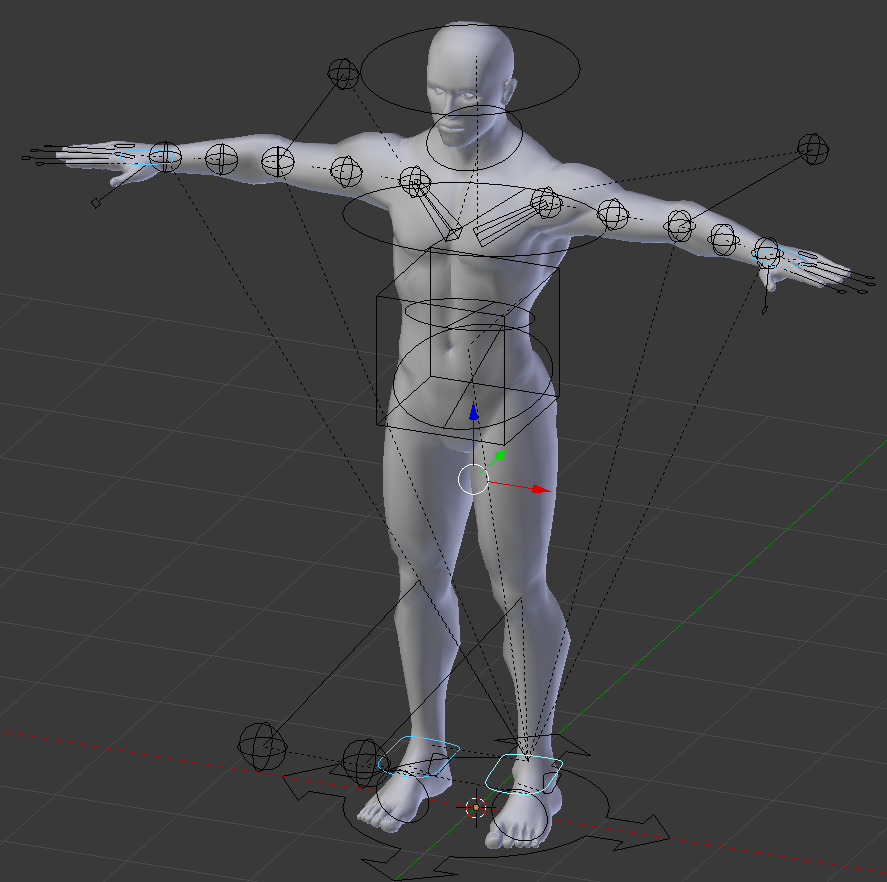{#fig:viewer_controllers width=500px height=500px}

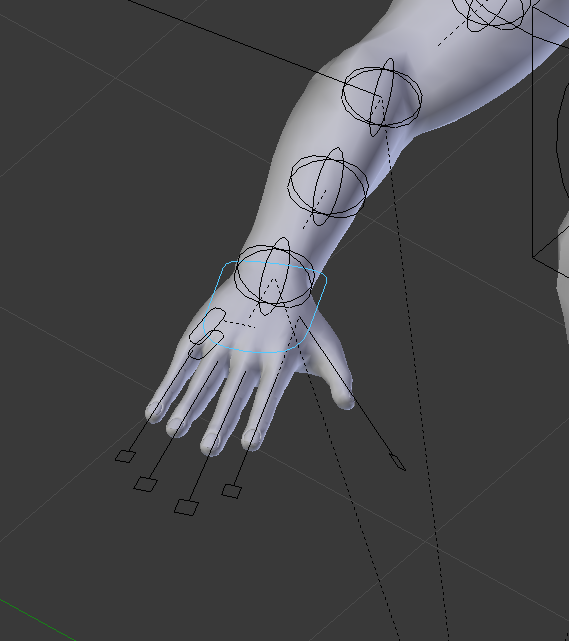{#fig:viewer_arm_r width=285px height=321px}

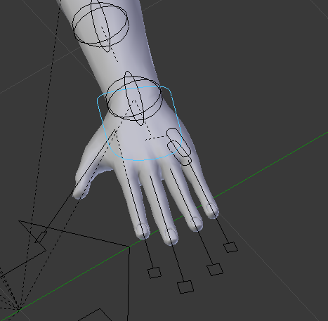{#fig:viewer_arm_l width=285px height=290px}

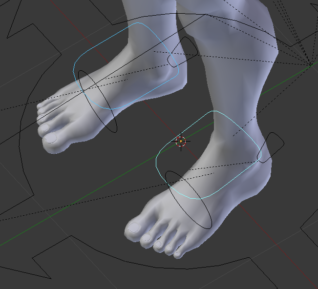{#fig:viewer_legs width=285px height=260px}

Para gerar um movimento da perna esquerda, por exemplo, 2RS-Viewer utiliza da variação dos vetores de `"leg_l"`. Ao variar a translação nos eixos $x$ e $y$ é possível modificar a perna ereta do modelo (conforme [@fig:viewer_leg_l_still]) para uma perna suspensa (conforme [@fig:viewer_leg_l_up]).

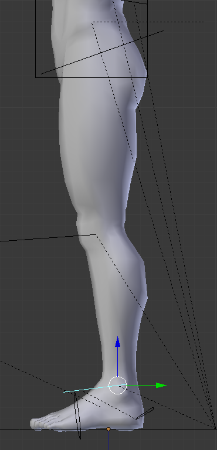{#fig:viewer_leg_l_still width=185px height=384px}

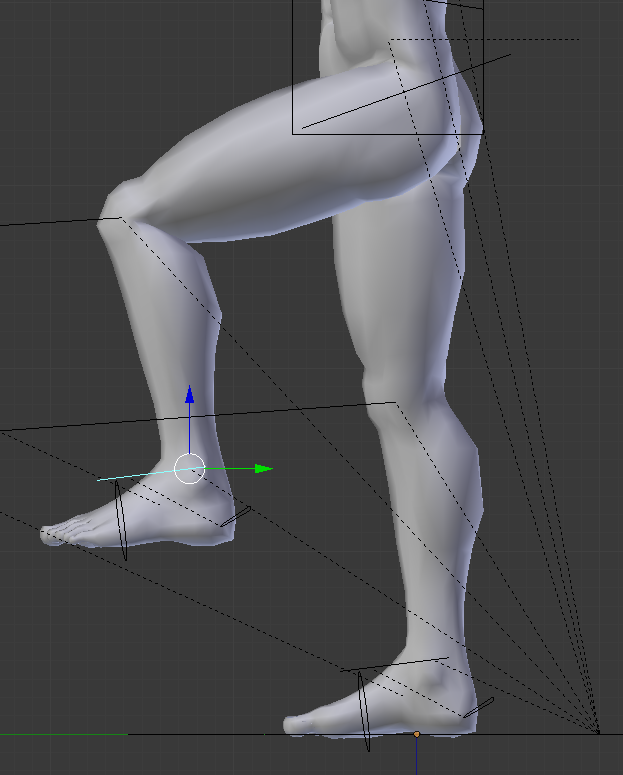{#fig:viewer_leg_l_up width=312px height=388px}

A variação de translação da prancha de controle `leg_l` impacta em faces específicas da perna esquerda, através da armadura (conforme [@fig:viewer_armature] e [@fig:viewer_armature_legs]), e do peso de impacto de cada _bone_ (conforme [@fig:viewer_foot_1], [@fig:viewer_foot_2], [@fig:viewer_leg_1], [@fig:viewer_leg_2], [@fig:viewer_leg_3], [@fig:viewer_leg_4] e [@fig:viewer_leg_5]). As cores das faces identificam o grau de impacto do _bone_, onde azul significa nenhum impacto e vermelho impacto total.

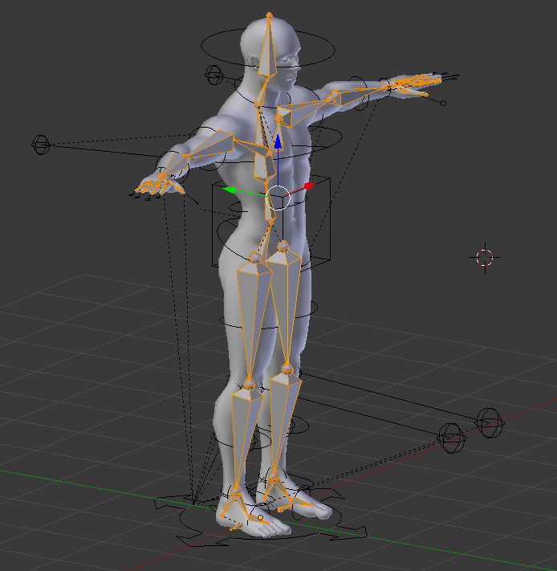{#fig:viewer_armature width=347px height=356px}

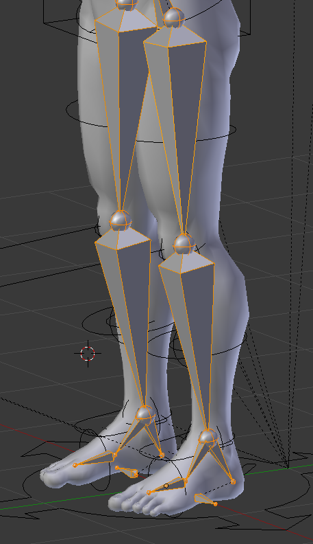{#fig:viewer_armature_legs width=229px height=394px}

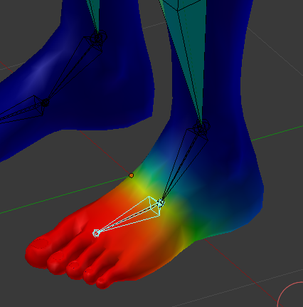{#fig:viewer_foot_1 width=330px height=340px}

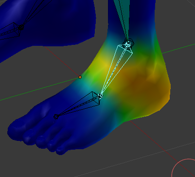{#fig:viewer_foot_2 width=330px height=305px}

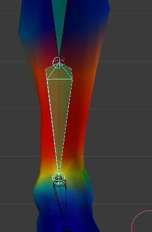{#fig:viewer_leg_1 width=210px height=345px}

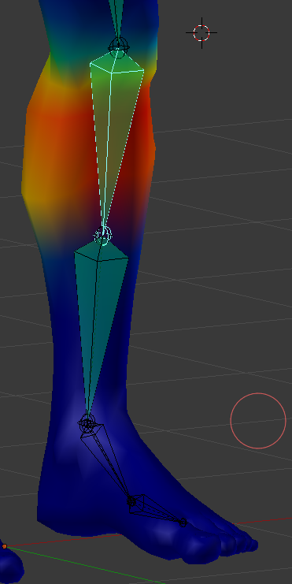{#fig:viewer_leg_2 width=210px height=420px}

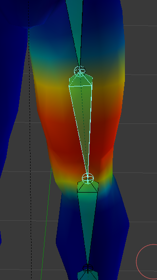{#fig:viewer_leg_3 width=238px height=400px}

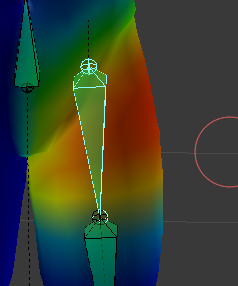{#fig:viewer_leg_4 width=238px height=286px}

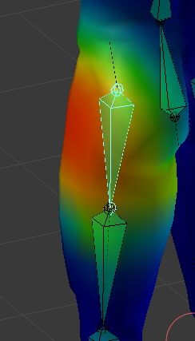{#fig:viewer_leg_5 width=238px height=420px}

<!-- TODO: Detalhes dos algoritmos, detalhes da armadura, imagens, testes -->
