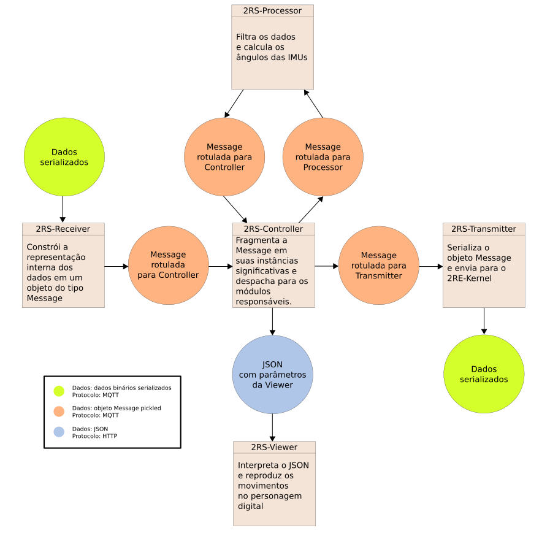
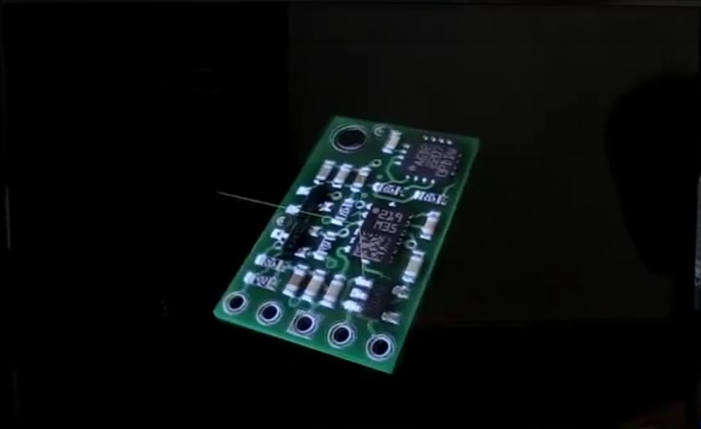
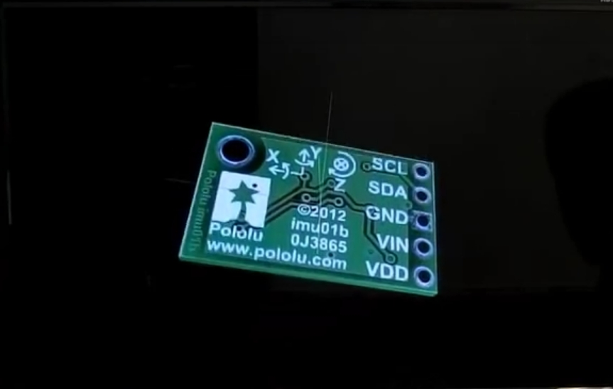
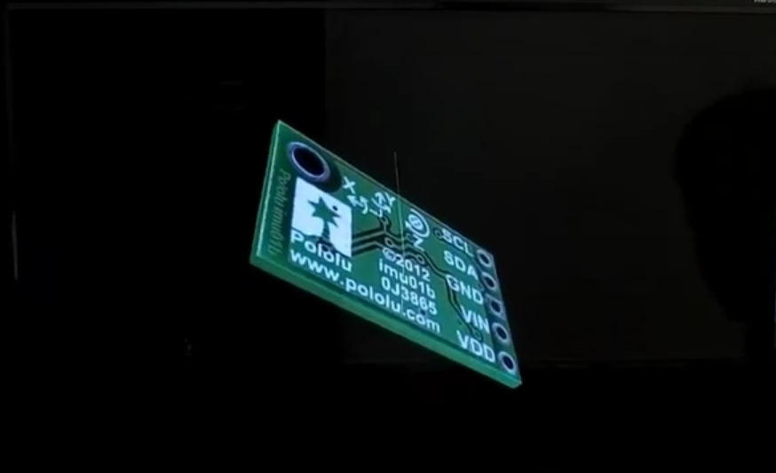
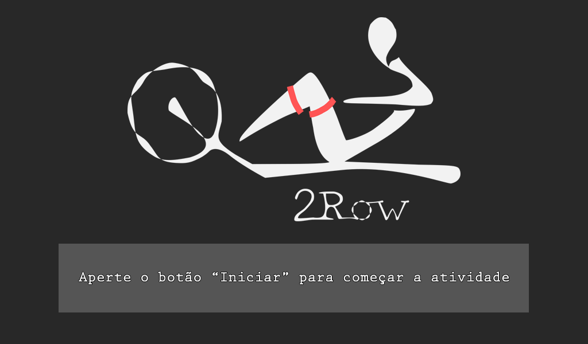
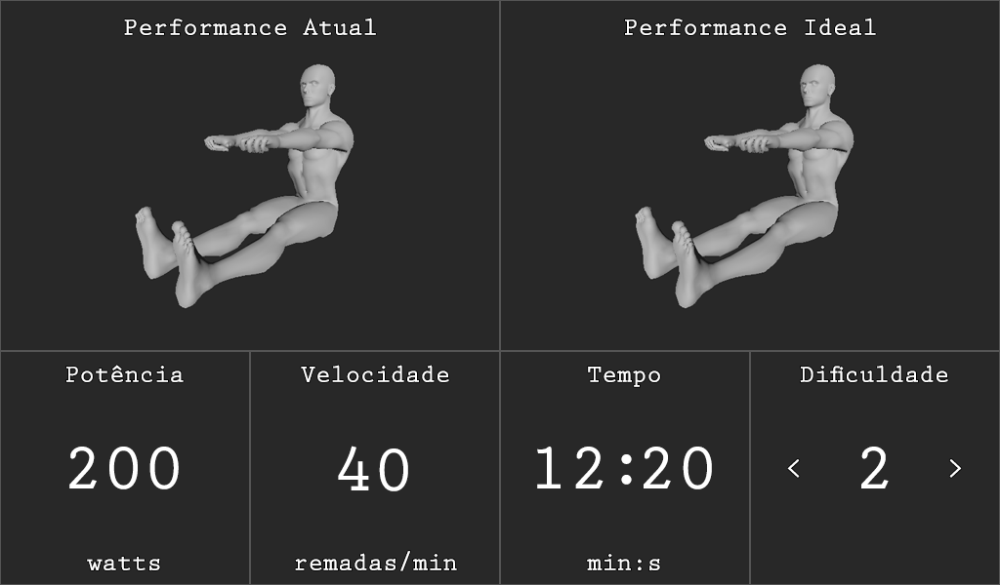

  
## 2RSystem

Responsável pela inovação em _software_ do 2Row, 2RSystem é capaz de receber, processar e transmitir dados dos sensores eletrônicos.

Cada módulo do 2RSystem é responsável por uma etapa específica do fluxo de informação do sistema. Este se comunica diretamente com 2RE-Kernel e transmite informações processadas para o atleta através do 2RS-Viewer.

### Arquitetura

O sistema não necessitará de um banco de dados, toda sua execução será em nível de memória visto que não faz parte do escopo armazenar as informações de cada treinamento do atleta. Partindo desse ponto, é evidente a necessidade de uma arquitetura performática e eficiente em relação ao fluxo de processamento dos dados que serão exibidos para o usuário em tempo real.

Uma aplicação _single core_ e _mono threaded_ subutilizaria os já limitados recursos de processamento da Raspberry Pi 3, 64bit ARMv8 Cortex-A53 Quad-Core com Clock de 1.2 GHz. Optamos, assim, pela expansão dos diferentes módulos em pequenos serviços especializados que possuem seus próprios processos e _threads_, que resultou em fluxo de processamento paralelo e não blocante. Isso otimiza o uso do processador _Quad-Core_ e multiplica por quatro, escusando outros processos concorrentes e variações dos algorítmos de escalonamento de processos, o tempo de permanência em CPU do _software_.

A partir do momento que passamos a lidar com um sistema modular assíncrono, vários problemas relacionados com a concorrência de processos foram evidenciados. O mais importante deles foi a necessidade de um sistema de comunicação robusto e veloz entre os diferentes módulos, de forma que o fluxo de processamento apresentado na [@fig:fluxo_de_processamento] fosse respeitado.

{#fig:fluxo_de_processamento}

Com exceção do módulo 2RS-Viewer, toda comunicação interna é implementada através do protocolo MQTT. Essa decisão de projeto alcançou dois grandes objetivos. O primeiro foi a solução do gerenciamento da comunicação assíncrona e da execução não blocante. O segundo se baseou no próprio sistema de _buffering_ do Mosquitto, servidor MQTT para comunicação interprocessos. Esse sistema permitiu o armazenamento temporário das mensagens ainda não lidas, proporcionando uma fila de espera das mensagens para serem processadas. Assim, cada processo executa sua função, publica os dados obtidos em uma fila de despacho e em seguida já pode solicitar outra mensagem que espera para ser processada, otimizando o _pipeline_ de execução de cada método observador.

O Eclipse Mosquitto^[https://mosquitto.org/] é um mensageiro intermediário de código-fonte aberto (licenciado por EPL/EDL) que implementa as versões 3.1 e 3.1.1 do protocolo MQTT. O Mosquitto é leve e adequado para uso em todos os dispositivos, desde computadores de mesa única de baixa potência até servidores completos.

O Eclipse Mosquitto dispõe de uma biblioteca implementada em Python chamada Paho. Essa biblioteca fornece o objeto Client, para gerenciamento das mensagens em tópicos inscritos. A _API_ apresenta limitações de integração para objetos de tipos complexos. Isso significa que uma mensagem com uma lista de valores inteiros correspondentes aos dados das IMUs teria que ser recorrentemente codificada e decodificada no formato de transmissão, _byte strings_. NEsse contexto, buscando um padrão que facilitasse a quantidade de conversões, implementamos o _design pattern adapter_, encapsular todo comportamento do Paho em três classes: Rx, Tx e Message.

* **Message**: Classe que utiliza a biblioteca Pickle para codificar e decodificar suas próprias instâncias em _byte strings_ complexas. Esses objetos definem um emissor, um receptor e um conteúdo. Podem ser transmitidos via MQTT e reconstruídos com extrema simplicidade pelos receptores.
* **Rx**: Implementa a MetaClasse **RxMeta**, que define o _design pattern decorator_ para dois métodos: *on_message* e *on_connect*. As classes filhas definem métodos que aplicam esses decoradores e suas instâncias assinam uma lista de tópicos do _broker_ Mosquitto.
* **Tx**: Define um método _Publish_ que aceita uma mensagem como parâmetro e envia para o receptor declarado dessa mensagem seu conteúdo codificado em uma _byte string_.

Todos os módulos, com exceção do 2RS-Viewer, herdam da classe **Rx**, afinal, toda comunicação interprocessos é baseada na recepção de mensagens. Cada um desses módulos passa a ser um processo isolado que não depende dos outros. Esse processo espera por uma mensagem, a processa assim que ela chega, e publica seu resultado em um canal de saída.

Nesse cenário, cada módulo independente pode ser testado e evoluído sem a necessidade dos outros. Utilizamos a biblioteca _Invoke_ do Python para integrar diferentes modelos de execução e a biblioteca _Pytest_ para executar os testes de integração assíncronos. Esse _framework_ facilita a criação de pequenos testes, mas ainda é escalável para suportar testes funcionais complexos para aplicativos e bibliotecas. Possui uma _API_ que permite a utilização de _fixtures_, funções reutilizáveis entre os testes que reduzem drasticamente a rapetição de código.

### Módulos

#### 2RS-Receiver

O módulo **2RS-Receiver** é o receptor dos dados providos pelo **2RE-Kernel**. Os dados são transmitidos utilizando o protocolo **MQTT** e vêm serializados com base no método **DSM**. Os dados são, então, desserializados e transformados em objetos do tipo **Message**, a qual é uma classe definida internamente, que representa as mensagens que são transmitidas - via **MQTT** - por todos os módulos do **2RSystem**.  Logo após, os dados desserializados são enviados para o módulo **2RS-Controller**, o qual é responsável por delegá-los para os outros módulos.
Os possíveis dados a serem recebidos pelo **2RS-Receiver** são: 

* $3$ valores númericos que representam os eixos $X$, $Y$ e $Z$ do acelerômetro de cada IMU
* $3$ valores númericos que representam os eixos $X$, $Y$ e $Z$ do giroscópio de cada IMU
* $3$ valores númericos que representam os eixos $X$, $Y$ e $Z$ do magnetômetro de cada IMU
* $1$ valor númerico do conjunto {$0$, $1$, $2$, $3$} que representa a dificuldade requerida pelo atleta
* $1$ valor númerico que representa a potência do **2RE-Watt**
* $1$ valor númerico que representa a temporização discreta do ciclo de exercício 

#### 2RS-Transmitter

O módulo **2RS-Transmitter** é o transmissor dos dados processados pelo **2RSystem** para o **2RE-Kernel**. Os dados são transmitidos utilizando o protocolo **MQTT** e são serializados com base no método **DSM**.
Os possíveis dados a serem enviados pelo **2RS-Transmitter** são:

* $1$ valor númerico do conjunto {$0$, $1$, $2$, $3$} que representa a dificuldade requerida pelo atleta
* $1$ valor númerico que representa a potência do **2RE-Watt**

#### 2RS-Controller

O módulo **2RS-Controller** é responsável por receber e delegar todas os dados e tarefas do **2RSystem** para os respectivos módulos responsáveis. Semanticamente, o papel do módulo **2RS-Controller** se assemelha aos padrões de projeto _Observer_ e _Delegate_.

A delegação de dados e tarefas é feita com o auxílio do protocolo de transmissão **MQTT**. O **MQTT** é baseado em um padrão de _publish_ e _subscribe_, onde vários tópicos (que são semelhantes a filas de mensagem) existem, e módulos podem publicar ou escolher se inscrever nesses tópicos. Por exemplo, um módulo **A** pode querer publicar dados sobre temperatura pra quem quer queira recebê-los; assim, um tópico chamado _**temperature**_ poderia ser criado e todo e qualquer módulo que quisesse receber informações sobre temperatura se inscreveria neste tópico. Assim que **A** publicasse uma mensagem no dito tópico, todos os módulos registrados receberiam a mensagem.

Levando isso em conta, foram criados tópicos de entrada e saída para cada módulo do **2RSystem**, onde o módulo **2RS-Controller** é o principal _publisher_ e, também, o principal _subscriber_. Por exemplo, o módulo **2RS-Processer** está como _subscriber_ do módulo $P_{in}$ (_Processer IN_), que aglomera todos os dados que servem de _input_ para o **2RS-Processer**, e o módulo **2RS-Controller** está como _publisher_, pois o mesmo deve passar informações e dados vindos de outros módulos para a **2RS-Controller**. Analogamente, o módulo **2RS-Processer** está como _publisher_ do módulo $P_{out}$ (_Processer OUT_), que aglomera todos os _outputs_ criados por **2RS-Processer**, e o módulo **2RS-Controller** está como _subscriber_, para poder recebê-los e depois delegá-los para outros módulos.

#### 2RS-Processer

O principal objetivo deste módulo é: receber os dados inferidos pelas IMUs e repassados pela **2RS-Controller** e transformá-los em informações necessárias para a renderização dos modelos do corpo humano.

As IMUs são compostas, basicamente, por $3$ instrumentos: $1$ acelerômetro, $1$ giroscópio e $1$ magnetômetro; esses, respectivamente, são capazes de: medir a aceleração do objeto, d direção do objeto e a intensidade, a direção e o sentido de campos magnéticos em sua proximidade. Cada um desses instrumentos possui $3$ eixos de precisão, os quais representam o espaço $3D$ em respeito às suas capacidades próprias, totalizando $9$ dados a serem utilizados por este módulo.

Esses $9$ dados separadamente não são úteis para a renderização dos modelos. Para que seja possível mapear os movimentos do atleta para a tela, é necessário ter em mãos os ângulos de Euler que representam a orientação. Para obter os ditos ângulos, é necessário inserir esses dados em um algoritmo de fusão sensorial, o qual dá como _output_ os ângulos de Euler.

O algoritmo de fusão sensorial escolhido foi o Madgwick ^[Paper original do algoritmo: [http://x-io.co.uk/res/doc/madgwick_internal_report.pdf](http://x-io.co.uk/res/doc/madgwick_internal_report.pdf)]. Este algoritmo incorpora compensação de distorção magnética e utiliza a representação de _quaternions_ (que podem ser transformado em ângulos de Euler), o que permite que os dados do acelerômetro e do magnetômetro sejam utilizados para medir e corrigir o erro do giroscópio como uma derivada do _quaternion_ do momento atual, o que seria impossível se as IMUs possuíssem apenas 6 eixos (i.e. não se possuíssem um magnetômetro).

O algoritmo é dividido em dois processos:
1. As medições do giroscópio são obtidas com um algoritmo de correção (com o objetivo de minimizar os efeitos do efeito de _drift_) e são, então, utilizadas para computar a orientação do corpo com a propagação do _quaternion_ começando da etapa anterior do algoritmo.
2. Logo após, as medições do acelerômetro e do magnetômetro são fundidas com um parâmetro $\beta$. O _output_ dessa fusão é usado para corrigir a orientaçpor Exocortex ão estimada no primeiro passo, onde apenas o giroscópio foi considerado.

O algoritmo foi implementado utilizando a linguagem de programação Python em conjunto com a biblioteca NumPy. O principal motivo pela escolha da linguagem foi a própria NumPy. Como a visualização dos movimentos deve ser feito em tempo real, a eficiência dos cálculos é altamente necessária. Nesse ponto, a NumPy se sobressai: as operações e os cálculos de matrizes, acessos de _arrays_/listas/tuplas etc são escritas, conjuntamente, nas linguages Fortran e C, fazendo com que sejam aproveitadas a rapidez dessas linguagens e a simplicidade da programação na linguagem Python.

Como o objetivo deste módulo era receber dados crus das IMUs e dar como _output_ os ângulos de Euler que representam as orientações do corpo, é necessário ter uma forma de testar se os ângulos estão realmente corretos; isto é, se o algoritmo de fusão sensorial está funcionando corretamente. Para tal teste, a ferramenta de visualização **ahrs-visualizer** foi utilizada.

Basicamente, a ferramenta **ahrs-visualizer** recebe uma matriz de rotação (que pode ser derivada do _quaternion_ mantido no Madgwick) e mostra na tela a representação da IMU na tela. Ou seja, uma bateria de dados foi coletada das nossas IMUs, esses dados foram colocados na implementação do Madgwick e as matrizes de rotação de cada momento de tempo foram dadas como _output_. Então, as matrizes de rotação foram dadas como _input_ para o **ahrs-visualizer** e, então, foi checado se as imagens mostradas pelos **ahrs-visualizer** correspondem ao movimentos feitos na IMU.

Algumas imagens do **ahrs-visualizer** podem ser vistas a seguir:

{#fig:ahrs_visualizer-1 height=300px}

{#fig:ahrs_visualizer-2}

{#fig:ahrs_visualizer-3}

#### 2RS-Viewer

Módulo responsável por renderizar e apresentar informações para o atleta, 2RS-Viewer é um programa binário desenvolvido através do uso da _engine free-source_ Godot^[Godot é uma _engine_ argentina para desenvolvimento de jogos. Página oficial: [https://godotengine.org/](https://godotengine.org/)] com algoritmos em GDScript^[GDScript é a linguagem de programação oficial do Godot, semelhante ao Python]. As principais informações apresentadas são:

* Potência atual do atleta, em Watts;
* Velocidade atual do atleta, em remadas por minuto;
* Timer da atividade do atleta, em minutos e segundos;
* Carga de dificuldade do remo, em unidade natural;
* _Performance_ do atleta, em modelo tridimensional;
* _Performance_ ideal, em modelo tridimensional.

O modelo tridimensional foi desenvolvido por Exocortex e disponibilizado em formato Collada^[Collada é um formato de arquivo para definição de elementos em 3D] para uso por Ben Houston^[Fonte: [https://clara.io/view/d49ee603-8e6c-4720-bd20-9e3d7b13978a](https://clara.io/view/d49ee603-8e6c-4720-bd20-9e3d7b13978a)]. A armadura de animação do modelo foi produzida manualmente através do uso da ferramenta _free-source_ Blender^[Blender é uma ferramenta para criação e animação de elementos em 3D. Página oficial: [https://www.blender.org/](https://www.blender.org/)].

Os dados atuais da atividade do atleta são requisitados para a 2RS-Controller 10 vezes por segundo através do protocolo HTTP via _socket_ TCP/IP, no formato JSON, conforme exemplo:

~~~~ {#viewerjson .json .numberLines}
{
  "power": 100,
  "speed": 33,
  "timer": 99,
  "difficulty": 1,
  "athlete": {
    "arm_l": [
      [0, 0, 0],
      [0, 0, 0],
      [0, 0, 0]
    ],
    "arm_r": [
      [0, 0, 0],
      [0, 0, 0],
      [0, 0, 0]
    ],
    "leg_l": [
      [0, 0, 0],
      [0, 0, 0],
      [0, 0, 0]
    ],
    "leg_r": [
      [0, 0, 0],
      [0, 0, 0],
      [0, 0, 0]
    ]
  },
  "ideal": {
    "arm_l": [
      [0, 0, 0],
      [0, 0, 0],
      [0, 0, 0]
    ],
    "arm_r": [
      [0, 0, 0],
      [0, 0, 0],
      [0, 0, 0]
    ],
    "leg_l": [
      [0, 0, 0],
      [0, 0, 0],
      [0, 0, 0]
    ],
    "leg_r": [
      [0, 0, 0],
      [0, 0, 0],
      [0, 0, 0]
    ]
  }
}
~~~~

Cada requisição é feita de forma assíncrona. Caso aconteça de entrelaçar as requisições (por atraso de processamento ou atraso de entrega), a de maior _timer_ prevalece e as outras requisições são descartadas.

O primeiro vetor dos elementos de `"ideal"` e `"athlete"` define a translação tridimensional (posição no espaço) de seu respectivo segmento corporal, o segundo vetor define a rotação tridimensional (ângulos de Euler) do segmento corporal e o terceiro vetor a deformidade tridimensional (escala, dilatação ou contração). Tais vetores modificam as controladoras tridimensionais da armadura do modelo tridimensional.

A [@fig:viewer_controllers] descreve o modelo tridimensional, suas controladoras (definidas por linhas pretas) e as quatro pranchas de controle (definidas por linhas azuis) que são utilizadas para animar o modelo em um tipo de movimento. A [@fig:viewer_arm_r] apresenta a mão direita do modelo e a prancha de controle `arm_r` azul. A [@fig:viewer_arm_l] apresenta a mão esquerda do modelo e a prancha de controle `arm_l` em azul. A [@fig:viewer_legs] apresenta os pés do modelo e as pranchas de controle `leg_r` e `leg_l` em azul.

{#fig:viewer_controllers width=500px height=500px}

{#fig:viewer_arm_r width=285px height=321px}

{#fig:viewer_arm_l width=285px height=290px}

{#fig:viewer_legs width=285px height=260px}

Para gerar um movimento da perna esquerda, por exemplo, 2RS-Viewer utiliza da variação dos vetores de `"leg_l"`. Ao variar a translação nos eixos $x$ e $y$ é possível modificar a perna ereta do modelo (conforme [@fig:viewer_leg_l_still]) para uma perna suspensa (conforme [@fig:viewer_leg_l_up]).

{#fig:viewer_leg_l_still width=185px height=384px}

{#fig:viewer_leg_l_up width=312px height=388px}

A variação de translação da prancha de controle `leg_l` impacta em faces específicas da perna esquerda, através da armadura (conforme [@fig:viewer_armature] e [@fig:viewer_armature_legs]), e do peso de impacto de cada _bone_ (conforme [@fig:viewer_foot_1], [@fig:viewer_foot_2], [@fig:viewer_leg_1], [@fig:viewer_leg_2], [@fig:viewer_leg_3], [@fig:viewer_leg_4] e [@fig:viewer_leg_5]). As cores das faces identificam o grau de impacto do _bone_, onde azul significa nenhum impacto e vermelho impacto total.

{#fig:viewer_armature width=347px height=356px}

{#fig:viewer_armature_legs width=229px height=394px}

{#fig:viewer_foot_1 width=330px height=340px}

{#fig:viewer_foot_2 width=330px height=305px}

{#fig:viewer_leg_1 width=210px height=345px}

{#fig:viewer_leg_2 width=210px height=420px}

{#fig:viewer_leg_3 width=238px height=400px}

{#fig:viewer_leg_4 width=238px height=286px}

{#fig:viewer_leg_5 width=238px height=420px}

Há três telas de visualização que são transmitidas para o atleta:

* **Tela de Espera**: Apresentada logo após a inicialização do sistema ou após o término da atividade do atleta, é composta por um fundo preto com um símbolo centralizado do 2Row e uma mensagem descritiva, conforme [@fig:viewer_waiting_screen];
* **Tela de Atividade**: Apresentada após o atleta acionar o botão de iniciar atividade, é composta pelas informações de atividade, incluindo o desempenho atual do atleta e o ideal, conforme [@fig:viewer_activity_screen];
* **Tela de Término de Atividade**: Apresentada após o atleta acionar o botão de encerrar atividade, é composta pelas informações finais da atividade, conforme [@fig:viewer_ending_screen].

{#fig:viewer_waiting_screen width=512px height=300px}

{#fig:viewer_activity_screen width=512px height=300px}

{#fig:viewer_ending_screen width=512px height=300px}

Após a integração do 2RSystem com 2RElectronic, espera-se que seja feita melhorias estéticas visando inteligibilidade e harmonia com as cores e o desenho do produto como um todo.

Ambientes de testes foram criados através da estratégia de _mock_ (simulação). Foi utilizado o JSON Server^[JSON Server é um simulador de servidor REST API de transmissão de dados no formato JSON. Página Oficial: [https://github.com/typicode/json-server](https://github.com/typicode/json-server)] para simular a interação com o 2RS-Controller, este sendo o único componente responsável por transmitir informação para o 2RS-Viewer. Para testar o _deployment_ do sistema, foi criado uma instância do Android Nougat 7.1 utilizando o AVD Manager^[AVD Manager é o sistema de emulação oficial da plataforma Android Studio, mantida pelo Google. Para mais informações: https://developer.android.com/studio/run/emulator] que replica o ambiente RTAndroid do Raspberry Pi 3 que será utilizado no 2Row.
