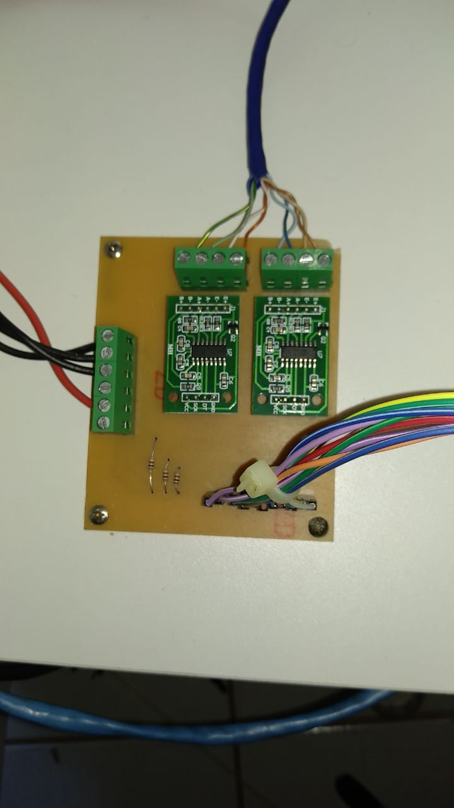
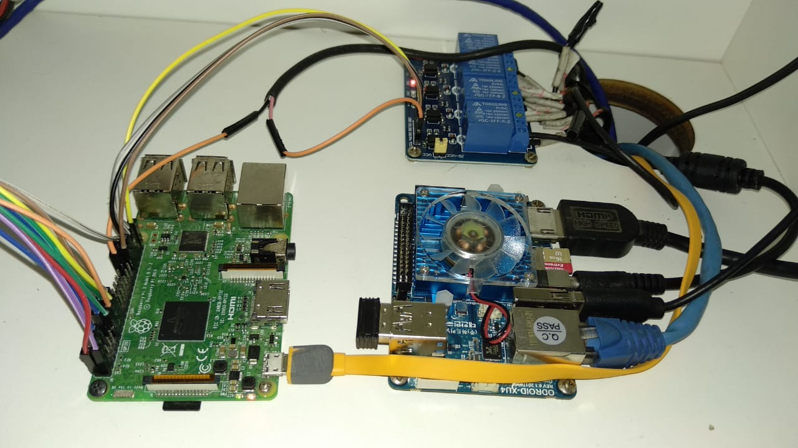

## 2RElectronic

Do ponto de controle 2 para o ponto de controle 3, depois de realizados testes de funcionamento e as possíveis integrações, algumas modificações foram necessárias e tomadas como soluções finais. Abaixo serão discutidos essas soluções finais, assim como resultados obtidos e dificuldades encontradas.

O MQTT, protocolo utilizado para o envio de mensagens do microcontrolador ESP8266 para o Kernel inicialmente foi desenvolvido 
com base em TCP/IP. Entretanto, ao fazer a integração com software e os possíveis testes do sistema de envio e recebimento de dados observou-se que a taxa de amostragem estava muito abaixo do esperado, o máximo com esse protocolo chegou a 20 Hz, isso porque esse tipo de protocolo ao enviar uma mensagem recebe uma outra mensagem avisando que a mensagem foi entregue, isso de certo modo interfere no período de envio de outras mensagem. Para o desenvolvimento de um sistema em tempo real, esse resultado não estava satisfatório, o processamento da ESP8266 estava de acordo com o esperado, porém, as publicações estavam ocorrendo de forma muito lenta. 

Para que a integração eletrônica/software fosse realizada o código de aquisição de leitura dos dados da IMU foi alterado para o 
protocolo MQTT-SN (MQTT for Sensor Network), isso porque esse protocolo em específico não depende do TCP/IP para que suas funcionalidades sejam atendidas. Esse protocolo é muito utilizado em projetos de IoT que precisam da utilização de baterias como fonte de alimentação. No caso desse projeto, foi preciso utilizarmos a camada de internet UDP, o tamanho mínimo da mensagem para esse protocolo é de 1 byte. Um ponto importante que auxilia a velocidade é que esse protocolo possibilita suporte ao ID, tornando a comunicação mais rápida, devido a resução de processamento e memória. Com a utilização desse protocolo  a taxa de amostragem do sistema ficou em 100 Hz, o que possibilitou receber os dados para o tratamento dos dados da IMU no sistema de software. É válido ressaltar que foi difícil de ser encontado materiais a respeito da biblioteca MQTT-SN e para que pudesse ser utilizada a função de publicação, o pessoal de software desenvolveu a biblioteca do MQTT-SN para o UDP. Assim, foi possível testar o código de leitura, tratamento e publicação dos dados da IMU.

Uma das grandes dificuldades que encontramos foi com relação a multiplexação  de mais de uma IMU, no ponto de controle 2 estava funcionando de forma aparentemente correta. Entretanto, ao integrar com software, devido a velocidade alta necessária para envio, o magnetômetro não suportou, o mesmo possui um tempo de leitura mais lento, ele sempre voltava o mesmo valor. Como solução, tentou-se realizar a multiplexação por hardware de forma externa, utilizando o CI CD4047, entretanto o protocolo I2C não permitiu utilizar essa configuração. Feita algumas pesquisas, verificou-se o modo possível de realizar isso seria enviando de forma cruzada os dados de uma IMU para a outra. Devido ao tempo estipulado para o término do projeto e sendo o magnetómetro um sensor importante para os ajustes finos do sistema, decidiu-se utilizar apenas uma IMU.

{width=290 height=295px}

### 2RE-Suit

Constitui-se da vestimenta que o atleta deve  posicionar no membro inferior para que o movimento seja detectado para comparação e geração de movimento em tempo real. Na imagem, uma parte do Suit constituída do microcontrolador nodemcu  esp8266 ligada a IMU, ambas curturadas em material elástico para fixação por velcros na perna do atleta para que o movimento seja inferido. A bateria para alimentação do sistema está fixada na parte traseira da cintura da pessoa para que não influencie no movimento.

#### Cálculos para bateria utilizada para suprir a ESP8266 com a MPU9250
Para os cálculos foram considerados o uso momenâneo com bateria recarregável para o projeto. 
Isso é suficiente pois a IMU escolhida é considerada de consumo super baixo e a ESP8266 também.

Segundo informações do Datasheet da IMU, o consumo por sensor embutido é:
3,2mA para o giroscópio
450uA para o acelerômetro
280uA para o magnetômetro
totalizando 3,93mA de consumo

A ESP8266 consome, com o WIFI ligado e clock máximo 215mA

O total de consumo para envio das mensagens usando MQTT por UDP é de:
215mA+3,93mA, totalizando 219mAh. Portanto a bateria escolhida de 5V e 5Ah era suficiente para o projeto.
A alta capacidade da bateria que ficou alocada em bolsão nas costas do atleta possibilitou vários testes até o correto funcionamento do aparelho por tempo suficiente para validação.

#### 2RE-Kernel

Inicialmente o kernel foi desenvolvido para receber as publicações feitas pela ESP8266 Node MCU, enviar os dados dos botões, força, tempo e todas as aquisições dos sinais da célula de carga, verificações dos botões e controle dos relés ficavam atuando em um único código. Ao integrar com software observou-se a necessidade de otimizar o código, desse modo ele foi separado em dois: kernel e kernel_control. O kernel continuou com as funções de publicações e recebimento dos dados do transmitter, entretanto a parte dos botões e controle dos relés foi direcionada ao kernel_control que roda paralelamente ao demais. Na estrutura do próprio kernel, para verificar a aquisição dos sinais da célula de carga de forma constante, essa parte do código foi desenvolvida como uma thread para funcionar também de forma paralela. Essa necessidade e modificações foram realizadas juntamente com software, pois a parte de eletrônica foi acrescida a arquitetura que eles já tinham desenvolvido, utilizando o gabby. 

{width=360 height=280px}
